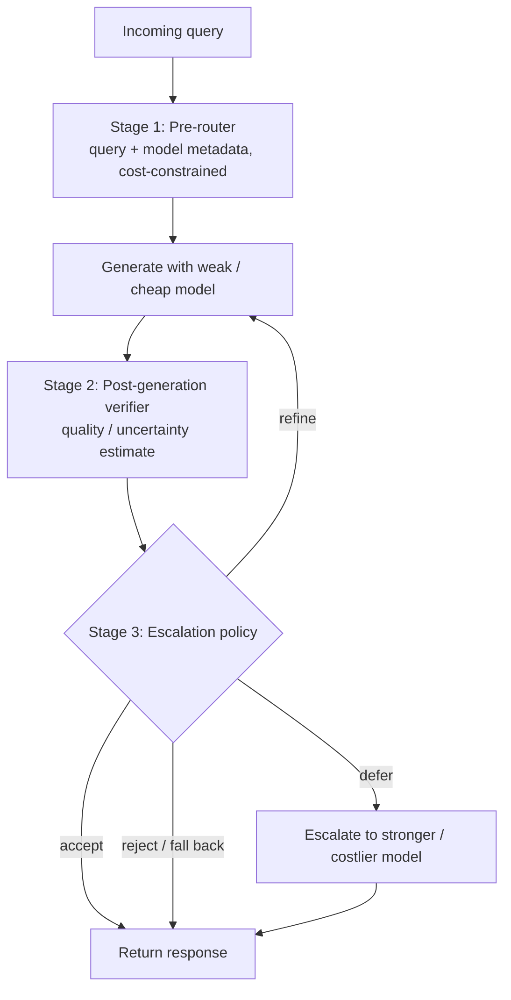

## Summary
Production LLM deployment faces a cost–performance dilemma: queries vary from trivial factual lookups to hard multi-step reasoning, but a single statically-deployed model wastes resources on easy queries and underperforms on hard ones. This survey (ADAPT Centre, Trinity College Dublin) systematizes **dynamic, inference-time selection among multiple independently trained LLMs** — explicitly excluding [[Mixture-of-Experts]], which routes *within* one model. It organizes the literature into six routing paradigms (difficulty-aware, human-preference-aligned, clustering-based, reinforcement-learning, uncertainty-based, and cascading), then introduces a unifying conceptual framework that characterizes any routing system along three axes — **when** the decision is made, **what** information it uses, and **how** it is computed. The central thesis: well-designed routing can outperform even the strongest individual model by exploiting model complementarity while cutting cost, and real systems are *compositional*, combining several paradigms under operational constraints.

## Key Contributions
- A **six-paradigm taxonomy** of multi-LLM routing/cascading with representative methods analyzed per paradigm, plus a consolidated method-summary table (Table 2) mapping each method to its routing mechanism and training data.
- A **three-dimensional conceptual framework** (Table 1 design-space matrix): *when* (pre-generation / post-generation / multi-stage / online), *what signals* (query / model metadata / response-level / feedback), and *how computed* (heuristic / supervised / bandit / RL policy) — showing practical systems fill multiple cells.
- An explicit scoping distinction: routing **across** independently trained LLMs vs MoE routing **within** a single model.
- A **three-stage compositional control pipeline** (pre-router → post-generation verifier → escalation policy) presented as a flexible template into which surveyed methods (FrugalGPT, Cascade Routing, MixLLM, PILOT, CP-Router, Self-REF) can be mapped.
- A review of **evaluation**: routing benchmarks ([[RouterBench]], RouterEval, MixInstruct, LLMRouterBench) and metrics spanning quality, latency/throughput, cost, and energy/carbon.
- Identification of **structural gaps**: no method pairs response-level signals with online adaptation; RL is under-explored in cascades; few systems solve a unified multi-objective optimization over quality/cost/latency.

## Architecture / Method

This is a survey, so the "method" is a conceptual framework rather than a single model. Two structures carry most of the explanatory weight.

### The three-axis design space (Table 1)
Every routing system is characterized by three independent questions:

| Axis | Options | Notes |
|---|---|---|
| **When** is the decision made | Pre-generation · Post-generation · Multi-stage · Online/adaptive | Multi-stage is a sequential escalation structure, *not* mutually exclusive with pre-/post-gen |
| **What** signal is used | Query · Model metadata · Response-level · Feedback | Richer signals cost more to obtain |
| **How** it is computed | Heuristic · Supervised · Bandit · RL policy | Methods often combine mechanisms (e.g. classifier + threshold) |

Difficulty-aware and clustering methods are generally pre-generation on query signals; uncertainty-based methods and cascades are generally post-generation on response signals.

### The compositional three-stage pipeline (Section 10)
The survey's recommended way to *build* a production system treats routing as a control pipeline whose stages can be combined, collapsed, or reordered:

The survey shows how surveyed methods instantiate this template: FrugalGPT and Cascade Routing fill all three stages; bandit systems (MixLLM, PILOT) collapse the verifier and escalation into an implicit online reward signal; uncertainty methods (CP-Router, Self-REF) use a post-generation confidence estimate as the escalation trigger without an explicit quality-estimation model.

### The six paradigms

Each paradigm has a dedicated concept note (with its own decision-flow diagram):

- **[[Difficulty-aware Routing]]** (§2): estimate query complexity (heuristics, learned classifiers, or LLM-as-judge), then send easy→small / hard→large. Methods: *BEST-Route* (DeBERTa-v3-small multi-head router + [[Best-of-N]] sampling, proxy reward from a DeBERTa-v3-large OpenAssistant RM), *vLLM Semantic Router* (ModernBERT classifier gating [[Chain-of-Thought]] reasoning), *RouteLMT* ([[LoRA]] probe on a small translator), *EmbedLLM* (matrix-factorization model embeddings), *ICL-Router*, *GraphRouter* (GNN edge prediction), *IRT-Router* (Item Response Theory).
- **[[Preference-aligned Routing]]** (§3): train routers on preference data. *RouteLLM* (uses Chatbot Arena human labels + LLM-judge augmentation; four router types incl. a causal LLM router based on Llama-3 8B), *Arch-Router* (1.5B model conditioned on user-defined domain-action policies, no retraining), *Hybrid LLM*, *P2L* (prompt-specific Bradley-Terry coefficients), *Eagle* (training-free ELO), *Zooter* (reward-guided distillation into mDeBERTa-v3-base).
- **[[Clustering-based Routing]]** (§4): K-means over query embeddings, assign each cluster its most cost-effective model; new models added without retraining. *UniRoute*, *Avengers-Pro* (claims a Pareto frontier surpassing GPT-5-medium).
- **[[Reinforcement Learning Routing]]** (§5): policy optimization (*Router-R1*, [[PPO]], ≤4 think/route steps; *R2-Reasoner*, [[GRPO]], decomposer+allocator; *SCOPE*, GRPO-trained performance estimator) and online bandits (*MetaLLM*, *MixLLM*, *PILOT* LinUCB, *GreenServ* energy-aware LinUCB, *Dueling Feedback* FGTS.CDB, *TI-UCB*). See [[Contextual Bandit]].
- **[[Uncertainty Quantification|Uncertainty-based Routing]]** (§6): route on confidence. Probe-based and perplexity-based methods beat verbalization; *CP-Router* uses conformal prediction on answer logits to route to Large Reasoning Models like [[DeepSeek-R1]] only when uncertain.
- **[[Model Cascading|Cascading]]** (§7): cheap-first, verify, escalate. *FrugalGPT* (router + DistilBERT quality estimator + stop judge), *Cascade Routing* (unified routing+cascading), *AutoMix* (POMDP on few-shot self-verification), *Self-REF* (fine-tuned confidence tokens), *LM-Blender* (cross-attention Pair Ranker + Gen Fuser ensemble).

Section 8 extends routing to multimodal models (Model-Spider, ReLope, MMR-Bench); Section 9 covers evaluation.

## Results & Benchmarks
As a survey, the quantitative claims below are results *reported by the cited methods*, reproduced as stated in the paper (not new experiments by the authors).

| Claim (as reported in the survey) | Figure | Source method / context |
|---|---|---|
| API cost savings while keeping competitive reasoning accuracy | 84.46% | R2-Reasoner (§5.1) |
| Quality reached relative to GPT-4, under time constraints | 97.25% of GPT-4 quality at 24.18% of cost | MixLLM (§5.2) |
| Accuracy gain vs random routing | +22% | GreenServ, pool of 16 open LLMs (§5.2) |
| Cumulative energy reduction vs random routing | −31% | GreenServ (§5.2) |
| Routing overhead per query | < 8 ms | GreenServ (§5.2) |
| SLMs match LLM performance on their most-confident queries | top 20% of queries | Chuang et al. UQ benchmark of 8 methods (§6.1) |
| RouterBench scale | 405k precomputed outputs, 11 LLMs, 7 tasks | [[RouterBench]] (§9.1) |
| RouterEval scale | 200M+ performance records, 8,500+ LLMs, 12 benchmarks | RouterEval, m-way classification m∈{3,5,10,100,1000} (§9.1) |
| MixInstruct scale | 110k examples w/ oracle pairwise preferences | MixInstruct (§9.1) |
| LLMRouterBench scale | 400K+ instances, 21 datasets, 33 models, 10 baselines | LLMRouterBench (§9.1) |

Recurring qualitative result across paradigms: a capable router can **surpass the best single model** in its pool via model complementarity (stated for RouterEval and Avengers-Pro). No single headline benchmark number belongs to the survey itself.

**Evaluation metrics catalogued** (§9.2): routing accuracy, task performance (exact match, pass@k, chrF/COMET, LLM-as-Judge), win rate, AUC; efficiency via latency (TTFT, TPOT), throughput (TPS/QPS), goodput; cost (relative or monetary) and quality–cost Pareto frontiers; plus energy per token/query and carbon footprint.

## Limitations
- **Survey, not benchmark.** The paper runs no head-to-head experiments; all numbers are self-reported by the surveyed methods under heterogeneous setups, so cross-method comparison is not apples-to-apples. [unverified across methods]
- **Generalization gap.** Many routers are trained/evaluated on a fixed LLM pool and struggle to transfer to new models, domains, or distributions; retraining-free routing remains open.
- **Multi-stage cascades under-explored.** Most work is one-stage routing; combining learned (RL) escalation policies with multi-stage cascades is largely unexplored.
- **Identified structural gap:** no surveyed method simultaneously pairs response-level signals with online adaptation (uncertainty/cascade methods are static post-deployment; bandits adapt online but use query-level signals only).
- **Few true multi-objective formulations:** quality/cost/latency are usually balanced via fixed trade-off knobs rather than a unified, tunable multi-objective optimization.
- **Multimodal routing is nascent:** text-only probes degrade with visual tokens; unified cross-modal representations and multi-modality queries are open problems.

## My Notes & Questions
- This is the **system-level counterpart** to my SLM work: instead of making one small model better, you compose a fleet and route. The pre-router → verify → escalate pipeline is essentially the on-device-first, cloud-fallback pattern I care about — the SLM handles the cheap path and a confident verifier keeps cloud escalations rare. Anchors nicely to [[Small Language Models]] and [[Model Cascading]].
- The strongest practical lever is **quality/uncertainty estimation** ([[Uncertainty Quantification]]): the survey repeatedly names it as the make-or-break component for cascades. The finding that probe-based/perplexity methods beat verbalization, and that SLMs are reliable on their top-20% confident queries, is directly actionable for an on-device escalation trigger.
- The "no method pairs response-level signals with online adaptation" gap is the most interesting open problem here — a **bandit-style escalation policy that learns its confidence threshold from deployment feedback**. Possible experiment for `04-Experiments/`: LinUCB over [accept / refine / escalate] using an SLM hidden-state probe as context.
- Cost is reported inconsistently across methods (relative-to-GPT-4 %, API $, energy, FLOPs). For my own comparisons I'd want to normalize on **energy/query** (GreenServ's framing) since that's the on-device-relevant axis, not API price.
- Open question: how stable are these routers as the model pool churns? TI-UCB's non-stationarity handling hints this is real but mostly unaddressed.
- Bridges to existing notes: difficulty-aware routing connects to [[Overthinking in Reasoning Models]] (overthink/underthink motivates difficulty estimation); RL routing reuses [[PPO]]/[[GRPO]] from my reasoning notes; Zooter reuses [[Knowledge Distillation]] and a [[Reward Model]].

## Related
- [[Model Routing]]
- [[Model Cascading]]
- [[Uncertainty Quantification]]
- [[Contextual Bandit]]
- [[Mixture-of-Experts]]
- [[Small Language Models]]
- [[DeepSeek-R1]]
- [[RouterBench]]
- [[Small Language Models are the Future of Agentic AI]]
