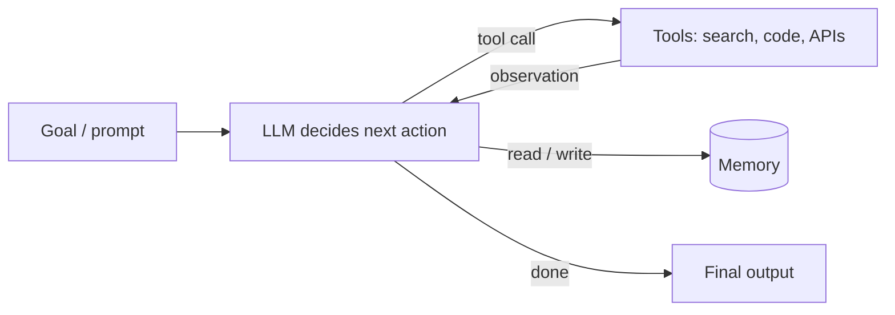

## Definition
Agentic AI refers to systems in which a language model is embedded in software that lets it act — calling tools, controlling the flow of operations, decomposing tasks, and reasoning over multiple steps — rather than just answering a single prompt.

## Intuition
A plain LLM call is a one-shot question/answer. An *agent* wraps the model in scaffolding: prompts, tools (search, code execution, APIs), memory, and control logic. The model becomes a decision-maker that decides *when and how* to use tools to complete a goal. Most "AI agent" products today are heavily-instructed, externally-choreographed gateways to a model plus a curated tool set ([[Small Language Models are the Future of Agentic AI]], argument A4).

## How It Works
Two modes of agency are useful to distinguish (Belcak et al., Figure 1):
- **Language-model agency** — the LM is *both* the human-computer interface (HCI) and the orchestrator of tool calls.
- **Code agency** — a dedicated controller code orchestrates all interactions; the LM (optionally) fills the HCI role and otherwise just performs controller-defined language tasks.

A key empirical observation is that the per-call work agents demand of a model is usually **narrow, repetitive, scoped, and non-conversational**: parse intent, emit a strictly-formatted [[Tool Calling|tool call]], extract fields, summarize a document, generate code. This narrowness is what makes [[Small Language Models]] a strong fit.

*The agent loop — model, tools, memory, control:*

## Variants & Evolution
- **Monolithic LLM agents** — one generalist LLM behind every call (the current industry default).
- **[[Heterogeneous Agentic Systems]]** — mix model sizes; default to SLMs, invoke an LLM only when general reasoning/dialogue is essential.
- **Modular "Lego-like" agents** — many small specialized experts composed together, scaling *out* instead of *up*.

## Key Papers
- [[Small Language Models are the Future of Agentic AI]]

## Related Concepts
- [[Heterogeneous Agentic Systems]]
- [[Small Language Models]]
- [[Tool Calling]]
- [[LLM-to-SLM Agent Conversion]]

## My Notes
The reframing that matters: an agent doesn't need a *generalist* at every call — it needs *reliable narrow behavior*. That shifts the design question from "which is the best model?" to "what is the cheapest model that nails this specific subtask?"
