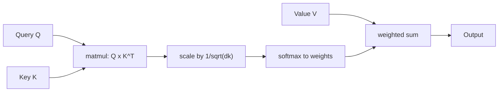

## Definition
> A mechanism that maps a query and a set of key-value pairs to an output computed as a weighted sum of the values, where each value's weight comes from a compatibility function between the query and that value's key.

## Intuition
For each position you want to compute, attention asks "which other positions are relevant to me, and how much?" — then blends their value vectors accordingly. Unlike a fixed convolution window or a sequential RNN state, attention can connect any two positions directly, so long-range dependencies are one hop away.

## How It Works
**Scaled dot-product attention** (from [[Attention Is All You Need]]):

`Attention(Q, K, V) = softmax(QKᵀ / √dₖ) · V`

- `Q, K` have dimension `dₖ`; `V` has dimension `dᵥ`.
- The `1/√dₖ` scaling matters: if `q` and `k` have unit-variance components, `q·k` has variance `dₖ`, so without scaling large `dₖ` pushes softmax into tiny-gradient regions.
- Dot-product attention is preferred over additive attention in practice — same theoretical cost but implementable as a single optimized matmul.

**Self-attention** is the case where Q, K, V all come from the same sequence (a layer attending to its own previous layer's outputs). **Cross / encoder-decoder attention** draws queries from one sequence and keys/values from another.

*Scaled dot-product attention — data flow:*

## Variants & Evolution
- **Multi-Head Attention** — run `h` attention functions in parallel on learned low-dim projections (`dₖ=dᵥ=dmodel/h`), concat, project. Lets the model attend to multiple representation subspaces; in the original Transformer `h=8`.
- **Masked self-attention** — future positions set to −∞ before softmax, preserving auto-regression in decoders.
- **Restricted / local attention** — attend only to a neighborhood of size `r` to tame the O(n²) cost (raised as future work in the original paper).
- Later efficiency variants worth their own notes when they come up: GQA / MQA (KV-head sharing), MLA (latent KV compression), linear / kernelized attention, and SSM hybrids ([[Hymba]], [[Nemotron-H]]).

## Key Papers
- [[Attention Is All You Need]]

## Related Concepts
- [[Positional Encoding]]
- [[Transformer]]

## My Notes
- The O(n²) cost of full attention is the single design pressure that spawns most of the efficiency / long-context literature I track.
- "Attention" here is the umbrella; when MHA/GQA/MLA accumulate enough depth, consider splitting them into dedicated notes per the README's variant-tracking convention.
