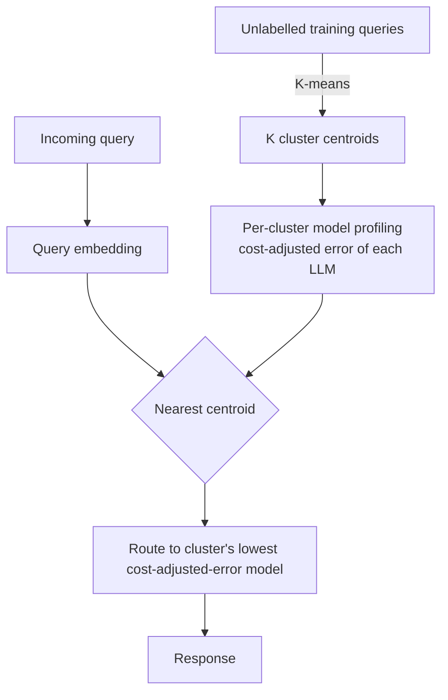

## Definition
**Clustering-based routing** groups similar queries with unsupervised learning (typically K-means over query embeddings) and assigns each cluster to its most cost-effective model, without requiring explicit task labels.

## Intuition
Queries that look alike in embedding space tend to need the same kind of model. So partition the query space once, measure how well each model does (per unit cost) on each region, and at inference just route a query to its nearest cluster's best model.

## How It Works
Offline: cluster a training set into K centroids and profile each candidate model's cost-adjusted error per cluster. Online: assign the query to its nearest centroid and route to that cluster's best model.

## Variants & Evolution
Per [[Dynamic Model Routing and Cascading for Efficient LLM Inference - A Survey]] (§4): *UniRoute* (K-means + unsupervised embedder; new LLMs added at inference time by profiling them on existing clusters, no retraining) and *Avengers-Pro* (clustering + scoring, reporting a Pareto frontier surpassing strong single models). A key advantage is label-free operation and easy extension to new models.

## Key Papers
- [[Dynamic Model Routing and Cascading for Efficient LLM Inference - A Survey]]

## Related Concepts
- [[Model Routing]]
- [[Small Language Models]]

## My Notes
The "add a new model without retraining" property is the standout — you just evaluate it on the existing clusters. Weakness: fixed clusters can stale as query distribution drifts, and embedding quality bounds routing quality.
