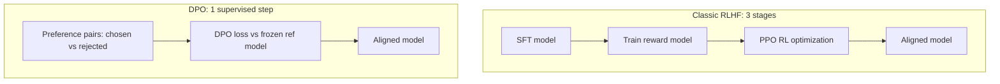

## Definition
Direct Preference Optimization (DPO) is a fine-tuning method that teaches a language model to prefer "good" responses over "bad" ones directly from preference pairs, without training a separate reward model like in classical RLHF.

## Intuition
Classical RLHF needs three stages: SFT → train reward model → PPO. DPO collapses this into a single supervised step using a clever mathematical reformulation. You just give it pairs of (preferred, rejected) responses and it learns the preference directly.

## How It Works

### Setup
For each prompt Q, you provide:
- **Y (chosen)** — the preferred response
- **R (rejected)** — the less preferred response

### Loss Function
$$L_{DPO} = -\mathbb{E}\left[\log \sigma\left(\beta \log \frac{M(Y|Q)}{M_{ref}(Y|Q)} - \beta \log \frac{M(R|Q)}{M_{ref}(R|Q)}\right)\right]$$

Where:
- `M` is the model being trained
- `M_ref` is the frozen reference model (usually the SFT-trained model)
- `β = 0.1` (typically) controls how aggressively to deviate from reference
- `σ` is the logistic function

**Term-by-term:**
- $L_{DPO}$ — the loss minimized over a dataset of preference pairs $(Q, Y, R)$.
- $\mathbb{E}[\cdot]$ — average over those (prompt, chosen, rejected) triples.
- $\dfrac{M(Y\mid Q)}{M_{ref}(Y\mid Q)}$ — the **likelihood ratio** between the trained model and the frozen reference on the *chosen* response. $>1$ means the model has become *more* likely than the reference to produce $Y$. The reference in the denominator is what keeps the model from drifting arbitrarily far — it plays the role RLHF's KL penalty plays.
- $\log\frac{M(Y|Q)}{M_{ref}(Y|Q)}$ — the log of that ratio. In DPO's derivation this quantity *is* the model's **implicit reward** for a response: $\hat r(Q,Y)=\beta\log\frac{M(Y|Q)}{M_{ref}(Y|Q)}$. This is the sense in which "your language model is secretly a reward model."
- The subtraction (chosen term − rejected term) — the **reward margin**: how much more the model rewards the chosen response than the rejected one. Training pushes this margin to be large and positive.
- $\beta$ — a temperature scaling the reward difference. Small $\beta$ (e.g. 0.1) = stay close to the reference, gentle updates; large $\beta$ = deviate aggressively. It's the same knob as the KL strength in RLHF.
- $\sigma(\cdot)$ — the **logistic (sigmoid)** function, $\sigma(x)=\frac{1}{1+e^{-x}}$. It maps the reward margin to a probability in $(0,1)$: this is the **Bradley–Terry** model of "probability that the chosen response beats the rejected one." Maximizing its log is exactly maximum-likelihood on the human preference labels.
- The minus sign — turns "maximize the log-probability that chosen ≻ rejected" into a loss to minimize.

### Why It Works
The math shows that maximizing this loss is equivalent to RLHF's objective, but without needing an explicit reward model. The model learns to **increase** the relative probability of chosen responses and **decrease** that of rejected ones.

*RLHF's three stages collapsed into DPO's single step:*

## Common Use Cases
- **Alignment** — teach model to refuse harmful prompts (chosen=refusal, rejected=compliance)
- **Style** — prefer concise over verbose (used in [[Efficient Long CoT Reasoning in Small Language Models]])
- **Quality** — prefer correct over incorrect reasoning
- **Safety** — reduce hallucinations

## Practical Tips
- Often combined with a small **SFT loss weight** (e.g., 0.3) to prevent likelihood collapse
- Reference model `M_ref` is typically the model after SFT, frozen during DPO
- Can over-fit fast — usually 1 epoch is enough
- Works best when chosen and rejected differ on a clear dimension (length, correctness, style)

## Variants
- **IPO** — Identity Preference Optimization (regularization variant)
- **KTO** — Kahneman-Tversky Optimization (single-response, not pairwise)
- **ORPO** — Odds Ratio Preference Optimization (removes need for ref model)
- **SimPO** — Simple Preference Optimization

## Key Papers
- Rafailov et al. 2023 — *Direct Preference Optimization: Your Language Model is Secretly a Reward Model* (original)
- [[Efficient Long CoT Reasoning in Small Language Models]] — uses DPO to prefer concise CoT over verbose

## Related Concepts
- [[RLHF]]
- [[SFT]]
- [[Knowledge Distillation]]

## My Notes
Used in the Efficient Long CoT paper to teach SLMs "concise reasoning is better than redundant reasoning" — chosen=pruned CoT, rejected=full bloated CoT. Elegant application: DPO is being repurposed beyond alignment into efficiency optimization.
