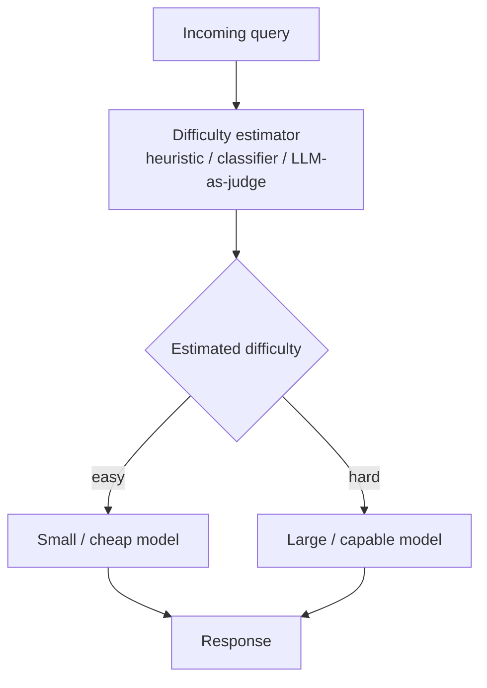

## Definition
**Difficulty-aware routing** estimates how hard an incoming query is and sends easy queries to small, cheap models and hard queries to large, capable ones — a pre-generation routing paradigm operating on query-level signals.

## Intuition
Most queries a system sees are easy and don't justify the biggest model. If you can cheaply guess "how hard is this?", you can match compute to need. Difficulty can be guessed from heuristics (length, word rarity, syntax), a trained classifier, or by asking an LLM-as-judge.

## How It Works
A lightweight difficulty estimator scores the query before any answer is generated, then a threshold maps the score to a model tier.

## Variants & Evolution
Per [[Dynamic Model Routing and Cascading for Efficient LLM Inference - A Survey]] (§2): *BEST-Route* (DeBERTa-v3-small multi-head router + [[Best-of-N]] sampling), *vLLM Semantic Router* (ModernBERT classifier that gates [[Chain-of-Thought]] reasoning), *RouteLMT* ([[LoRA]] probe on a small translator), *EmbedLLM* (matrix-factorization model embeddings), *ICL-Router* (in-context capability vectors), *GraphRouter* (GNN edge prediction over task/query/LLM graph), *IRT-Router* (Item Response Theory ability/difficulty model). Difficulty estimation also appears in single-LLM settings to decide whether to activate "thinking" mode.

## Key Papers
- [[Dynamic Model Routing and Cascading for Efficient LLM Inference - A Survey]]

## Related Concepts
- [[Model Routing]]
- [[Overthinking in Reasoning Models]]
- [[Small Language Models]]

## My Notes
The cheapest, most deployable paradigm: a small classifier in front of an SLM/LLM pair. The risk is calibration of the estimator — a mis-scored hard query routed to the small model produces a confident wrong answer with no second check (unlike [[Model Cascading]]).
