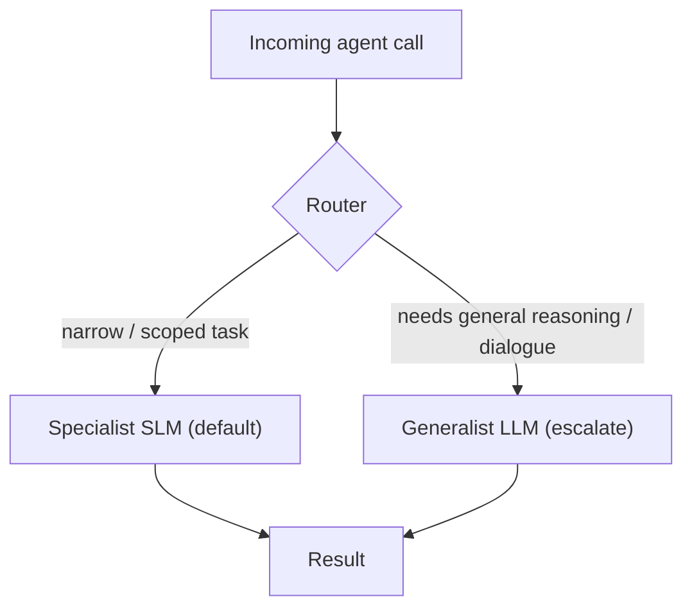

                                            cc 
## Definition
A heterogeneous agentic system is an [[Agentic AI|agent]] that invokes *multiple different language models* of varying sizes and specializations, choosing the cheapest capable model for each subtask rather than routing everything through one generalist LLM.

## Intuition
Because the agent's code controls every model call, it can in principle pick *any* model each time. So use small specialized [[Small Language Models|SLMs]] by default and reserve an LLM only for the rare calls that genuinely need general reasoning or open-domain conversation. A model can even be a *tool* called by another model. This is the natural entry point for SLMs into existing agents.

## How It Works
- **Default-SLM, escalate-to-LLM** routing: a router sends each call to a specialist SLM; falls back to an LLM only when needed.
- **Role split** (Belcak et al., Figure 1-Right): one SLM for conversationality, another for controller-defined tasks, etc. 

*Default-SLM, escalate-to-LLM routing:*

## Variants & Evolution
- Combine with tool calling, caching, and fine-grained routing for cost-effective, sustainable agents.
- Tension (counter-argument CA3): a single generalist LLM endpoint is easier to load-balance than many specialist SLM endpoints — routing and utilization are the open engineering problems.

## Key Papers
- [[Small Language Models are the Future of Agentic AI]]

## Related Concepts
- [[Agentic AI]]
- [[Small Language Models]]
- [[LLM-to-SLM Agent Conversion]]
- [[Tool Calling]]

## My Notes
The hard, under-specified piece is the **router**: it must be cheap and accurate, or it becomes a generalist LLM in disguise and erases the savings. A good experiment target.
