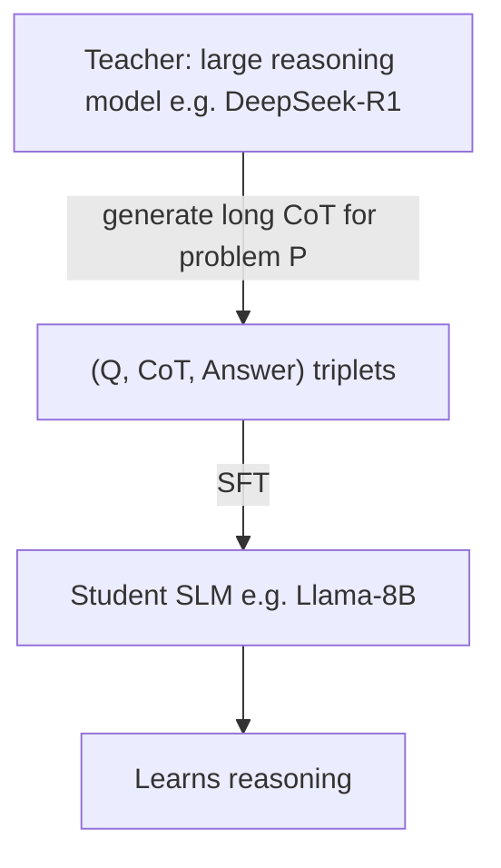

## Definition
Knowledge Distillation (KD) is a model compression technique where a smaller "student" model learns to mimic a larger "teacher" model, transferring the teacher's capabilities into a more efficient form.

## Intuition
You have a giant model that's smart but slow and expensive. You want a small model that runs on a laptop or phone but is *almost* as capable. Distillation is how you transfer the "knowledge" from big to small — typically by training the student on the teacher's outputs (or reasoning traces, or probability distributions).

## How It Works

### Classic KD (Hinton et al., 2015)
Student learns to match teacher's **soft probability distribution** (not just hard labels):
$$L_{KD} = T^2 \cdot KL(p_{teacher}^T \| p_{student}^T)$$

**Term-by-term:**
- $L_{KD}$ — the distillation loss the student minimizes. Lower = student's distribution is closer to the teacher's.
- $p_{teacher}^T$, $p_{student}^T$ — the **softened** output probability distributions of teacher and student over the vocabulary, each computed with a temperature $T$ inside the softmax: $p_i^T = \frac{\exp(z_i/T)}{\sum_j \exp(z_j/T)}$, where $z_i$ are the logits.
- $T$ (**temperature**) — controls how "soft" the distribution is. $T=1$ is the normal softmax; $T>1$ flattens the distribution, exposing the teacher's *relative* beliefs over wrong answers (the "dark knowledge" — e.g. that a "7" looks more like a "1" than a "cat"). That inter-class signal is far richer than a one-hot label.
- $KL(\cdot \| \cdot)$ — **Kullback–Leibler divergence**, an asymmetric measure of how far the student's distribution is from the teacher's. $KL(P\|Q)=\sum_i P_i \log \frac{P_i}{Q_i}$; it is $0$ only when the two match exactly. Here the teacher $P$ is the reference the student $Q$ is pulled toward.
- $T^2$ (the **scaling factor**) — softening by $T$ shrinks the gradients by roughly $1/T^2$. Multiplying the loss by $T^2$ restores gradient magnitude so the soft-target term keeps a stable weight when combined with a normal hard-label loss.

In practice the total loss is often a weighted sum of this $L_{KD}$ (soft targets) and a standard cross-entropy on the true hard labels.

### Modern Reasoning Distillation
Teacher (large reasoning model like DeepSeek-R1) generates CoT traces → student SLM fine-tunes on those traces via SFT.

## Variants & Evolution
- **Response-based KD** — student matches teacher's outputs
- **Feature-based KD** — student matches teacher's hidden representations
- **Reasoning Distillation** — student learns explicit reasoning chains
- **On-Policy Distillation** — pruning teacher data based on student's own capability ([[Efficient Long CoT Reasoning in Small Language Models]])

## Challenges
- Teacher outputs can be **too complex** for student to learn (overthinking)
- Student has different inductive biases than teacher
- Risk of student memorizing rather than generalizing
- Quality vs. quantity trade-off in distillation data

## Key Papers
- Hinton et al. 2015 — *Distilling the Knowledge in a Neural Network* (original)
- Guo et al. 2025 — *DeepSeek-R1* (modern reasoning distillation)
- [[Efficient Long CoT Reasoning in Small Language Models]] (on-policy refinement)

## Related Concepts
- [[Small Language Models]]
- [[SFT]]
- [[On-Policy Learning]]
- [[Chain-of-Thought]]

## My Notes
For my SLM research, distillation is the practical path to capable small models. The newer "on-policy" framing — where the student validates its own training data — is more aligned with my interest in SLM-specific training strategies.
