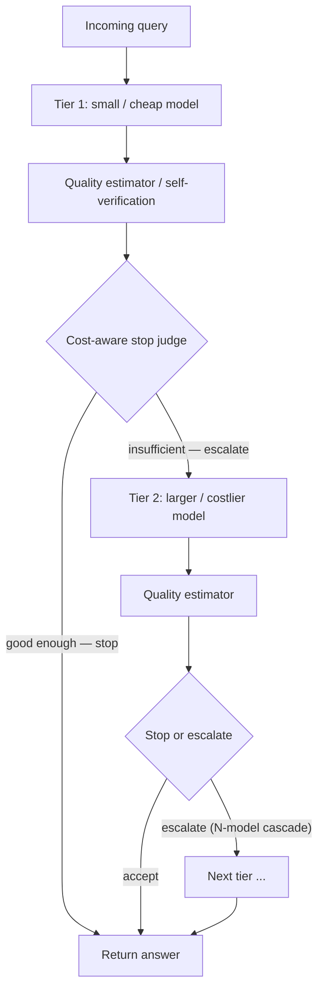

## Definition
**Model cascading** is a sequential inference strategy that first attempts a query with a smaller, cheaper model and escalates to larger, more capable models only when the initial response is judged insufficient by a quality or confidence estimator.

## Intuition
Instead of picking one model up front ([[Model Routing]]), you try the cheap model first and ask "is this answer good enough?" If yes, you stop and save money; if no, you defer to a stronger model. The decision hinges on a reliable quality/confidence signal — get that wrong and you either waste the big model on easy queries or ship bad answers from the small one.

## How It Works
## How It Works
Per [[Dynamic Model Routing and Cascading for Efficient LLM Inference - A Survey]], a typical cascade has: (1) generation by a small model, (2) a quality estimator or self-verification step, and (3) a cost-aware stop/escalate judge. Escalation can mean regenerating from scratch with a stronger model, or refining the small model's draft (e.g. automatic post-editing in machine translation). Quality estimation is identified as *the* critical factor for cascade success.

Representative methods: FrugalGPT (router + DistilBERT quality estimator + stop judge), AutoMix (POMDP router on few-shot self-verification), Self-REF (fine-tuned confidence tokens), Cascade Routing (unified routing+cascading), and LM-Blender (ensemble fuse).

## Variants & Evolution
Cascading sits at the post-generation end of the design space and is naturally multi-stage. The survey frames cascades as a flexible three-stage control pipeline (pre-router → verifier → escalation policy) whose stages can be combined, collapsed, or reordered. It notes RL is still under-explored for cascades.

## Key Papers
- [[Dynamic Model Routing and Cascading for Efficient LLM Inference - A Survey]]

## Related Concepts
- [[Model Routing]]
- [[Uncertainty Quantification]]
- [[Small Language Models]]

## My Notes
Cascading is the more honest framing for production: you rarely know query difficulty a priori, so a cheap-first / verify / escalate loop is robust. The open question for my work is whether SLM self-verification ([[Uncertainty Quantification]]) is calibrated enough on-device to be the escalation trigger without an external verifier.
