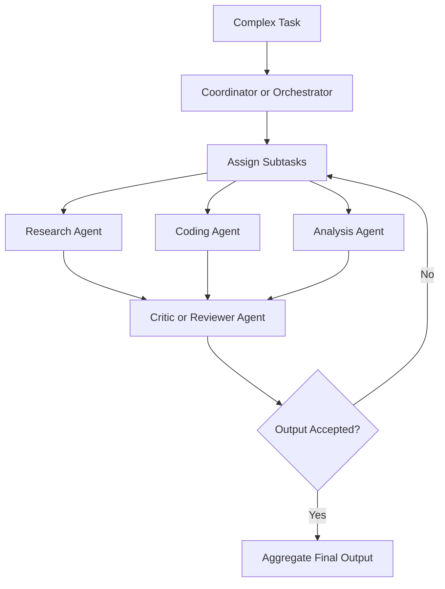

## Definition
The Multi-Agent Pattern is an agentic design pattern where a task is divided among multiple specialized LLM agents (e.g. planner, coder, reviewer) collaborating via a defined protocol to achieve a collective goal.

## Intuition
Rather than relying on a single monolithic generalist model, multi-agent systems assign distinct personas, guidelines, and tool subsets to specialized sub-agents. This mirrors human organizations (e.g., software engineering teams consisting of PMs, developers, and QA engineers). Specialization often leads to higher performance and cleaner separation of concerns.

## How It Works
1. **Coordination**: An orchestrator (or central coordinator agent) decomposes the task and assigns subtasks to specialists.
2. **Specialist Execution**: Specialist agents execute their designated tasks (e.g. writing code).
3. **Review/Criticism**: Critic agents review the output and provide feedback.
4. **Communication**: Agents pass structured messages or update a shared workspace (e.g., git repo, state store) to hand over work.

## Variants & Evolution
- **Hierarchical Multi-Agent**: Orchestrator controls flow; specialists have a parent-child relationship.
- **Collaborative/Choreographed Multi-Agent**: Agents interact via a message bus or state board without a strict hierarchy.
- **Heterogeneous Agent Systems**: Mixing larger LLMs for orchestration/review and smaller SLMs for narrow execution tasks.

## Key Papers
- [[Top AI Agentic Workflow Patterns]]

## Related Concepts
- [[Agentic AI]]
- [[Heterogeneous Agentic Systems]]
- [[Reflection Pattern]]

## My Notes
Extremely powerful for large, complex workflows. However, it introduces significant communication and state-management overhead. Debugging multi-agent interactions requires logging the complete conversation graph to trace cascading errors.
