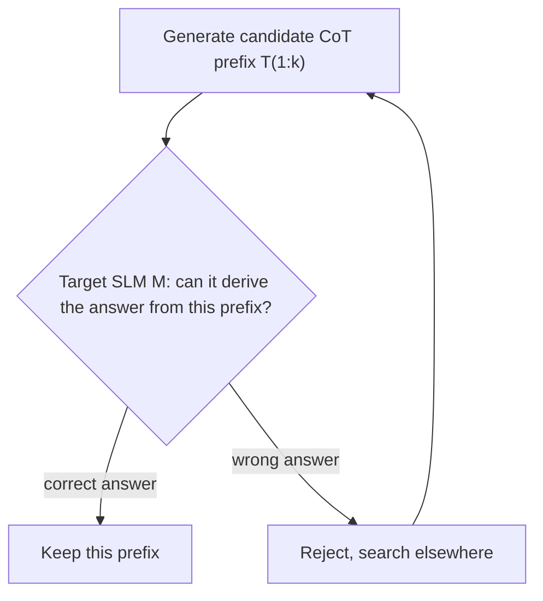

## Definition
On-policy learning is a training paradigm where the model's training data or feedback comes from **its own outputs** at the current training stage — as opposed to off-policy, where data comes from a different (e.g., older or external) policy.

## Intuition
Off-policy is like learning to cook by watching Gordon Ramsay — useful but his moves might not fit your skill level. On-policy is like learning by cooking yourself, then getting feedback on your own attempts. The data is tailored to your current capability.

## How It Works

### Classic RL Sense
- **On-policy** (e.g., PPO, GRPO) — collect rollouts from current policy, train on them, discard
- **Off-policy** (e.g., DQN) — replay buffer from old policies, more sample-efficient but less aligned

### In Modern LLM Training
- **On-policy CoT validation** — let the SLM itself decide if a pruned reasoning trace is good ([[Efficient Long CoT Reasoning in Small Language Models]])
- **On-policy preference data** — generate pairs from the current model rather than reusing old data
- **Self-rewarding** — model rates its own outputs

## On-Policy Validation (Efficient Long CoT paper)
This paper applies the on-policy idea to **data curation**, not just training:

The validator is the **target model itself**, not GPT-4 or another judge. This means:
- Pruned CoT aligns with the SLM's **own** reasoning capacity
- Different SLMs get different training data tailored to them
- Avoids "the teacher's reasoning was too complex for the student" problem

## Trade-offs
**Pros:**
- Data tailored to model's current capability
- Avoids distribution mismatch
- Naturally adapts as model improves

**Cons:**
- More expensive (need to query model repeatedly during data prep)
- Can reinforce model's existing biases
- Less sample-efficient than replaying old data

## Related Concepts
- [[RLHF]]
- [[DPO]]
- [[Knowledge Distillation]]
- [[Self-Consistency]]

## Key Papers
- [[Efficient Long CoT Reasoning in Small Language Models]] — on-policy validation for CoT pruning
- Most RLHF papers (PPO is on-policy)

## My Notes
The "on-policy validation" trick is one of the most reusable ideas from the Efficient Long CoT paper. It generalizes beyond CoT pruning — any time you're curating training data for a specific model, validating with that model could improve quality. Could be useful for my work on SLM tool-calling.
