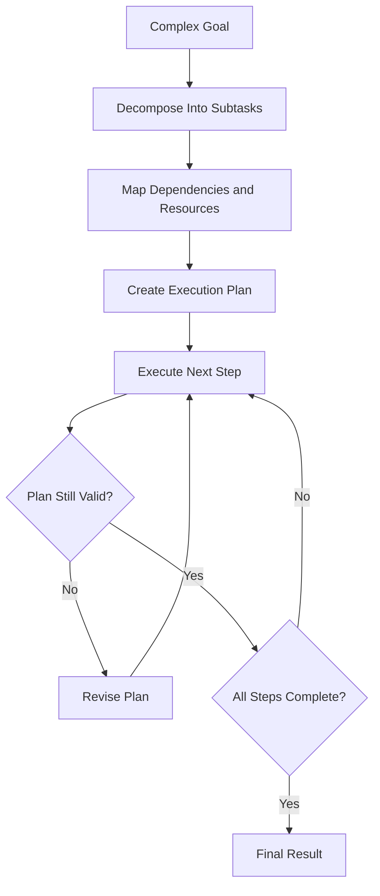

## Definition
The Planning Pattern is an agentic design pattern where an LLM decomposes a complex user goal into structured subtasks, analyzes their dependencies, and constructs an execution plan prior to taking external actions.

## Intuition
Unlike ReAct, which decides actions step-by-step on the fly, the Planning Pattern focuses on upfront strategic decomposition. The agent determines what steps can be run in parallel, which steps depend on prior steps, and what resources are required. This reduces backtracking and makes resource scheduling more predictable.

## How It Works
1. **Decomposition**: The agent breaks the main goal into smaller tasks.
2. **Dependency Mapping**: Tasks are sequenced (e.g. DAG creation).
3. **Execution**: The agent executes the tasks step-by-step.
4. **Replanning**: If a step fails, the agent intercepts the failure and dynamically modifies the remaining plan.

## Variants & Evolution
- **Static Planning**: The plan is fixed upfront and run to completion (fails if any step fails).
- **Dynamic Replanning**: The plan is updated dynamically based on intermediate tool outputs or environmental feedback.
- **Tree-of-Thoughts (ToT)**: Expands multiple candidate plans concurrently and uses search algorithms (like BFS/DFS) to explore paths.

## Key Papers
- [[Top AI Agentic Workflow Patterns]]

## Related Concepts
- [[Agentic AI]]
- [[ReAct Pattern]]

## My Notes
Upfront planning works best in relatively predictable domains with clear constraints (e.g. data processing pipelines, software builds). Under high uncertainty, the planning overhead is wasted, and reactive agents (ReAct) are more resilient.
