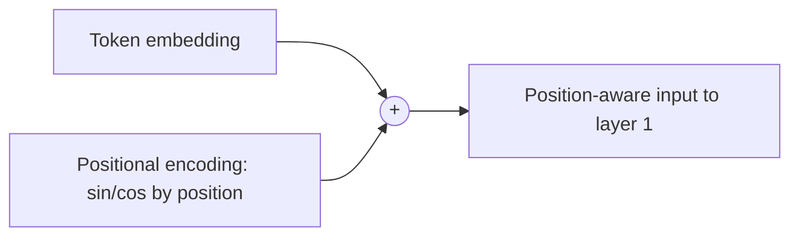

## Definition
> A method for injecting information about token order into a model that, unlike RNNs/CNNs, has no inherent notion of sequence position.

## Intuition
Self-[[Attention]] is permutation-equivariant: shuffle the input tokens and the raw attention computation doesn't know the difference. To recover word order, you add a position-dependent signal to each token embedding before the first layer, so "the cat sat" and "sat the cat" produce different representations.

## How It Works
The original [[Transformer]] uses fixed **sinusoidal** encodings added to the input embeddings:

`PE(pos, 2i)   = sin(pos / 10000^(2i/dmodel))`
`PE(pos, 2i+1) = cos(pos / 10000^(2i/dmodel))`

- `pos` = position, `i` = dimension index. Each dimension is a sinusoid; wavelengths form a geometric progression from `2π` to `10000·2π`.
- Same dimension `dmodel` as the embeddings, so they sum directly.
- Rationale: for any fixed offset `k`, `PE(pos+k)` is a linear function of `PE(pos)`, which the authors hypothesized would help the model attend by *relative* position.
- Chosen over **learned** positional embeddings (which gave nearly identical results in their ablation, Table 3 row E) because fixed sinusoids might extrapolate to sequence lengths longer than seen in training.

*Position signal added to embeddings before layer 1:*

## Variants & Evolution
- **Learned absolute** embeddings — a trainable vector per position (near-identical results in the original paper; later standard in BERT/GPT-style models).
- **Relative position** encodings and **RoPE** (rotary) — encode relative offsets, now common in modern LLMs; worth their own note when they come up.
- **ALiBi** — additive linear bias on attention scores for length extrapolation.

## Key Papers
- [[Attention Is All You Need]]

## Related Concepts
- [[Attention]]
- [[Transformer]]

## My Notes
- The "extrapolate to longer sequences" hope was never actually demonstrated in the original paper — it became a real research thread later (RoPE scaling, ALiBi). Relevant to my long-context / on-device interest.
