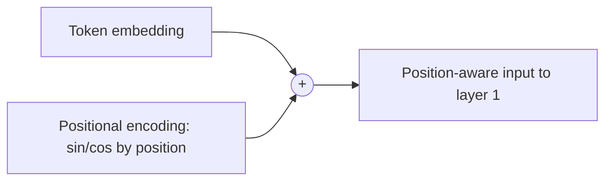

## Definition
> A method for injecting information about token order into a model that, unlike RNNs/CNNs, has no inherent notion of sequence position.

## Intuition
Self-[[Attention]] is permutation-equivariant: shuffle the input tokens and the raw attention computation doesn't know the difference. To recover word order, you add a position-dependent signal to each token embedding before the first layer, so "the cat sat" and "sat the cat" produce different representations.

## How It Works
The original [[Transformer]] uses fixed **sinusoidal** encodings added to the input embeddings:

`PE(pos, 2i)   = sin(pos / 10000^(2i/dmodel))`
`PE(pos, 2i+1) = cos(pos / 10000^(2i/dmodel))`

- `pos` = position, `i` = dimension index. Each dimension is a sinusoid; wavelengths form a geometric progression from `2π` to `10000·2π`.
- Same dimension `dmodel` as the embeddings, so they sum directly.
- Rationale: for any fixed offset `k`, `PE(pos+k)` is a linear function of `PE(pos)`, which the authors hypothesized would help the model attend by *relative* position.
- Chosen over **learned** positional embeddings (which gave nearly identical results in their ablation, Table 3 row E) because fixed sinusoids might extrapolate to sequence lengths longer than seen in training.

**Term-by-term:**
- **PE(pos, ·)** — the positional-encoding vector for the token at position `pos`. It has the same length `dmodel` as the token embedding so the two can be added element-wise.
- **pos** — the token's absolute index in the sequence (0, 1, 2, …). This is the quantity being encoded.
- **i** — the index of the dimension *pair* within the vector. Even dimensions (`2i`) use sine, odd dimensions (`2i+1`) use cosine, so each pair `(2i, 2i+1)` is a (sin, cos) couple sharing one frequency.
- **10000^(2i/dmodel)** — the per-dimension **wavelength control**. As `i` grows from 0 to `dmodel/2`, the exponent goes 0→1, so the divisor sweeps from 1 up to 10000. Low dimensions oscillate fast (short wavelength), high dimensions oscillate slowly (long wavelength) — together they form a geometric progression of frequencies.
- **why sin *and* cos** — pairing them is what makes `PE(pos+k)` expressible as a fixed linear (rotation) transform of `PE(pos)`: a shift by `k` rotates each (sin, cos) pair by a constant angle. That's the property that lets attention reason about *relative* offsets, and it's the same idea RoPE later builds on.
- **10000** — an arbitrary constant setting the longest wavelength; big enough that even distant positions get distinguishable codes without the fast dimensions aliasing.

*Position signal added to embeddings before layer 1:*

## Variants & Evolution
- **Learned absolute** embeddings — a trainable vector per position (near-identical results in the original paper; later standard in BERT/GPT-style models).
- **Relative position** encodings and **RoPE** (rotary) — encode relative offsets, now common in modern LLMs; worth their own note when they come up.
- **ALiBi** — additive linear bias on attention scores for length extrapolation.

## Key Papers
- [[Attention Is All You Need]]

## Related Concepts
- [[Attention]]
- [[Transformer]]

## My Notes
- The "extrapolate to longer sequences" hope was never actually demonstrated in the original paper — it became a real research thread later (RoPE scaling, ALiBi). Relevant to my long-context / on-device interest.
