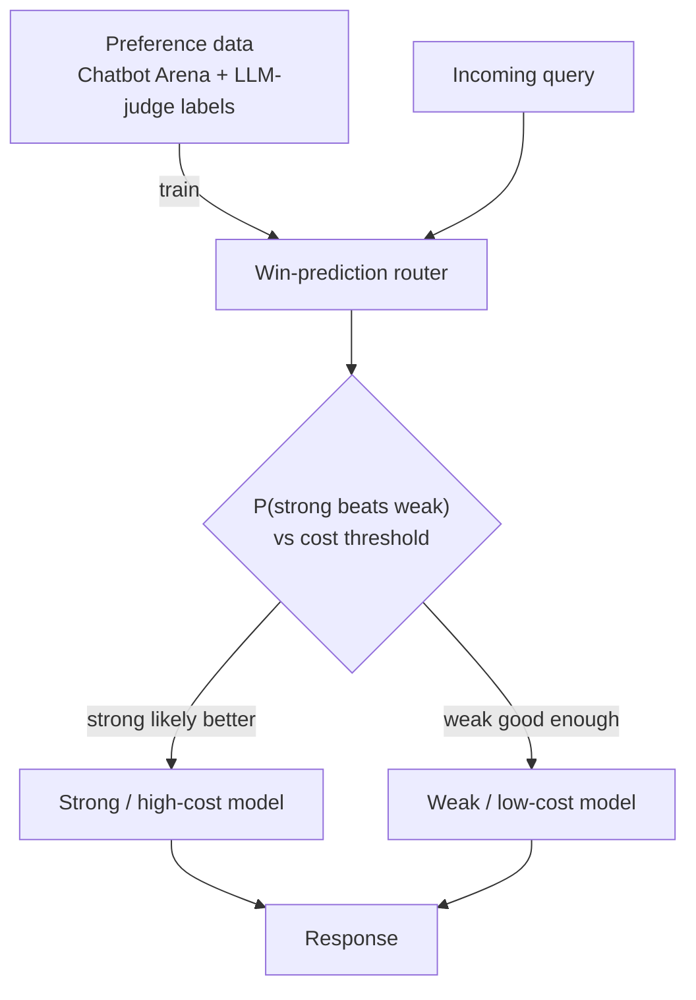

## Definition
**Preference-aligned routing** trains the router on human (or synthetic) preference data so it predicts which model a user would prefer for a given query, then routes to maximize expected preference subject to cost.

## Intuition
Rather than defining "difficulty," you learn directly from comparisons: for queries like this, did people prefer the strong model or was the weak model good enough? The router becomes a win-predictor between a strong/expensive and weak/cheap model.

## How It Works
A win-prediction model is trained on pairwise preference labels (e.g. Chatbot Arena), optionally augmented with an LLM judge, then used at inference to pick a model.

## Variants & Evolution
Per [[Dynamic Model Routing and Cascading for Efficient LLM Inference - A Survey]] (§3): *RouteLLM* (human Arena labels + LLM-judge augmentation; SW-Ranking / matrix-factorization / BERT / causal-LLM routers), *Arch-Router* (1.5B model conditioned on user-defined domain-action policies, updatable without retraining), *Hybrid LLM* and *Arch-Router* using synthetic preferences, *P2L* (prompt-specific Bradley-Terry coefficients), *Eagle* (training-free ELO ranking), *Zooter* (reward-guided distillation into mDeBERTa-v3-base). See [[Reward Model]].

## Key Papers
- [[Dynamic Model Routing and Cascading for Efficient LLM Inference - A Survey]]

## Related Concepts
- [[Model Routing]]
- [[RLHF]]
- [[Reward Model]]

## My Notes
Attractive because it optimizes the thing you actually care about (user preference), not a proxy like difficulty. Cost: you need preference data, and routers trained on a fixed model pair (strong/weak) generalize poorly when the pool changes.
