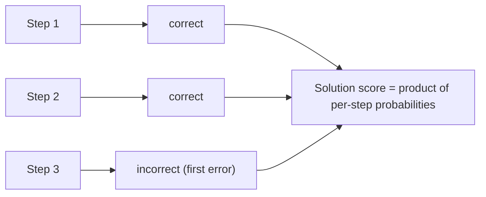

## Definition
Process supervision trains a [[Reward Model]] (a [[PRM]]) by giving feedback on **every intermediate reasoning step** of a solution, rather than only on the final answer.

## Intuition
Instead of telling the model "the final answer was wrong," process supervision points at *which step* went wrong. For multi-step reasoning this is a much richer training signal: it makes credit assignment easy and rewards the model for following a human-endorsed [[Chain-of-Thought]] rather than for stumbling into the right answer via flawed reasoning.

## How It Works
A [[PRM]] predicts a correctness label after each step; the solution's score is typically the probability that *all* steps are correct (product of per-step probabilities). Human labelers mark steps positive/negative/neutral, often supervising only up to the **first incorrect step**. Contrast with [[Outcome Supervision]], which only scores the final result.

*A PRM scores every step; solution score is the product of per-step probabilities:*

## Variants & Evolution
Introduced for math reasoning by Uesato et al. (2022) and scaled up in [[Let's Verify Step by Step]] (OpenAI, 2023), which showed process supervision strongly beats [[Outcome Supervision]] on [[MATH]] and released [[PRM800K]]. Later work uses PRMs as verifiers for test-time search and as reward signals in reasoning-model training.

## Key Papers
- [[Let's Verify Step by Step]]

## Related Concepts
- [[Outcome Supervision]]
- [[Reward Model]]
- [[Chain-of-Thought]]
- [[RLHF]]

## My Notes
Stub — created from [[Let's Verify Step by Step]]. Expand with the credit-assignment argument and the "negative alignment tax" framing.
