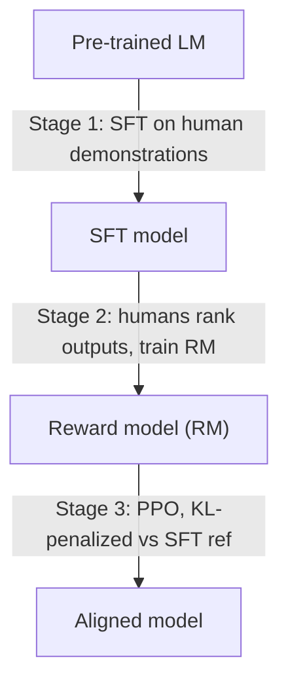

## Definition
Reinforcement Learning from Human Feedback (RLHF) is a fine-tuning technique that aligns a language model with human preferences by training a *reward model* on human comparisons of outputs, then optimizing the LM (via RL, typically PPO) to maximize that learned reward.

## Intuition
Pretraining and [[SFT]] teach a model to imitate text, but imitation can't express "response A is *better* than response B." RLHF closes that gap: humans rank model outputs, a reward model learns to predict those rankings, and the LM is then nudged to produce outputs the reward model scores highly. This is what turned raw GPT-style models into helpful, instruction-following assistants (e.g. InstructGPT → ChatGPT).

## How It Works

### The classic 3-stage pipeline

1. **Supervised fine-tuning ([[SFT]])** — establishes a reasonable base policy from human demonstrations.
2. **Reward model training** — collect pairs/rankings of outputs for the same prompt; train a model to output a scalar reward consistent with human preference (Bradley–Terry style loss).
3. **RL policy optimization** — usually **PPO (Proximal Policy Optimization)**. The LM (policy) generates responses, the RM scores them, and PPO updates the policy to increase expected reward. A **KL-divergence penalty** against the frozen SFT reference model prevents the policy from drifting too far and "reward hacking."

### Key ingredients
- **Reward model** — the learned stand-in for human judgment (the expensive, fragile part).
- **PPO** — an **on-policy** RL algorithm (see [[On-Policy Learning]]): it learns from fresh samples the current policy generates, not a static dataset.
- **KL constraint** — keeps the tuned model close to the reference, balancing alignment vs capability retention.

## Variants & Evolution
- **[[DPO]]** (Rafailov et al., 2023) — collapses RLHF into a single supervised loss on preference pairs, *removing the explicit reward model and the RL loop*. The DPO note frames itself directly against this RLHF pipeline.
- **RLAIF** — Reinforcement Learning from *AI* Feedback: an LLM replaces human labelers to generate preferences cheaply (e.g. Constitutional AI).
- **GRPO** — Group Relative Policy Optimization; used by [[DeepSeek-R1]] with rule-based/verifiable rewards instead of a learned RM, especially for math/code where correctness is checkable.
- **Other preference-optimization methods** — IPO, KTO, ORPO, SimPO (see [[DPO]] variants).

## Key Papers
- Christiano et al. 2017 — *Deep Reinforcement Learning from Human Preferences* (origin of the RM-from-comparisons idea)
- Ouyang et al. 2022 — *Training language models to follow instructions with human feedback* (InstructGPT; the canonical LM RLHF recipe)
- Bai et al. 2022 — *Constitutional AI* (RLAIF; AI-generated feedback)
- Rafailov et al. 2023 — *Direct Preference Optimization* (the [[DPO]] simplification)

## Related Concepts
- [[DPO]] — the now-popular RL-free alternative
- [[SFT]] — the supervised stage that precedes RLHF
- [[On-Policy Learning]] — why PPO needs fresh on-policy samples
- [[Knowledge Distillation]] — an alternative way to transfer behavior without preferences
- [[DeepSeek-R1]] — uses RL (GRPO) with verifiable rewards, a reasoning-era descendant of RLHF

## My Notes
RLHF is the "classical" alignment pipeline that everything else in this vault is measured against. The trend in 2024–2025 has been to *avoid its complexity*: [[DPO]] drops the reward model, and reasoning models like [[DeepSeek-R1]] swap human preference rewards for rule-based/verifiable ones. Worth remembering the through-line: SFT teaches *what to say*, RLHF/DPO teach *what to prefer*, and the KL penalty is the safety rail that keeps the model from collapsing into the reward.
