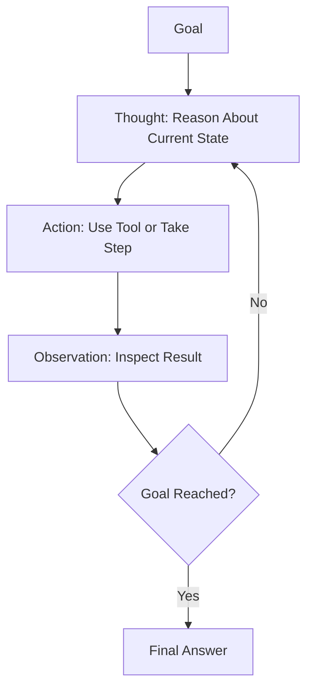

## Definition
The ReAct (Reason and Act) Pattern is an agentic design pattern that combines reasoning traces and task-specific actions in an interleaved manner, enabling LLMs to dynamically create, maintain, and adjust plans while interacting with external tools.

## Intuition
Normally, agents either plan silently (CoT) or act blindly. ReAct forces the agent to alternate between writing a "Thought" (reasoning about what to do next) and executing an "Action" (calling a tool), then viewing the "Observation" (tool output). This provides a structured, interpretable loop that makes error correction and path adaptation natural.

## How It Works
The execution loop runs as:
- **Thought**: "I need to find X. I will use the search tool to look up Y."
- **Action**: `search(query="Y")`
- **Observation**: "Search results show Z."
- **Thought**: "Based on Z, I now need to compute W. I will use the calculator."
This process repeats until the agent outputs the final answer.

## Variants & Evolution
- **ReAct with Self-Consistency (CoT-SC)**: Running multiple ReAct trajectories and voting on the final result.
- **Plan-and-Solve**: Separating the plan generation from the execution loop, rather than interleaving them dynamically at every single step.

## Key Papers
- [[ReAct - Synergizing Reasoning and Acting in Language Models]]
- [[Top AI Agentic Workflow Patterns]]

## Related Concepts
- [[Agentic AI]]
- [[Tool Use Pattern]]
- [[Chain-of-Thought]]

## My Notes
The ReAct loop is the foundational pattern behind most modern agent frameworks (like LangChain, AutoGPT). It is simple but powerful, although it is prone to hallucination loops if the model gets stuck in repetitive thoughts.
