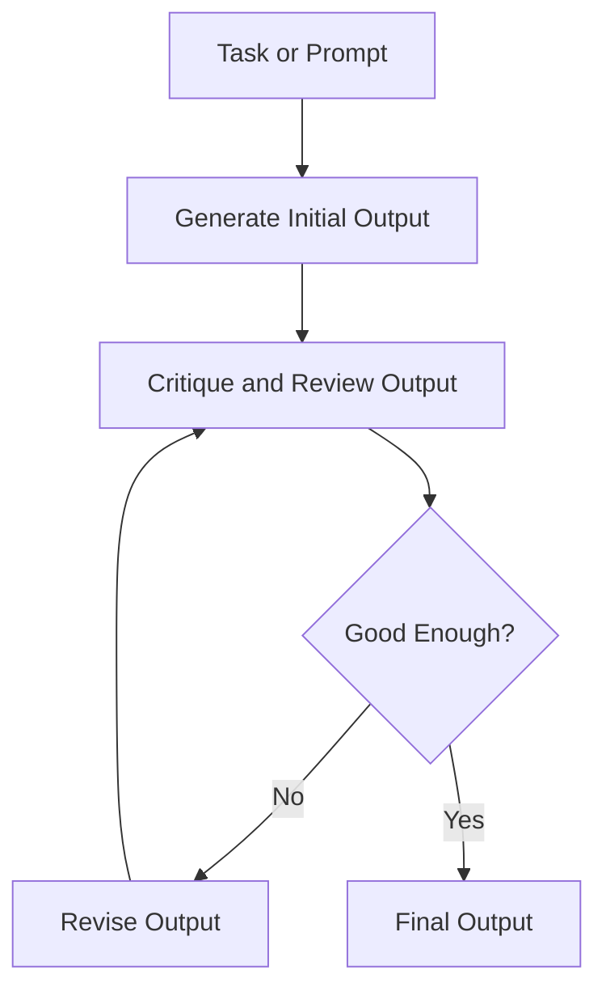

## Definition
The Reflection Pattern is an agentic design pattern where an LLM reviews, critiques, and refines its own output iteratively before producing a final result.

## Intuition
Instead of accepting the model's first-turn output as final, reflection introduces a self-critique loop. The model acts as both generator and critic, identifying bugs, inaccuracies, or stylistic errors, and then generating a revised version. This mirrors how humans draft, critique, and edit their work.

## How It Works
1. **Generation**: The agent generates an initial draft.
2. **Critique**: The agent (or a separate critic model) evaluates the draft against specific criteria (accuracy, clarity, safety, code correctness).
3. **Revision**: The agent updates the draft to address the critique points.
4. **Exit Condition**: The loop terminates after a set number of iterations or when the critique passes a quality gate.

## Variants & Evolution
- **Self-Critique (Single-Model)**: The same model generates and critiques.
- **Critic-Generator (Multi-Model)**: One model generates, while another (possibly larger or specialized) critiques.
- **Lego-like / Specialized Reflection**: Criticizing specifically for a single dimension (e.g. security audits in code).

## Key Papers
- [[Top AI Agentic Workflow Patterns]]

## Related Concepts
- [[Agentic AI]]
- [[Multi-Agent Pattern]]

## My Notes
A highly effective pattern for code generation and technical writing, but adds significant latency and token cost due to sequential LLM calls.
