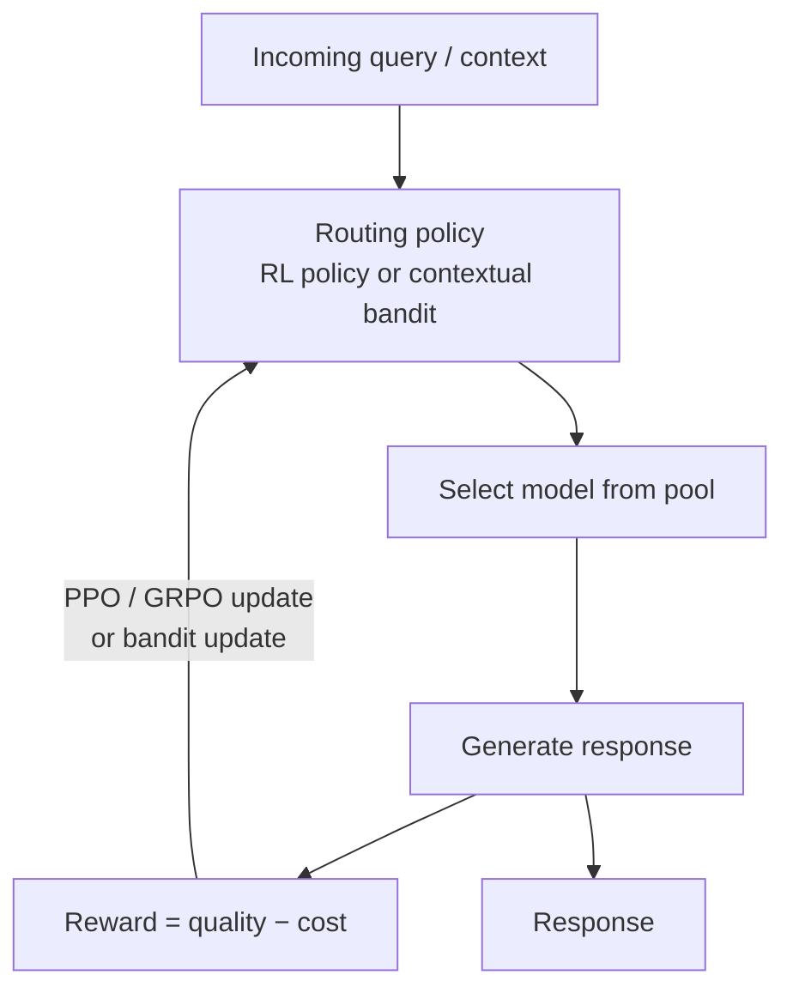

## Definition
**Reinforcement learning routing** formulates model selection as decision-making under uncertainty, learning a routing policy from reward feedback that combines answer quality and cost — via policy optimization or online bandits.

## Intuition
Instead of a fixed rule, the router *learns* which model to pick by trial and reward. Two flavors: offline policy optimization (train a policy that can reason and route over multiple steps) and online bandits (keep improving the policy from live feedback, balancing exploration vs exploitation).

## How It Works
The router selects a model (action) given the query (context/state); the realized quality-minus-cost is the reward used to update the policy.

## Variants & Evolution
Per [[Dynamic Model Routing and Cascading for Efficient LLM Inference - A Survey]] (§5):
- **Policy optimization:** *Router-R1* (LLM router alternating think/route, max 4 steps, [[PPO]]), *R2-Reasoner* (task decomposer + subtask allocator, [[GRPO]], staged SFT+RL), *SCOPE* (GRPO-trained performance estimator rather than a policy).
- **Bandits ([[Contextual Bandit]]):** *MetaLLM* (multi-armed bandit), *MixLLM* (contextual bandit + policy gradient on binary feedback), *PILOT* (LinUCB with preference priors), *GreenServ* (energy-aware LinUCB), *Dueling Feedback* (FGTS.CDB), *TI-UCB* (non-stationary, improving pools).

## Key Papers
- [[Dynamic Model Routing and Cascading for Efficient LLM Inference - A Survey]]

## Related Concepts
- [[Model Routing]]
- [[Contextual Bandit]]
- [[PPO]]
- [[GRPO]]

## My Notes
Bandit variants are the most production-friendly: they learn from cheap binary "was this accepted?" feedback online, no labeled set. Policy-optimization variants (multi-step think/route) add latency from multiple model calls, so they pay off mainly when per-call API cost dominates.
