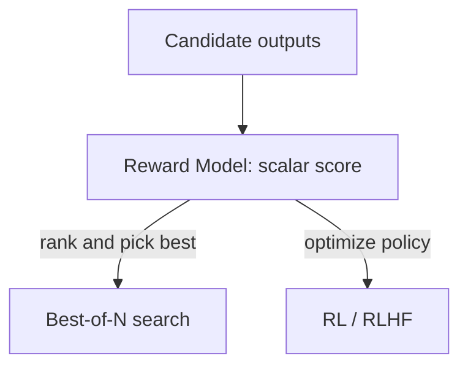

## Definition
A reward model (RM) is a learned model that assigns a scalar quality score to a model's output, acting as a stand-in for human judgment that can be queried cheaply at scale.

## Intuition
Human feedback is expensive and slow; a reward model distills it into a function you can call millions of times. That score then drives either **search** (rank N candidate outputs and keep the best — see [[Best-of-N]]) or **RL** (optimize a policy to maximize reward — see [[RLHF]]). The whole system is only as reliable as the RM, so how you train it matters.

## How It Works
RMs are trained from human signal — preference comparisons (as in [[RLHF]]) or correctness labels. Two label granularities are central in reasoning work: an [[ORM]] scores the whole output ([[Outcome Supervision]]), while a [[PRM]] scores each reasoning step ([[Process Supervision]]).

*A reward model's score drives either search or RL:*

## Variants & Evolution
[[RLHF]] popularized preference-trained RMs for alignment. For reasoning, [[Let's Verify Step by Step]] (2023) showed step-level [[PRM|PRMs]] outperform answer-level [[ORM|ORMs]]. Verifiable/rule-based rewards (e.g. in [[DeepSeek-R1]]) replace a learned RM where correctness is checkable.

## Key Papers
- [[Let's Verify Step by Step]]
- [[RLHF]]

## Related Concepts
- [[Process Supervision]]
- [[Outcome Supervision]]
- [[RLHF]]
- [[Best-of-N]]

## My Notes
Stub — created from [[Let's Verify Step by Step]].
