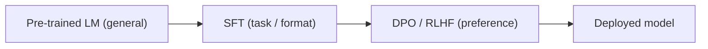

## Definition
Supervised Fine-Tuning (SFT) is the process of training a pre-trained language model on labeled (input, output) pairs to teach it specific behaviors, formats, or skills.

## Intuition
A pre-trained model is a generalist — it has read the internet but doesn't know how *you* want it to respond. SFT is how you "shape" it for a specific task: customer support, code generation, instruction following, or — in [[Efficient Long CoT Reasoning in Small Language Models]] — concise reasoning.

## How It Works
Given dataset `D = {(Q, Y)}` of question-answer pairs, minimize negative log-likelihood:

$$L_{SFT} = -\mathbb{E}_{(Q, Y) \sim D} \log M(Y | Q)$$

The model learns to maximize probability of `Y` given `Q`. Standard cross-entropy training.

**Term-by-term:**
- $L_{SFT}$ — the loss being minimized. Minimizing a *negative* log-likelihood is the same as *maximizing* the likelihood the model assigns to the target answers.
- $\mathbb{E}_{(Q,Y)\sim D}$ — the **expectation** (average) over question–answer pairs drawn from the dataset $D$. In practice this is the mean over the training batch.
- $M(Y\mid Q)$ — the probability the model $M$ assigns to producing the target output $Y$ given the input $Q$. For a sequence it factorizes autoregressively: $M(Y\mid Q)=\prod_t M(y_t \mid Q, y_{<t})$ — the product of the probabilities of each token given everything before it.
- $\log$ — turns that product of per-token probabilities into a sum of log-probabilities (numerically stable, and it's what makes this equivalent to token-level **cross-entropy** against the ground-truth tokens).
- The minus sign — probabilities are $\le 1$ so their logs are negative; negating makes the loss a positive quantity to drive toward zero.

The key limitation is visible in the formula: every pair $(Q,Y)$ is treated as equally, unconditionally correct — there is no term expressing that one answer is *better* than another (that's what [[DPO]]/RLHF add).

## When to Use SFT
- **Instruction tuning** — teach model to follow instructions
- **Domain adaptation** — make model good at specific topics (medical, legal)
- **Format learning** — JSON outputs, specific structures
- **Distillation step** — first stage when learning from teacher outputs (see [[Knowledge Distillation]])
- **Pre-RLHF stage** — usually SFT comes before [[DPO]] or RLHF

## Typical Recipe
- 1-3 epochs (more risks overfitting)
- Low learning rate (1e-6 to 5e-5)
- Cosine schedule with warmup
- LoRA / QLoRA for parameter-efficient variants
- Pack multiple examples to maximize GPU utilization

## SFT in Pipeline

## Limitations
- Only mimics the data — can't surpass demonstration quality
- Risk of catastrophic forgetting of pre-training knowledge
- No notion of "better" vs "worse" — every example treated as ground truth
- Cannot teach what to *avoid* (that's what [[DPO]] / RLHF is for)

## Key Papers
- Most modern instruction-tuning papers use SFT as a baseline
- [[Efficient Long CoT Reasoning in Small Language Models]] — uses SFT on pruned CoT data

## Related Concepts
- [[DPO]]
- [[RLHF]]
- [[Knowledge Distillation]]
- [[LoRA]]

## My Notes
SFT is the workhorse. Every fine-tuning project starts here. The interesting innovations are usually in *what data* you SFT on — like the on-policy pruned CoT data in the Efficient Long CoT paper.
