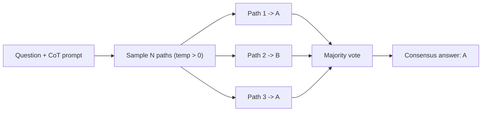

## Definition
Self-consistency (often abbreviated **CoT-SC**) is a decoding strategy for reasoning: instead of taking one greedy [[Chain-of-Thought]] answer, sample *multiple* diverse reasoning paths and return the **majority-vote** final answer (Wang et al., 2022).

## Intuition
A single chain of thought is brittle — one bad step dooms the whole answer. But there are usually many valid ways to reach a correct answer and comparatively few ways to reach a *specific wrong* one. So if you sample several independent reasoning paths, the correct answer tends to be the most common endpoint even when individual chains disagree. Self-consistency exploits this: it marginalizes over the reasoning, keeping only the consensus answer.

## How It Works
1. Prompt the model with [[Chain-of-Thought]] exemplars.
2. **Sample** N reasoning paths with a non-zero decoding temperature (diversity is the point), rather than greedy/beam decoding.
3. Extract the final answer from each path.
4. **Majority-vote** over the final answers; ties broken by frequency.

Cost scales linearly with N (N full generations per question), so it is a pure test-time-compute lever — more samples, higher accuracy, diminishing returns. It applies wherever answers are comparable (multiple-choice, numeric, short spans).

*Sample many reasoning paths, then take the majority answer:*

## Variants & Evolution
- **Origin:** Wang et al., 2022, *Self-Consistency Improves Chain of Thought Reasoning in Language Models* (arXiv 2203.11171).
- **As a baseline/component:** in [[ReAct - Synergizing Reasoning and Acting in Language Models|ReAct]], CoT-SC samples **21** chains at temperature 0.7 and consistently beats plain CoT; ReAct↔CoT-SC back-off reaches 21-sample quality with only 3–5 samples.
- **Related test-time-compute methods:** [[Best-of-N]] (rank candidates with a [[Reward Model]] instead of majority vote), and weighted/verifier-guided voting (e.g. [[PRM]]-weighted voting in [[Let's Verify Step by Step]]).

## Key Papers
- [[ReAct - Synergizing Reasoning and Acting in Language Models]]
- [[Let's Verify Step by Step]]

## Related Concepts
- [[Chain-of-Thought]]
- [[Best-of-N]]
- [[Reward Model]]

## My Notes
Self-consistency is the cheapest, model-agnostic way to trade compute for accuracy on reasoning — no extra training, no verifier. The natural next step up is replacing the unweighted majority vote with a learned scorer ([[Best-of-N]] / [[PRM]]-weighted voting), which is exactly the direction [[Let's Verify Step by Step]] pushes.
