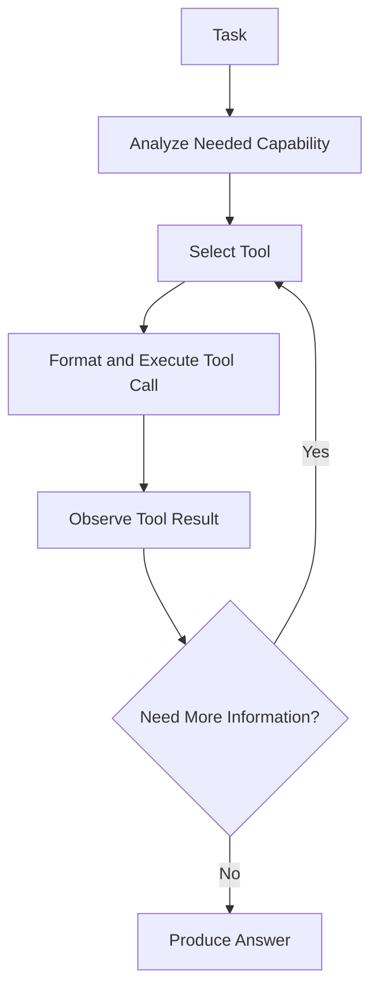

## Definition
The Tool Use Pattern is an agentic design pattern where an LLM is equipped with external interfaces (APIs, search engines, calculators, code execution environments) and dynamically determines when and how to invoke them to solve a task.

## Intuition
Standard LLMs are limited by static pre-training data and struggle with math, real-time facts, and database interactions. By giving them tools, they can offload specific operations (like calculation or search) to dedicated software systems. The LLM acts as the central router/decision-maker, executing actions, digesting outputs, and adapting.

## How It Works
1. **Selection**: The agent parses the user query and decides which tool is appropriate.
2. **Parameter Extraction**: The agent formats the arguments for the tool call (usually as structured JSON or specific schema).
3. **Execution**: The runtime environment executes the tool and returns the observation/result.
4. **Integration**: The agent receives the tool output and uses it to answer the prompt or decide on further actions.

## Variants & Evolution
- **Function Calling**: Native support built into modern LLM APIs (e.g. OpenAI function calling) where the model is trained to output JSON matching a schema.
- **ReAct (Reason and Act)**: Interleaves explicit thoughts with tool use.
- **MRKL / Toolformer**: Distilled or specialized models trained specifically to emit API tokens inline.

## Key Papers
- [[Top AI Agentic Workflow Patterns]]
- [[ReAct - Synergizing Reasoning and Acting in Language Models]]

## Related Concepts
- [[Agentic AI]]
- [[Tool Calling]]
- [[ReAct Pattern]]

## My Notes
Tool use is the core mechanism enabling LLMs to interact with the physical/digital world. For Lead Data Engineers, robust error handling around tool failures (timeouts, schema validation errors) is critical when constructing agent execution engines.
