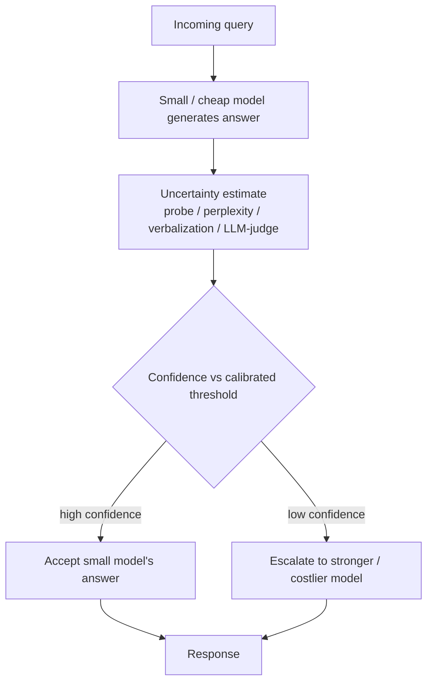

## Definition
**Uncertainty Quantification (UQ)** is the estimation of how confident a model is in its own output, ideally such that the confidence is well-aligned with actual correctness — used in routing to decide when to escalate a query to a more capable model.

## Intuition
If a small model "knows when it doesn't know," you can trust it on the queries it's sure about and only pay for a big model on the rest. The whole value of UQ for routing hinges on *calibration*: reported confidence must track real correctness, or escalation decisions are noise.

## How It Works
## How It Works
Per [[Dynamic Model Routing and Cascading for Efficient LLM Inference - A Survey]], UQ methods for routing fall into families:

- **Probe-based** — a trained classifier reads hidden states to predict correctness (most reliable, but needs weight access + supervision).
- **Probability/perplexity-based** — derive confidence from token probabilities or logits (e.g. CP-Router applies conformal prediction to answer-option logits).
- **Verbalization** — the model self-reports a confidence score (one-step or two-step); found to be poorly aligned with correctness.
- **LLM-as-a-Judge** — an external model rates response quality as a confidence proxy.

The survey reports that probe-based and perplexity-based methods significantly outperform verbalization, and that SLMs can match LLM performance on their high-confidence (top 20%) queries.

As a routing paradigm, the confidence estimate becomes the escalation trigger: confident → keep the cheap model's answer; uncertain → defer to a stronger model.

## Variants & Evolution
UQ underpins the uncertainty-based routing paradigm and the verification step of cascades (AutoMix self-verification, Self-REF confidence tokens). Extending reliable probes from text to multimodal inputs (ReLope) is an active frontier.

## Key Papers
- [[Dynamic Model Routing and Cascading for Efficient LLM Inference - A Survey]]

## Related Concepts
- [[Model Cascading]]
- [[Model Routing]]
- [[Small Language Models]]

## My Notes
Most relevant concept here for on-device routing: if a hidden-state probe on an SLM is well-calibrated, the escalation trigger can live entirely on-device. The verbalization-is-unreliable finding is a useful negative result to remember.
