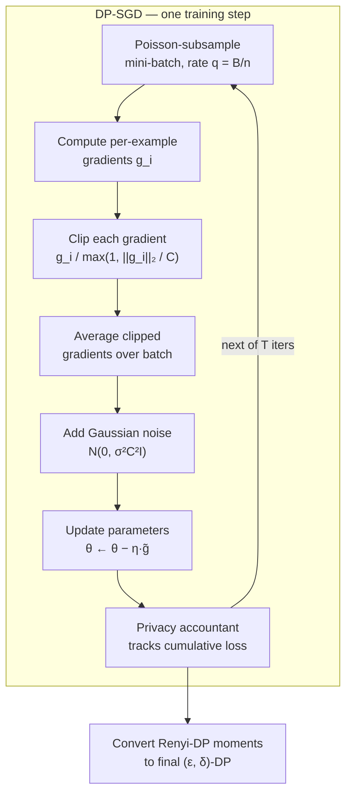

## Summary
> One paragraph: what problem, what approach, what result.

This is a **survey / review paper** (not a single new method) that maps the full landscape of **differential privacy (DP)** — from formal foundations through practical mechanisms to real-world deployment and user perception. The problem it addresses: the abundance of personal data enables useful ML/analytics but exposes individuals to re-identification, and ad-hoc anonymization provably fails against modern adversaries. DP is presented as the "gold standard" response — a mathematically rigorous framework guaranteeing that an algorithm's output is (nearly) unchanged whether or not any single individual's record is present. The paper progressively builds from the $\varepsilon$-DP definition and its relaxations, through noise mechanisms (Laplace, Gaussian, Exponential), composition/post-processing properties, trust models (central / local / distributed), DP in ML (with **DP-SGD** and privacy accounting as the centerpiece), synthetic data, DP combined with cryptography and federated learning, and finally usability, "privacy theater," and open research directions. It is directly relevant to this vault because **DP is the theoretical backbone of certified / approximate unlearning**: the same $(\varepsilon,\delta)$-indistinguishability, composition, and neighboring-dataset machinery underpins certified removal and deletion guarantees.

## Key Contributions
- A **comprehensive, structured survey** of DP spanning theory → mechanisms → ML → deployment → user expectations, aimed at both researchers and practitioners; papers were collected from Scopus, IEEE Xplore, and Google Scholar.
- A consolidated **taxonomy of DP variants** (pure DP, approximate $(\varepsilon,\delta)$-DP, Rényi DP, zCDP, Gaussian DP, local DP, personalized DP, heterogeneous DP, sensitive privacy) with core idea, metric, advantage, limitation, and use case for each (Table 2).
- A clear treatment of the **three trust models** — central, local, distributed — with strengths/limitations and worked survey examples (Table 3).
- A practitioner-focused deep dive on **DP in ML / DP-SGD**: gradient clipping + Gaussian noise, the moments accountant, Rényi-DP accounting, convergence/utility trade-offs, and hyperparameter tuning under a privacy budget.
- A synthesis of **applied and human-factors issues**: privacy-preserving synthetic data, DP + cryptography + federated learning, use cases (cybersecurity, healthcare, finance), and usability/communication failures ("privacy theater").

## Architecture / Method
> Describe the core method, model design, or algorithm.

Being a survey, the "method" is the conceptual scaffolding of DP. The core objects:

**Setup.** Let $\mathcal{D}$ be the universe of datasets and $D \subset \mathcal{D}$ a dataset of $n$ records. A query function $f$ maps a dataset to a quantity of interest (a mean, or the weights of a trained network). A **mechanism** $\mathcal{A}:\mathcal{D}\to\mathcal{R}$ is a randomized algorithm approximating $f$, often additively as $\mathcal{A}(D)=f(D)+\text{noise}$ (though non-additive mechanisms like randomized response or subsampling also qualify).

**Neighboring datasets.** $D \sim D'$ if they differ by one record (add-or-remove criterion: $D\subset D'$ and $|D'|=|D|+1$). Alternatives: *replace-one* (≈ twice as strong) and *zero-out* (size-preserving, semantically equivalent $\varepsilon$).

**Pure $\varepsilon$-DP (Def. 3).** For $\varepsilon>0$, $\mathcal{A}$ is $\varepsilon$-DP if for all $D\sim D'$ and all $S\subseteq\mathcal{R}$:
$$P[\mathcal{A}(D)\in S] \le \exp(\varepsilon)\cdot P[\mathcal{A}(D')\in S].$$
The **privacy loss** is $\ln\frac{P[\mathcal{A}(D)\in S]}{P[\mathcal{A}(D')\in S]}$. Smaller $\varepsilon$ = stronger privacy; $\varepsilon=0$ makes output independent of data (useless). Rules of thumb: $\varepsilon<1$ for simple statistics, often relaxed to $\varepsilon\approx 10$ in deep learning.

**Approximate $(\varepsilon,\delta)$-DP (Def. 4).**
$$P[\mathcal{A}(D)\in S] \le \exp(\varepsilon)\cdot P[\mathcal{A}(D')\in S] + \delta,$$
where $\delta$ is the probability of a "bad event" where the guarantee may fail. Guideline: $\delta \ll 1/n$ (worst-case analysis: expected successful identifications $\approx \delta n$ must be $\ll 1$).

**Properties.**
- *Sequential composition (Prop. 1):* $k$ mechanisms, each $(\varepsilon_i,\delta_i)$-DP, compose to $\left(\sum_i \varepsilon_i, \sum_i \delta_i\right)$-DP.
- *Advanced composition (Thm. 1):* $k$-fold adaptive composition of $(\varepsilon,\delta)$-DP mechanisms gives $(\varepsilon',k\delta+\delta')$-DP with $\varepsilon' = \sqrt{2k\ln(1/\delta')}\,\varepsilon + k\varepsilon(e^{\varepsilon}-1)$, and for small $\varepsilon$, $\varepsilon' \approx \sqrt{2k\ln(1/\delta')}\,\varepsilon + k\varepsilon^2$.
- *Parallel composition (Prop. 2):* on disjoint partitions, guarantee is $(\max_i \varepsilon_i, \max_i \delta_i)$-DP — does not compound.
- *Post-processing immunity (Prop. 3):* for any $g$, $g\circ\mathcal{A}$ is still $(\varepsilon,\delta)$-DP.
- *Group privacy:* under $\varepsilon$-DP, datasets differing in $k$ records satisfy $k\varepsilon$-DP (Prop. 4); under $(\varepsilon,\delta)$-DP it becomes $(k\varepsilon, k e^{k\varepsilon}\delta)$-DP (Prop. 5).

**Sensitivity (Def. 6).** Global $\ell_p$-sensitivity $\Delta^p_f = \max_{D\sim D'} \lVert f(D)-f(D')\rVert_p$. Noise scale is directly proportional to sensitivity; clipping bounds otherwise-unbounded sensitivity (bias–variance trade-off).

**Basic mechanisms.**
- *Laplace (Thm. 2):* $\mathcal{A}_L(D)=f(D)+(Y_1,\dots,Y_d)$ with $Y_i \sim \text{Lap}(\Delta^1_f/\varepsilon)$ gives $\varepsilon$-DP. Laplace pdf $g(u)=\frac{1}{2b}\exp(-|u|/b)$, variance $2b^2$.
- *Gaussian:* calibrates noise to $\ell_2$-sensitivity, gives $(\varepsilon,\delta)$-DP; favored in high-composition / ML settings.
- *Exponential (Def. 9, McSherry–Talwar):* selects from a discrete set weighted by a utility function $u:\mathcal{D}\times\mathcal{R}\to\mathbb{R}$; handles non-numeric outputs.

**DP in ML — DP-SGD (the centerpiece).** DP-SGD (Song et al. 2013; Abadi et al. 2016) makes SGD private via two modifications each step:
1. **Per-example gradient clipping** to bound sensitivity:
$$g_i \leftarrow \frac{g_i}{\max\!\left(1, \lVert g_i\rVert_2 / C\right)}.$$
2. **Gaussian noise addition** on the averaged batch gradient:
$$\tilde{g} \leftarrow \frac{1}{B}\sum_{i=1}^{B} g_i + \mathcal{N}(0, \sigma^2 C^2 I).$$

Noise can be injected at three points (Example 18, after Jayaraman & Evans 2019): **objective perturbation** (noise on the loss), **gradient perturbation** (noise on updates, = DP-SGD), and **output perturbation** (noise on final $\theta$).

**Privacy accounting.** Naive/advanced composition is too loose over thousands of iterations. The **moments accountant** (Abadi et al. 2016) tracks log-moments of the privacy loss, built on **Rényi DP** (Mironov 2017):
- Rényi divergence of order $\alpha>1$: $D_\alpha(P\Vert Q)=\frac{1}{\alpha-1}\log \mathbb{E}_{x\sim Q}\left[\left(\frac{P(x)}{Q(x)}\right)^{\alpha}\right]$.
- $(\alpha,\varepsilon)$-Rényi DP: $D_\alpha(\mathcal{A}(D)\Vert\mathcal{A}(D')) \le \varepsilon$ (composes additively).
- Convert to $(\varepsilon,\delta)$ via tail bound $\delta = \min_\lambda \exp(\alpha_\mathcal{M}(\lambda)-\lambda\varepsilon)$, with the subsampled-Gaussian moment approximation $\alpha(\lambda) \le \frac{q^2\lambda(\lambda+1)}{(1-q)\sigma^2} + O\!\left(\frac{q^3}{\sigma^3}\right)$, where $q=B/n$ is the sampling rate.

Later accountants: **GDP** (Dong et al. 2022, hypothesis-testing / CLT view), **PLD accounting** (Koskela et al. 2020, tracks the full privacy-loss distribution), and Asoodeh et al.'s (2020) optimal Rényi→$(\varepsilon,\delta)$ conversion.

**Convergence/utility.** For convex, Lipschitz losses, excess empirical risk $R_{\text{ERM}}(\theta)=L(\theta;D)-\min_\theta L(\theta;D)$ is bounded by $O\!\left(\frac{\sqrt{p}}{\varepsilon n}\right)$ ($p$ = #params), and $O\!\left(\frac{p}{\varepsilon^2 n^2}\right)$ for strongly convex losses. Nonconvex (deep) settings only guarantee stationary points; DP-SGD is shown (nearly) optimal there (Bassily et al. 2021). Utility is governed by noise scale $\sigma$ and clipping norm $C$ (adaptive / per-layer clipping help).

## Results & Benchmarks
> Survey paper — no new experiments. The one concrete quantitative comparison is Example 17 (reproduced from Abadi et al. 2016), showing the moments accountant is far tighter than strong composition for DP-SGD.

Setup for Example 17: sampling ratio $q=0.01$, noise level $\sigma=4$, $\delta=10^{-5}$, steps per epoch $T=E/q=100E$.

| Benchmark | Score | Baseline |
|-----------|-------|----------|
| Total $\varepsilon$ at $E=100$ epochs (moments accountant) | $\varepsilon = 1.26$ | Strong composition: $\varepsilon = 9.34$ |
| Total $\varepsilon$ at $E=400$ epochs (moments accountant) | $\varepsilon = 2.55$ | Strong composition: $\varepsilon = 24.22$ |

Other reference points stated in the text (not experiments run by the authors): typical $\varepsilon<1$ for simple statistical queries and $\varepsilon\approx 10$ for deep learning (Ponomareva et al. 2023); convex excess-risk bound $O(\sqrt{p}/(\varepsilon n))$; strongly-convex bound $O(p/(\varepsilon^2 n^2))$.

## Limitations
- **Survey, not empirical:** contributes no new method or benchmark of its own; the only numeric comparison is reproduced from Abadi et al. (2016). Value is in synthesis/organization, not new evidence.
- **Breadth over depth:** covers a very wide surface (theory, mechanisms, synthetic data, crypto/FL, use cases, usability) so individual topics (e.g., proofs, unlearning-specific certified removal) are summarized rather than derived.
- **DP-training pain points remain open** (the paper itself flags these): the privacy–utility trade-off, heavy computational overhead of per-example clipping, hyperparameter sensitivity, large-data requirements, architecture constraints, and difficult communication of guarantees to users ("privacy theater").
- **Unlearning/deletion is only implicit:** the survey frames DP around data *release* and *training*, not the right-to-be-forgotten / certified-removal angle central to this vault — the connection has to be drawn by the reader.

## My Notes & Questions
> Personal takeaways, things to explore, open questions.

- **Why this matters for unlearning:** the add-or-remove neighboring relation is literally the "delete one record" operation. Certified/approximate unlearning reuses $(\varepsilon,\delta)$-indistinguishability to bound how close an *unlearned* model is to a *retrained-from-scratch* model — DP is the parent framework. Worth cross-linking heavily from certified-removal notes.
- **Composition = deletion capacity intuition:** sequential composition's budget accounting is the same accounting that limits how many deletions a certified-unlearning scheme can absorb before it must retrain. Follow up: does advanced composition / RDP accounting map onto sequential-deletion bounds?
- **Group privacy $\to$ group deletion:** $k\varepsilon$ scaling under $\varepsilon$-DP is a clean analogue for deleting a *group* of correlated records at once.
- **Open question:** the survey treats output/objective/gradient perturbation as three noise-injection points — which of these best supports efficient *post-hoc* unlearning updates (influence-function style) versus DP training from the start?
- **To reproduce:** Example 17's accountant comparison is a cheap sanity check via Opacus / TF-Privacy — could seed an entry in `04-Experiments/`.
- **Verify at review:** confirm the advanced-composition constant, the moments approximation exponents, and both $\varepsilon$ pairs (1.26/9.34, 2.55/24.22) against the PDF before promoting to `reviewed`.

## Related
- [[Differential Privacy]]
- [[Approximate Differential Privacy]]
- [[Renyi Differential Privacy]]
- [[Composition]]
- [[Post-Processing Immunity]]
- [[Sensitivity]]
- [[Membership Inference]]
- [[DP-SGD]]
- [[Gaussian Mechanism]]
- [[Laplace Mechanism]]
- [[PATE]]
- [[(epsilon-delta)-DP]]
- [[Privacy Budget]]

## Review

**2026-07-06 · Reviewer agent · VERDICT: PASS** — all benchmark numbers and formulas verified against the source PDF (arXiv:2509.03294v1); status promoted `needs-review → reviewed`.

| Check | Result | Evidence |
|---|---|---|
| 1. Faithfulness | PASS | Example 17 verified: q=0.01, σ=4, δ=10⁻⁵, T=E/q=100E; ε=1.26 vs 9.34 (E=100), ε=2.55 vs 24.22 (E=400). Advanced composition (Thm 1), group privacy (Prop 4/5: kε and (kε, ke^{kε}δ)), sensitivity (Def 6), Laplace (Def 7/Thm 2, var 2b²), DP-SGD clip+noise equations, tail bound δ=min_λ exp(α_M(λ)−λε), moment bound q²λ(λ+1)/((1−q)σ²)+O(q³/σ³), convergence O(√p/(εn)) and O(p/(ε²n²)), Bassily 2021, GDP/PLD/Asoodeh refs, Table 2 variants, ε=10 deep-learning guideline, δ≪1/n — all match. One flag below. |
| 2. Completeness | PASS | All template sections filled; frontmatter complete; no placeholders. |
| 3. Wikilinks | PASS | All 13 links resolve to existing notes in 02-Concepts/03-Architectures/05-Glossary; no duplicates. |
| 4. Conventions | PASS | Tags `paper, privacy, certified, evaluation` are in README vocabulary; correct folder. Minor: `evaluation`/`certified` fit loosely (paper is DP survey, not unlearning benchmarks/certified unlearning). |
| 5. Cross-note | PASS | All linked stubs exist; Papers-MOC.md lists this note. |
| 6. Calibration | PASS | Limitations honest (survey-not-empirical, unlearning only implicit); My Notes clearly editorial. |

**Flags (non-blocking):**
1. **Rényi divergence prefactor:** the note writes the standard Mironov (2017) form 1/(α−1); the paper's Definition 10 prints 1/(1−α) — a sign typo in the source. The note silently corrects it; noting the discrepancy here for the record.
2. Paper says sources were collected from "Scopus, IEEE Explorer, and Google Scholar" (sic); the note normalizes to "IEEE Xplore" — acceptable.
3. The literal `#params` in the Convergence paragraph registers as a stray Obsidian tag `params`; consider rewording to "number of params".
