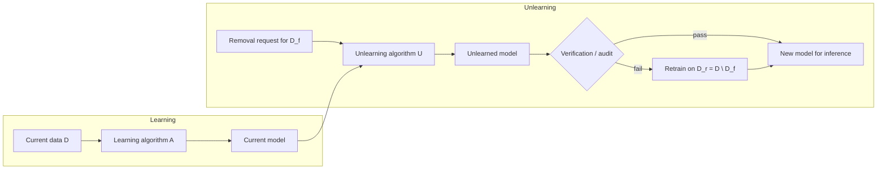

## Summary
Regulations such as GDPR's "right to be forgotten" require deleting user data not only from databases but also from trained ML models, which "remember" training data (as demonstrated by [[Membership Inference]] and other adversarial attacks). This survey (v6, Sep 2024) gives a comprehensive, systematic treatment of machine unlearning: an unlearning framework (workflow, request types, design requirements, verification), formal definitions of [[Exact Unlearning]] and [[Approximate Unlearning]] with indistinguishability metrics, restricted-access scenarios (zero-glance, zero-shot, few-shot), a unified taxonomy of methods into **model-agnostic**, **model-intrinsic**, and **data-driven** approaches, a compilation of published implementations/datasets/evaluation metrics, application domains (recommender systems, federated learning, graph embedding, lifelong learning, LLMs, generative models), and open research questions. It is a category collection rather than a new method; the companion resource lives at the authors' awesome-machine-unlearning repository.

## Key Contributions
- **Unlearning framework** (§2): a reference workflow (learn → removal request → unlearn → verify → retrain if verification fails), a typology of removal requests (item, feature, class, task, stream), design requirements (completeness, timeliness, accuracy, light-weight, provable guarantees, model-agnosticism, verifiability), and verification techniques (feature injection test, forgetting measurement, information-leakage/membership-inference attacks, backdoor attacks, slow-down attacks, interclass confusion test, federated verification, cryptographic proofs via SNARK + Merkle trees).
- **Formal problem definitions** (§3): exact unlearning as distributional equality (weight space vs. output space, the latter aka *weak unlearning*), $\epsilon$- and $(\epsilon,\delta)$-approximate unlearning, and their relationship to [[Differential Privacy]]; indistinguishability metrics ($\ell_2$ verification error, KL divergence, weight leakage via gradients).
- **Restricted-access scenarios** (§4): zero-glance (no access to forget set $D_f$), zero-shot (no access to training data at all), and few-shot (only a small subset of $D_f$) unlearning, with representative methods (error-maximizing/minimizing noise, gated knowledge transfer, model inversion, Fisher-based influence approximation).
- **Unified taxonomy of algorithms** (§5): model-agnostic ([[Differential Privacy]]-based, [[Certified Removal]] mechanisms, statistical query learning, decremental learning, knowledge adaptation/distillation, MCMC parameter sampling), model-intrinsic (softmax/logit classifiers via linear filtration, linear models via projective residual updates, tree-based models via robust splits, Bayesian models via posterior manipulation, DNNs via influence/Fisher approximations), and data-driven ([[SISA]]-style data partitioning, error-manipulating data augmentation, data-influence methods).
- **Resource compilation** (§6): ~45 published implementations with repos (SISA, CertifiedRem, DeltaGrad, HedgeCut, DaRE-RF, GraphEraser, RecEraser, FedEraser, Quark, ...), widely used datasets by modality, and a catalogue of evaluation metrics (accuracy, completeness, unlearn/relearn time, layer-wise & activation distance, JS-divergence, membership inference, ZRF score, Anamnesis Index, epistemic uncertainty/efficacy, model inversion).
- **Trends and open problems** (§8): influence functions dominate; verification/auditing is underdeveloped; federated unlearning is emerging; open questions include unified design requirements, unified benchmarking, adversarial machine unlearning, interpretable unlearning, unlearning in evolving data streams, and causality.

## Architecture / Method

### Unlearning workflow (Fig. 1 of the paper)

![[unlearning_framework.png]]
The unlearning algorithm must respect requirements (completeness, timeliness, privacy guarantees); the unlearned model is evaluated with metrics (accuracy, ZRF, AIN) and audited (e.g., feature injection, membership inference) before being trusted.

### Core formal definitions

**Notation.**
- $\mathcal{Z}$ = example space; 
- $D$ = training set; 
- $D_f$ = forget set; 
- $D_r = D \setminus D_f$ = retained set; 
- $A(\cdot)$ = (randomized) learning algorithm;
- $U(\cdot)$ = unlearning algorithm; 
- $\mathcal{H}$ = hypothesis space; 
- $w = A(D)$, $w_r = A(D_r)$, $w_u = U(\cdot)$ model parameters.

**Exact unlearning (general case, Def. 2).**

$$Pr(A(D \setminus D_f) \in \mathcal{T}) = Pr(U(D, D_f, A(D)) \in \mathcal{T}) \quad \forall\, \mathcal{T} \subseteq \mathcal{H},\ D \in \mathcal{Z}^*,\ D_f \subset D$$

*What each symbol means:* $\mathcal{T}$ is any measurable subset of the hypothesis space $\mathcal{H}$; $A(D \setminus D_f)$ is a model retrained from scratch on the retained data; $U(D, D_f, A(D))$ is the unlearned model; $Pr(\cdot)$ denotes distributions over models because both $A$ and $U$ are randomized (SGD mini-batch order, floating-point nondeterminism).
*Logic:* an unlearning process is exact iff the distribution of unlearned models is *identical* to the distribution of retrained models — no observer, seeing only the resulting model, can tell whether the data was ever used. Depending on whether $Pr(\cdot)$ is over the **weight space** or the **output space**, one gets two notions; the output-space version is called *weak unlearning*. Retraining trivially satisfies this, so it is sometimes considered the only exact method, but it is expensive and handles batch deletions poorly.

**$\epsilon$-approximate unlearning (certified removal).**

$$e^{-\epsilon} \le \frac{Pr(U(D, z, A(D)) \in \mathcal{T})}{Pr(A(D \setminus z) \in \mathcal{T})} \le e^{\epsilon}$$

*What each symbol means:* $z \in D$ is the single removed sample; $\epsilon > 0$ is the privacy/indistinguishability budget bounding the multiplicative gap between the two model distributions.
*Logic:* instead of demanding exact distributional equality, the likelihood ratio between "unlearned" and "retrained" is bounded within $[e^{-\epsilon}, e^{\epsilon}]$ — exactly the max-divergence bound style of [[Differential Privacy]]. Exponential bounds arise because distributions are compared on a log scale. Note the bound is per-sample; whether constant bounds extend to larger forget subsets is an open question in the survey.

**$(\epsilon,\delta)$-approximate unlearning (Def. 3, relaxation).**

$$Pr(U(D, z, A(D)) \in \mathcal{T}) \le e^{\epsilon}\, Pr(A(D \setminus z) \in \mathcal{T}) + \delta$$
$$Pr(A(D \setminus z) \in \mathcal{T}) \le e^{\epsilon}\, Pr(U(D, z, A(D)) \in \mathcal{T}) + \delta$$

*What each symbol means:* $\delta > 0$ is an additive slack that upper-bounds the probability that the pure $\epsilon$ max-divergence bound fails; other symbols as above.
*Logic:* mirrors [[Approximate Differential Privacy]] — with probability at least $1-\delta$ the $e^{\epsilon}$ multiplicative guarantee holds. Both directions are required so neither distribution can dominate the other. This is the definition behind [[Certified Removal]].

**Relationship to differential privacy (Eq. 8).**

$$\forall\, \mathcal{T} \subseteq \mathcal{H},\ D: \quad e^{-\epsilon} \le \frac{Pr(A(D) \in \mathcal{T})}{Pr(A(D \setminus z) \in \mathcal{T})} \le e^{\epsilon}$$

*What each symbol means:* here the ratio compares the model trained on the *full* dataset $D$ against the model trained without $z$ — no unlearning algorithm appears.
*Logic:* if the learning algorithm $A$ itself is DP, deletion is a non-issue because $A$ never memorized $z$ in the first place — DP implies approximate unlearning "for free." The catch the survey stresses: a model that is DP for *any* data learns almost nothing from each sample, and DP models suffer significant accuracy loss even at large $\epsilon$. Unlearning exists precisely to avoid paying that cost up front.

**$\rho$-TV-stability (Ullah et al., streaming exact unlearning, Eq. 14).**

$$\sup_{D, D' : |D \setminus D'| + |D' \setminus D| = 1} \Delta\big(A(D), A(D')\big) \le \rho$$

*What each symbol means:* $D, D'$ are datasets differing in one item; $\Delta(\cdot,\cdot)$ is the total variation distance (largest possible difference in probability assigned to the same event) between the induced model distributions; $\rho \in [1/n, \infty)$ is the stability parameter.
*Logic:* if swapping one training item moves the model distribution by at most $\rho$ in TV distance, then a coupling/transport argument shows an unlearning procedure exists that achieves exact unlearning at any point of a streaming deletion sequence, with accuracy and unlearning time bounded in terms of $\rho$. Smaller $\rho$ = more stable learner = cheaper unlearning.

### Restricted-access scenarios (§4)

| Scenario | Unlearner's access | Formalization |
|---|---|---|
| Zero-glance | Retained subset only, never sees $D_f$ | $w_u = U(D_{r\_sub}, A(D))$, $D_{r\_sub} \subseteq D_r$ |
| Zero-shot | No training data; only forget classes $C_f$ or $D_f$ | $Pr(A(D \setminus D_f) \in \mathcal{T}) \approx Pr(U(D_f, A(D)) \in \mathcal{T})$ |
| Few-shot | Small subset of the forget set | $w_u = U(D, D_{f\_sub}, A(D))$, $D_{f\_sub} \subseteq D_f$ |

*Logic for the zero-glance equation:* the smaller $D_{r\_sub}$, the better the privacy, since the organization touches less data after the deletion request. Methods (Tarun et al.) learn an **error-maximizing noise** matrix for the forget classes (impair step: 1 epoch on $D_{r\_sub} \cup \mathcal{N}$), then a **repair step** (≥1 epoch on $D_{r\_sub}$) restores retained-class accuracy. Zero-shot methods use error-minimizing noise plus **gated knowledge transfer** (a gate blocks teacher→student distillation of forget-class knowledge); few-shot methods use **model inversion** to retrieve a proxy training set, filter, and relearn.

### Taxonomy of unlearning algorithms (§5)

```mermaid
flowchart TD
    MU[Machine Unlearning Methods]
    MU --> MA[Model-agnostic]
    MU --> MI[Model-intrinsic]
    MU --> DD[Data-driven]
    MA --> MA1[Differential privacy]
    MA --> MA2[Certified removal mechanisms]
    MA --> MA3[Statistical query learning]
    MA --> MA4[Decremental learning]
    MA --> MA5[Knowledge adaptation / distillation]
    MA --> MA6[MCMC parameter sampling]
    MI --> MI1[Softmax classifiers - linear filtration]
    MI --> MI2[Linear models - projective residual update]
    MI --> MI3[Tree-based - robust splits, HedgeCut]
    MI --> MI4[Bayesian - posterior manipulation]
    MI --> MI5[DNN - influence and Fisher approximations]
    DD --> DD1[Data partitioning - SISA, shard graphs]
    DD --> DD2[Data augmentation - error-manipulating noise]
    DD --> DD3[Data influence - historical updates, FIM]
```

Selected method-level details worth keeping:

- **Certified removal mechanisms** ([[Certified Removal]]): train on a *perturbed* regularized empirical risk (noise from a standard normal); unlearning computes a model perturbation toward the risk on the remaining data, approximated by the [[Influence Functions]] machinery (inverse Hessian on training data × gradient of the forget data, i.e., a one-step Newton update). If the theoretical error bound exceeds a threshold, fall back to retraining. Extensions: (regularized/distributed) perturbed gradient descent for weakly convex losses (Neel et al., Descent-to-Delete lineage).
- **MCMC/parameter-sampling unlearning:** approximate the retrained posterior via $Pr(w_r|D) \approx Pr(w|D) \propto Pr(D|w)\,Pr(w)$, sample with MCMC (Gaussian proposal centered at the current sample, initialized at the original model), and take $w_r = \arg\max_w Pr(w|D_r)$. *Symbols:* $Pr(w)$ = prior over parameters (from the learning algorithm's stochasticity), $Pr(D|w)$ = likelihood (the model's predictive output). *Logic:* if the forget set is small, the retrained posterior stays close to the original posterior, so sampling around the trained model finds retrained-like parameters — with no access to $D_f$ needed.
- **Bayesian unlearning (Nguyen et al., Eq. 18):**
  $$Pr(w|D_r) = \frac{Pr(w|D)\,Pr(D_f|D_r)}{Pr(D_f|w)} \propto \frac{Pr(w|D)}{Pr(D_f|w)}$$
  *Symbols:* $Pr(w|D)$ = posterior of the original model; $Pr(D_f|w)$ = likelihood of the forget data under parameters $w$; $Pr(D_f|D_r)$ = a $w$-independent normalizer. *Logic:* Bayes' rule lets you "divide out" the forget-set likelihood from the posterior — down-weighting parameter regions that explain $D_f$ well. Direct sampling only works for quantized parameters or conjugate priors; otherwise minimize the KL divergence between $Pr(w|D)$ and $Pr(w|D_r)$, which also mitigates catastrophic unlearning. Certified Bayesian unlearning bounds $KL\big(Pr(A(D_r)),\ \mathbb{E}_{A(D)} Pr(U(D, D_f, A(D)))\big) \le \epsilon$, where the expectation is over the original model's parameter distribution and $\epsilon$ bounds the divergence between retrained and unlearned posteriors.
- **[[SISA]] (data partitioning / efficient retraining):** shard the data, train one model per shard, aggregate outputs; checkpoint per slice inside each shard so deletion only retrains the affected shard from an intermediate state. Shard-graph variants (SAFE) track dependencies and roll back only affected updates.
![[retraininig_ml_using_data_partition.png]]
- **Tree-based (HedgeCut):** a split is *robust* if removing $k$ Items cannot flip it; non-robust splits keep all subtree variants materialized, and deletion swaps in the variant with higher Gini gain.
- **Statistical query learning (Cao & Yang):** represents learning as sums of statistical queries; unlearning recomputes the summations on remaining data. Doesn't scale to DNNs (exponentially many queries).

### Evaluation metrics (§6.3) — the two exotic ones

**ZRF (Zero Retrain Forgetting) score:**

$$ZRF = 1 - \frac{1}{n_f} \sum_{i=0}^{n_f} JS\big(M(x_i), T_d(x_i)\big)$$

*What each symbol means:* $x_i$ = $i$-th sample of the forget set, $n_f$ = forget-set size, $M$ = unlearned model, $T_d$ = a randomly initialized ("incompetent") teacher, $JS$ = Jensen–Shannon divergence between their output distributions.
*Logic:* compares the unlearned model's behavior on forgotten samples to pure randomness — ZRF ≈ 1 means the model's predictions on the forget set are indistinguishable from a random model (fully forgotten); ZRF ≈ 0 means a systematic pattern remains. Its virtue is needing **no retrained reference model**.

**Anamnesis Index (AIN):**

$$AIN = \frac{r_t(M_u, M_{orig}, \alpha)}{r_t(M_s, M_{orig}, \alpha)}$$

*What each symbol means:* $r_t(M, M_{orig}, \alpha)$ = number of relearn mini-batches/steps for model $M$ to get within $\alpha\%$ of the original model $M_{orig}$'s accuracy on the forgotten classes; $M_u$ = unlearned model; $M_s$ = model trained from scratch.
*Logic:* if information truly left the model, relearning it should take as long as learning from scratch, giving AIN ≈ 1. AIN ≪ 1 means the unlearned model relearns suspiciously fast (knowledge was retained, only the output layer changed); AIN ≫ 1 signals the parameters were pushed so far that unlearning itself is detectable (Streisand effect).

**Epistemic uncertainty / efficacy (Becker & Liebig):** influence $i(w; D) = tr(\mathcal{I}(w; D))$, where $\mathcal{I}(w; D) \approx \frac{1}{|D|}\sum_{x,y \in D}\big(\frac{\partial \log p(y|x;w)}{\partial w}\big)^2$ is the empirical Fisher Information Matrix; $\text{efficacy}(w;D) = 1/i(w;D)$ if $i(w;D) > 0$, else $\infty$. *Logic:* the FIM trace measures how much information the parameters carry about the data; lower efficacy after unlearning = less exposure. Cheap and requires no retrained model, but measures overall (not sample-specific) information.

## Results & Benchmarks

As a survey, the paper reports no new experimental numbers. Its "results" are systematizations:

| Resource | Content |
|-----------|-------|
| Table 1 | Feature comparison vs. 9 prior surveys (only this one covers verification, all scenarios, all request types, and applications incl. LLMs/generative models) |
| Table 3 | Method-family × (scenario, design requirement, request type) support matrix — e.g., certified removal supports approximate + item/stream removal with guarantees; SISA-style partitioning supports exact + zero-glance/few-shot |
| Table 4 | ~45 published implementations with language/platform/repo (SISA, CertifiedRem, PRU, DeltaGrad, HedgeCut, DaRE-RF, MCMC-Unlearning, L-CODEC, GraphEraser, RecEraser, FedEraser, EUL, Quark, ...) |
| Table 5 | Common datasets: MNIST (70K, used by 29+ papers), CIFAR (60K, 16+), SVHN (600K, 8+), ImageNet (14M+), Adult (48K+, 8+), MovieLens (1B+), OGB (100M+), etc. |
| Table 6 | Evaluation metrics with formulas and usage (accuracy, completeness, unlearn/relearn time, layer-wise/activation distance, JS-divergence, MIA recall, ZRF, AIN, epistemic uncertainty, model inversion) |

Key qualitative findings (§8.1): influence functions are the dominant machinery; the parameter-space "reachability" assumption (same parameters reachable with or without the data) can create false positives; verification/data auditing is under-studied and lacks agreed success criteria; federated unlearning is a distinct emerging setting; unlearning doubles as model repair (poison removal, debiasing, catastrophic-forgetting mitigation).

## Limitations
- Survey-level: no empirical benchmarking of the surveyed methods against each other; the authors themselves flag the lack of unified benchmarks as an open problem (the only cited empirical study covers decremental learning and efficiency only).
- The taxonomy's support matrix (Table 3) uses coarse ✓/✗/– judgments that partially/indirectly supported cells make hard to act on.
- Coverage of LLM and generative-model unlearning (§7.5–7.6) is brief and citation-driven; modern LLM unlearning benchmarks (TOFU, WMDP, MUSE, RWKU) are not covered — worth cross-checking against dedicated LLM-unlearning surveys.
- Some referenced definitions are stated per-sample ($z$) only; the survey acknowledges that extending constant bounds to arbitrary forget sets is open.
- Several cited works were arXiv preprints at the time of writing; specific claims inherit their preprint status.

## My Notes & Questions
- The DP ↔ unlearning tension is the sharpest framing in the paper: DP gives unlearning for free but destroys the learning signal; unlearning is a way to pay the privacy cost lazily, only for data actually deleted. This connects directly to my [[Certified Data Removal from Machine Learning Models]] note (Guo et al. is the survey's canonical certified-removal citation [64]).
- $\rho$-TV-stability looks like the cleanest theoretical bridge between algorithmic stability and exact unlearning in streams — candidate for a deeper concept note and possibly an experiment on SGD stability vs. deletion cost.
- The verification section is the most actionable for my research focus: feature injection only works for linear models, backdoor verification is intrusive with false positives, and cryptographic proofs (SNARK + Merkle) are demonstrated only on SISA. Auditable deletion remains wide open.
- Question: the survey claims data partitioning ([[SISA]]) supports "exact" unlearning — but aggregation of shard models is not the same distribution as a monolithic retrain. Exactness holds w.r.t. the *sharded* training procedure. Worth being precise about this when comparing guarantees.
- Question: how do the slow-down attacks of Marchant et al. interact with certified removal's fallback-to-retrain threshold? Adversarially forcing the fallback defeats the efficiency purpose entirely.

## Related
- [[Certified Data Removal from Machine Learning Models]] — the survey's reference certified-removal mechanism (Guo et al.)
- [[Understanding Black-box Predictions via Influence Functions]] — the influence-function machinery the survey calls "dominant"
- [[A Comprehensive Guide to Differential Privacy]] — background for the DP-vs-unlearning relationship
- [[Exact Unlearning]] · [[Approximate Unlearning]] · [[Certified Removal]] · [[SISA]]
- [[Influence Functions]] · [[Differential Privacy]] · [[Approximate Differential Privacy]] · [[Membership Inference]] · [[Data Poisoning]]
- [[ZRF Score]] · [[Anamnesis Index (AIN)]] · [[Fisher Information Matrix (FIM)]]
