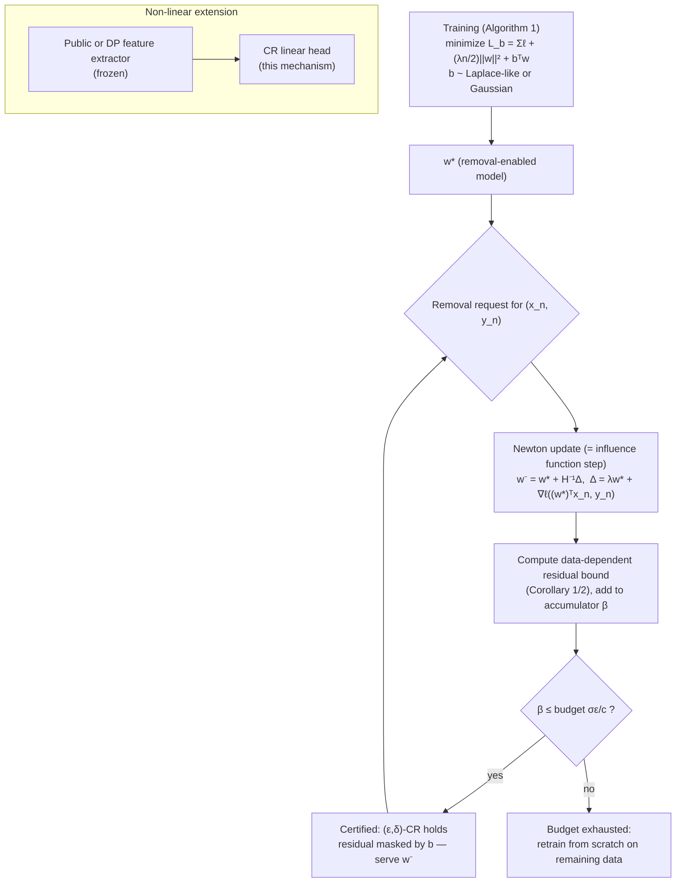

## Summary
Guo et al. (ICML 2020) define **certified removal**: a removal mechanism $M$ applied to a trained model must be statistically indistinguishable (in the (ε,δ)-DP sense, but comparing *unlearned model* vs. *model retrained without the point*) from never having seen the deleted data. They instantiate it for $L_2$-regularized linear models with differentiable convex losses: the removal step is a one-shot **Newton update** — explicitly identified as the [[Influence Functions|influence function]] of the deleted point — whose leftover **gradient residual** is bounded using [[Strong Convexity|strong convexity]] (via the regularizer) and then **masked by loss perturbation** (a random linear term $b^\top w$ added at training time, à la Chaudhuri et al. 2011). Removal is orders of magnitude faster than retraining (e.g., 0.04s vs 15.6s on MNIST; 0.48s vs 124s on LSUN), and combining a public or differentially private feature extractor with a certified-removal linear head extends the scheme to non-linear networks — LSUN supports 10,000+ removals at a cost of 88.6% → 83.3% accuracy.

## Key Contributions
- **Formal definition of ε- and (ε,δ)-certified removal (CR)**, importing the max-divergence indistinguishability of [[Differential Privacy]] but benchmarking against retraining-from-scratch — this guarantees [[Membership Inference]] attacks fail on removed data.
- **Newton-update removal mechanism** for regularized linear models, with worst-case (Theorem 1) and much tighter data-dependent (Corollary 1) bounds on the gradient residual it leaves behind.
- **Loss perturbation for certification**: the residual's *direction* can leak the removed point, so a random linear term added to the training objective masks it; Laplace-like noise gives ε-CR and Gaussian noise gives (ε,δ)-CR (Theorem 3).
- **Batch removal** (Theorem 4, Corollary 2) and an **online accounting algorithm** (Algorithm 2) that accumulates residual norms and triggers full retraining when the budget $\sigma\epsilon/c$ is exhausted — an explicit [[Deletion Capacity]] mechanism.
- **Extension to non-linear models** by applying CR to a linear head on a public or DP feature extractor, with additive composition of guarantees (Thm 5), beating fully-DP training in accuracy at comparable ε.

## Architecture / Method

### The certified-removal definition
For learning algorithm $A$, dataset $\mathcal{D}$, removed point $\mathbf{x}$, mechanism $M$ is $\epsilon$-CR if for all measurable $\mathcal{T}$, all $\mathcal{D}$, all $\mathbf{x} \in \mathcal{D}$:

$$e^{-\epsilon} \le \frac{P(M(A(\mathcal{D}), \mathcal{D}, \mathbf{x}) \in \mathcal{T})}{P(A(\mathcal{D} \setminus \mathbf{x}) \in \mathcal{T})} \le e^{\epsilon}$$

**What each symbol means:** numerator = distribution of the unlearned model; denominator = distribution of a model retrained from scratch without $\mathbf{x}$; $\mathcal{T}$ ranges over sets of models.
**Logic:** no test can reliably tell "removed after training" from "never trained on" — the DP definition with the retrained model in place of the neighboring-dataset run. The $(\epsilon,\delta)$-CR relaxation adds $+\delta$ on the right, exactly like [[(epsilon-delta)-DP]].

### The removal mechanism: one Newton step
Setting: $L(w;\mathcal{D}) = \sum_{i=1}^n \ell(w^\top x_i, y_i) + \frac{\lambda n}{2}\lVert w \rVert_2^2$ with $\ell$ convex and differentiable; $w^* = A(\mathcal{D})$ the unique minimizer. To remove $(x_n, y_n)$:

$$w^- = w^* + H_{w^*}^{-1}\Delta, \qquad \Delta = \lambda w^* + \nabla\ell\left((w^*)^\top x_n,\, y_n\right)$$

**What each symbol means:** $H_{w^*} = \nabla^2 L(w^*; \mathcal{D}')$ is the Hessian of the loss on the *remaining* data $\mathcal{D}' = \mathcal{D}\setminus(x_n,y_n)$, evaluated at $w^*$; $\Delta$ is the removed point's total gradient contribution (its loss gradient plus its share of the regularizer).
**Logic:** one Newton step that cancels the removed point's first-order pull on the optimum — the paper states this is exactly the influence function of $(x_n,y_n)$ on the parameters ([[Understanding Black-box Predictions via Influence Functions]], Eq. 1). Cost: forming $H$ is $O(d^2 n)$ (done offline at training), inverting is $O(d^3)$ at removal time.

### Bounding what the step leaves behind
Theorem 1 (worst case): if $\lVert \nabla\ell \rVert_2 \le C$, $\ell''$ is $\gamma$-Lipschitz, and $\lVert x_i \rVert_2 \le 1$:

$$\lVert \nabla L(w^-; \mathcal{D}') \rVert_2 = \lVert (H_{w^\eta} - H_{w^*}) H_{w^*}^{-1}\Delta \rVert_2 \le \gamma (n-1) \lVert H_{w^*}^{-1}\Delta \rVert_2^2 \le \frac{4\gamma C^2}{\lambda^2 (n-1)}$$

**What each symbol means:** $\nabla L(w^-;\mathcal{D}')$ is the gradient residual (how far $w^-$ is from being the true minimizer on remaining data); $w^\eta$ is a point between $w^*$ and $w^-$ (Taylor remainder); $\lambda$ the regularization constant, i.e. the manufactured strong-convexity strength.
**Logic:** the Newton step is exact for quadratic losses; the residual is purely the third-order remainder, controlled by the Lipschitz constant $\gamma$ of $\ell''$ and squared in $\lVert H^{-1}\Delta\rVert$. Strong convexity enters as the $1/\lambda^2$ factor: stiffer regularization ⇒ smaller parameter movement ⇒ smaller residual. Larger datasets dilute one point's influence ($1/(n-1)$). For least-squares, $\gamma = 0$: the update is exact and ε-CR with $\epsilon = 0$, no noise needed.

Corollary 1 (data-dependent, used in practice): $\lVert \nabla L(w^-;\mathcal{D}')\rVert_2 \le \gamma\,\lVert X_-\rVert_2\,\lVert H_{w^*}^{-1}\Delta\rVert_2\,\lVert X_- H_{w^*}^{-1}\Delta\rVert_2$, where $X_-$ is the remaining data matrix — much tighter than the worst case (though the paper notes a large gap remains between this bound and the true residual).

### Certifying: loss perturbation
A small residual isn't enough — its *direction* can leak the removed point. So train on a perturbed objective:

$$L_b(w;\mathcal{D}) = \sum_{i=1}^n \ell(w^\top x_i, y_i) + \frac{\lambda n}{2}\lVert w\rVert_2^2 + b^\top w$$

**What each symbol means:** $b \in \mathbb{R}^d$ is a random vector drawn once at training time.
**Logic:** the random linear tilt makes the exact optimum unpredictable, so a gradient residual of norm $\le \epsilon'$ hides in $b$'s randomness. Theorem 3: (i) $p(b) \propto e^{-\frac{\epsilon}{\epsilon'}\lVert b\rVert_2}$ gives ε-CR; (ii) $b \sim \mathcal{N}(0, c\,\epsilon'/\epsilon)^d$ gives (ε,δ)-CR with $\delta = 1.5\,e^{-c^2/2}$. Standard deviation $\sigma$ trades utility for removal capacity.

### Batch removal and the removal budget
For a batch $\mathcal{D}_m$ of $m$ points: $\Delta^{(m)} = m\lambda w^* + \sum_j \nabla\ell((w^*)^\top x_j, y_j)$, $H^{(m)}_{w^*} = \nabla^2 L(w^*; \mathcal{D}\setminus\mathcal{D}_m)$, and residual bound $\frac{4\gamma m^2 C^2}{\lambda^2 (n-m)}$ (Theorem 4) — error grows *quadratically* in batch size $m$ (single Hessian reused) vs. linearly for one-by-one removal. Algorithm 2 accumulates data-dependent residual norms in $\beta$ across removal requests; when $\beta$ exceeds the budget $\sigma\epsilon/c$, retrain from scratch on the remaining data.

### Non-linear models
Apply CR to the last linear layer over a frozen feature extractor: either trained on *public* data (LSUN via ResNeXt-101 pretrained on 1B Instagram images; SST via pretrained RoBERTa), or trained with [[DP-SGD]] (Abadi et al. 2016) on private data (SVHN) — the DP extractor never needs updating on removal. Guarantees compose additively (Thm 5): the released model is $(\epsilon_{DP} + \epsilon_{CR},\, \delta_{DP} + \delta_{CR})$-CR. In the §4.3 experiments the removal budget is set via group privacy at $\epsilon_{CR} \approx \epsilon_{DP}/10$, supporting on the order of 10 removals before retraining — removals consume budget; they are not free.

## Results & Benchmarks
| Benchmark | Score | Baseline |
|-----------|-------|----------|
| MNIST (3 vs 8, logistic regression, δ=1e-4): removal time | 0.04 s | Retraining: 15.6 s |
| LSUN (10-class → 10 one-vs-all, ResNeXt-101 public features, n=1M, ε=1, δ=1e-4): removal time | 0.48 s | Retraining: 124 s |
| SST (binary sentiment, RoBERTa features, ε=1, δ=1e-4): removal time | 0.07 s | Retraining: 61.5 s |
| SVHN (DP feature extractor + CR linear head, δ=1e-4): removal time | 0.27 s | Retraining: 1.5 h |
| LSUN: removals supported before retraining | >10,000 | Accuracy cost: 88.6% → 83.3% (non-removal model vs removal-enabled) |
| SVHN at ε≈0.1: DP extractor + CR linear head accuracy | 71.2% | Fully differentially private model: 22.7% (Fig 5 / §4.3; dashed non-private reference) |
| Gradient-residual accounting (MNIST, Fig 2) | Data-dependent bounds grow ≈linearly with #removals; large gap to true residual remains | Worst-case bounds (Thms 1/4) far looser |

## Limitations
- **Linear models only** (the certified part): the mechanism covers $L_2$-regularized differentiable convex losses; non-convex removal is explicitly unsupported and flagged as requiring local loss-surface analysis (paper's own discussion).
- **Hessian cost**: $O(d^2 n)$ to form, $O(d^3)$ to invert — problematic for large $d$; the authors suggest near-diagonal approximations as future work.
- **Bounds still loose**: even the data-dependent bound leaves a large gap to the true gradient residual (Fig 2), so the retraining budget triggers earlier than strictly necessary.
- **Batch removal error grows as $m^2$** because the Hessian is computed once at $w^*$ rather than per removed point.
- **Utility cost is real**: certification requires both stiffer regularization $\lambda$ and perturbation noise $\sigma$, each of which lowers accuracy (Fig 1); capacity–accuracy trade-off must be tuned in advance.
- Feature-extractor route assumes the *extractor* itself never trained on the removed data (public data) or is already DP — removal never touches the representation.

- **Published errata on Theorem 1's worst-case bound**: the $\lVert\Delta\rVert$ bound is derived for the unperturbed loss $L$, but Theorem 3 applies it to the perturbed objective $L_b$, where it holds only with high probability (concentration over $b$) — the data-dependent bounds (Corollaries 1/2) actually used in Algorithm 2 are unaffected.

## My Notes & Questions
- Closes the loop the vault predicted: Eq. 3 here *is* [[Understanding Black-box Predictions via Influence Functions]] Eq. 1 with the removal direction applied, and the certificate *is* the [[Differential Privacy]] max-divergence definition pointed at retraining. The two "fundamental papers" meet exactly here.
- [[Strong Convexity]] does double duty: (a) unique minimizer makes "the retrained model" well-defined; (b) $1/\lambda^2$ in Theorem 1 converts curvature directly into residual size. This is the cleanest concrete answer to "why do certificates need convexity."
- The $\beta$-accumulator in Algorithm 2 is an early, concrete [[Deletion Capacity]] mechanism — compare with sequential-deletion budget accounting in DP [[Composition]] (see `A Comprehensive Guide to Differential Privacy` note's composition section).
- Atypical/high-loss points have the largest removal-update norms (Fig 3: weird 3s and 8s) — consistent with Koh & Liang's finding that ambiguous points are most influential. Worst-case deletion requests are the strange points.
- Question: loss perturbation is drawn **once at training** — after many removals, does the adversary observing the *sequence* of released models get extra leakage beyond the accounted ε? (Sequence-of-releases threat model seems under-specified.)
- Experiment idea for `04-Experiments/`: reproduce the MNIST 3-vs-8 accountant (Fig 2) — cheap, and directly tests the data-dependent bound gap.

## Related
- [[Certified Removal]]
- [[Influence Functions]]
- [[Strong Convexity]]
- [[Differential Privacy]]
- [[(epsilon-delta)-DP]]
- [[DP-SGD]]
- [[Membership Inference]]
- [[Privacy Budget]]

## Review

**2026-07-13 · Reviewer agent · VERDICT: FAIL** — faithfulness of the paper note is strong; FAIL is from wikilinks / cross-note / related-concept stubs that this Worker pass left incomplete.

| Check | Result | Evidence |
| ----- | ------ | -------- |
| 1. Faithfulness | PASS (flags) | Table 1 times match (0.04/15.6, 0.48/124, 0.07/61.5, 0.27/1.5h). LSUN >10k removals + 88.6%→83.3% match §4.2. CR def (Eq. 1), Newton step (Eq. 3), Thm 1/3/4, Cor 1, Algorithms 1–2 budget `σε/c`, δ=1.5 e^{-c²/2} all match arXiv:1911.03030. Flags below. |
| 2. Completeness | PASS | All template sections filled; frontmatter present; no placeholders in the paper note itself. |
| 3. Math | PASS | Every displayed formula is LaTeX and followed by symbol + logic prose; matches source (w vs bold w is cosmetic). |
| 4. Wikilinks | FAIL | Related `[[...]]` targets exist, but prose names **deletion capacity** without linking, and vault-wide `[[Deletion Capacity]]` (from [[Differential Privacy]]) is a broken link — stub never created. |
| 5. Conventions | PASS | Tags `paper, certified, privacy` ∈ README vocabulary; file in `01-Papers/`. |
| 6. Cross-note | FAIL | Papers-MOC lists this note, but [[Certified Removal]] is still a Koh-era stub ("Stub created by Worker while processing Koh & Liang"; Variants empty; `related_papers` omits this paper). [[Influence Functions]] Key Papers omits this paper. |
| 7. Calibration | PASS | Limitations match §6 (linear/convex only, Hessian cost, loose bounds, m² batch error, utility cost); My Notes clearly editorial. |

**Flags (faithfulness, non-blocking alone):**
1. Paper **Errata** (appendix): Thm 1's worst-case `‖Δ‖` bound is stated for unperturbed `L`, but Thm 3 applies it under `L_b` — high-probability only. Note Limitations omit this.
2. Non-linear / DP-extractor line: "up to n (ε_DP,δ)-CR removals" overstates; Thm 5 is additive (ε_DP+ε_CR, δ_DP+δ_CR), and §4.3 experiments budget ~10 removals via ε/10 group privacy — not a free `n`.
3. SVHN row says "Much higher than fully-DP" — source gives concrete 71.2% vs 22.7% at ε≈0.1 (Fig 5 / §4.3).

### Specifixes (do these; do not leave as vibes)

1. **`02-Concepts/Certified Removal.md`** — Replace "Koh & Liang stub" My Notes; set `related_papers` to include `[[Certified Data Removal from Machine Learning Models]]`; fill **Variants & Evolution** (ε-CR vs (ε,δ)-CR; Newton+loss-perturbation; public vs DP feature-extractor heads; batch + β-budget Algorithm 2). Status → at least `needs-review`.
2. **`02-Concepts/Deletion Capacity.md`** — Create the missing concept stub (privacy-budget analogue: residual accumulator β vs `σε/c` before retrain). Link it from this paper note's My Notes and from [[Differential Privacy]] / [[Privacy Budget]].
3. **`02-Concepts/Influence Functions.md`** — Add this paper under Key Papers / Variants (Newton deletion = influence step + certificate).
4. **This paper note · Non-linear models** — Rewrite the "up to n removals" sentence to match Thm 5 + §4.3 group-privacy accounting.
5. **This paper note · Results** — Replace SVHN "Much higher…" with **71.2% vs 22.7% at ε≈0.1**.
6. **This paper note · Limitations** — Add one bullet on the published Thm 1 / `L_b` errata (data-dependent Cor 1/2 unaffected).
7. **`00-MOC/Papers-MOC.md`** — After fixes, bump this entry's status string to match frontmatter.

---

**2026-07-13 · Reviewer agent · VERDICT: PASS** — re-review after Worker applied the prior FAIL fixes; checked against arXiv:1911.03030 and linked concept notes. Status `needs-review → reviewed`.

| Check | Result | Evidence |
| ----- | ------ | -------- |
| 1. Faithfulness | PASS | Prior numbers still match. Fixes verified: Non-linear § uses Thm 5 additive composition + §4.3 ~10-removal budget; SVHN row is 71.2% vs 22.7% at ε≈0.1; Limitations include published Thm 1 / `L_b` errata. |
| 2. Completeness | PASS | Template sections filled; no placeholders. |
| 3. Math | PASS | Formulas still LaTeX + symbol/logic prose; match source. |
| 4. Wikilinks | PASS | `[[Deletion Capacity]]` created and linked from Key Contributions / My Notes; all Related targets resolve; `[[Composition]]` resolves. |
| 5. Conventions | PASS | Tags `paper, certified, privacy` ∈ README vocab; `01-Papers/`. |
| 6. Cross-note | PASS | [[Certified Removal]] upgraded (Variants filled, this paper primary, status `needs-review`); [[Influence Functions]] Key Papers + Variants cite this paper; [[Deletion Capacity]] exists and is linked from [[Differential Privacy]] / [[Privacy Budget]]; Papers-MOC status synced to `reviewed`. |
| 7. Calibration | PASS | Limitations honest (incl. errata); My Notes editorial. |

**Flags (non-blocking):**
1. Optional: add `[[Deletion Capacity]]` to this note's **Related** list (already linked in-body).
2. `02-Concepts/Influence Functions.md` My Notes still says “Stub created…” — content already updated; cosmetic cleanup only.
3. `02-Concepts/Certified Removal.md` and `Deletion Capacity.md` remain concept-status `needs-review`/`draft` — fine for this paper note’s PASS; review those separately if desired.
