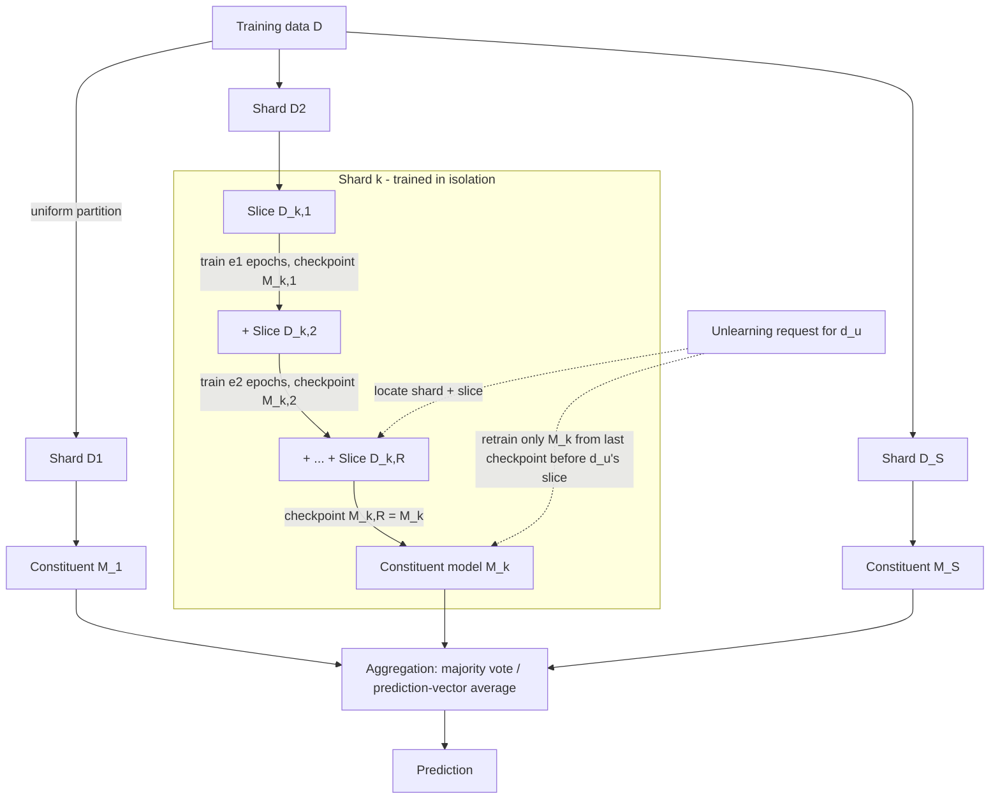

## Summary

The GDPR/CCPA "right to be forgotten" requires that a model provably no longer reflects a user's deleted data, but retraining from scratch is intractable at scale. Bourtoule et al. (IEEE S&P 2021) introduce **SISA training** (Sharded, Isolated, Sliced, Aggregated), which strategically limits each training point's influence *by construction*: the dataset is partitioned into $S$ disjoint shards, one constituent model is trained per shard in complete isolation, each shard is further cut into $R$ slices with parameter checkpoints saved as slices are added incrementally, and inference aggregates constituent predictions (majority vote or prediction-vector averaging). Unlearning a point then means retraining only the affected shard's model from the checkpoint just before the point's slice was introduced — giving the same distributional guarantee as retraining from scratch ([[Exact Unlearning]]) at a fraction of the cost. On simple tasks (Purchase, SVHN) SISA yields 4.63× / 2.45× speed-ups with <2 percentage points (PPs) accuracy loss; on ImageNet it yields 1.36× with a larger accuracy gap that transfer learning substantially closes.

## Key Contributions
- **A new, intuitive definition of unlearning** (Def. III.1): training on a point and then unlearning it must produce the same *distribution* of models as never training on it — strictly stronger than what poisoning mitigation needs, and explicitly distinct from [[Differential Privacy]] (DP bounds each point's influence but the bound is non-zero; unlearning requires zero residual influence, and $\epsilon = 0$ DP cannot learn at all).
- **SISA training**: a practical, model-agnostic framework (sharding + isolation + slicing + aggregation) implementable with minimal pipeline changes; guarantee follows from the training algorithm's design, making it intelligible and auditable rather than resting on per-point influence analysis, which is intractable for DNNs ([[Influence Functions]] are expensive and unreliable there).
- **Analytical cost model**: closed-form expected retraining costs for sequential and batched unlearning requests under sharding and slicing, validated by the (experimentally confirmed) linear relationship between retraining time and number of retrained samples.
- **Empirical evaluation** across task complexities (MNIST, Purchase, SVHN — simple; CIFAR-100, Mini-ImageNet, ImageNet — complex), identifying the regimes where SISA wins and quantifying accuracy trade-offs; code released (cleverhans-lab/machine-unlearning).
- **Distribution-aware sharding** (§VIII): when the provider knows the unlearning-request distribution (modeled on Google's reported deletion rates, ~$10^{-6}$ of the dataset), concentrating high-erasure-probability users into few small shards (Poisson-binomial construction, Algorithm 1) further cuts expected retraining, at ~1 PP accuracy cost (94.4% vs. 95.7% on SVHN).
- **Strawman analysis**: why DP ($\epsilon=0$ contradiction), [[Certified Removal]] (probabilistic residue, effectively limited to linear models), statistical query learning (diverges for adaptive queries / DNNs), and decremental learning (model-specific) fail the paper's goals G1–G6 (intelligibility, comparable accuracy, reduced unlearning time, provable guarantees, model-agnosticism, limited overhead).

## Architecture / Method

**The four components:**

1. **Sharding** — $D$ is uniformly partitioned into $S$ disjoint shards ($\cap_k D_k = \emptyset$, $\cup_k D_k = D$); each point belongs to exactly one shard (maximizes unlearning savings). Expected speed-up per single request: $S\times$.
2. **Isolation** — no gradient/update flow between constituent models. This is what makes the guarantee *provable and intuitive*: a point's influence is structurally confined to one constituent. Cost: constituents may become weak learners on small shards.
3. **Slicing** — each shard is split into $R$ slices; training proceeds incrementally ($D_{k,1}$, then $D_{k,1}\cup D_{k,2}$, ...), checkpointing parameters before each new slice. Unlearning restarts from the last checkpoint not containing the point. Requires a *stateful, iterative* learner (gradient descent yes; greedy decision-tree induction no). Storage overhead is linear in $R$.
4. **Aggregation** — label-based majority vote by default (must not involve training data, or the aggregator itself would need unlearning); prediction-vector averaging recovers accuracy on complex tasks (+1.68 PPs top-1, +4.37 PPs top-5 on ImageNet).

**Unlearning definition (Def. III.1).** Let $D' = D \cup d_u$; let $\mathcal{D}_M$ be the distribution of models from training mechanism $M$ on $D'$ then unlearning $d_u$, and $\mathcal{D}_{real}$ the distribution from training $M$ on $D$. $M$ facilitates unlearning when
$$\mathcal{D}_M = \mathcal{D}_{real}$$
*What each symbol means:* $d_u$ = the user's data (a point or set); $\mathcal{D}_M, \mathcal{D}_{real}$ = distributions over models (not single models) because training is stochastic.
*Logic:* stochasticity means identical parameters can arise from different datasets and vice versa, so the meaningful guarantee is distributional indistinguishability — plausible deniability that $d_u$ was ever used. Notably, retraining from scratch isn't required, only *evidence* the model could have been trained without $d_u$; SISA's evidence is the training algorithm itself.

**Epoch recalibration for slicing (Eq. 1).** To keep total training time equal with and without slicing:
$$e' = \frac{2R}{R+1}\, e_0$$
*What each symbol means:* $e_0$ = epochs without slicing; $e'$ = total epochs across all $R$ incremental steps (assuming each step trains equally long, $e_i = e'/R$, and time scales with data volume).
*Logic:* early steps see less data and are cheaper, so more epochs fit in the same wall-clock budget; equating cumulative sample-passes $e_0 D = \sum_i e_i \frac{iD}{R}$ yields the factor $\frac{2R}{R+1}$.

**Expected retraining cost — sharding (uniform requests).** Sequential, after $K$ requests (Eq. 2):
$$\mathbb{E}[C] = \left(\frac{N}{S} + \frac{1}{2S} - 1\right)K - \frac{K^2}{2S}$$
Batched (Eq. 3):
$$\mathbb{E}[C] = N\left(1 - \left(1 - \frac{1}{S}\right)^K\right) - K$$
*What each symbol means:* $C$ = number of samples to retrain (proxy for time, validated as linear); $N$ = dataset size; $S$ = number of shards; $K$ = number of unlearning requests; each request hits any shard with probability $1/S$.
*Logic:* sequentially, each request retrains one shard of $\approx N/S$ points (minus points already deleted — hence the $-K^2/2S$ correction). In the batch case, $1-(1-1/S)^K$ is the expected fraction of shards hit by at least one of $K$ uniform requests; only those shards retrain. Benefits concentrate in the regime $K \ll N$; as $K \to N$, cost approaches $N - K$ (no better than retraining).

**Expected retraining cost — slicing.** Sequential, single request (Eq. 4):
$$\mathbb{E}[C] = e_0 D\left(\frac{2}{3} + \frac{1}{3R}\right)$$
*What each symbol means:* $D = N/S$ = points per shard; $R$ = slices per shard; a request in slice $r$ forces retraining slices $r$ through $R$ from the saved checkpoint.
*Logic:* averaging the truncated incremental cost over the uniformly random slice index gives the $\frac{2}{3} + \frac{1}{3R}$ factor; as $R \to \infty$ this tends to $\frac{2}{3}e_0 D$, i.e., a **maximum expected slicing speed-up of 1.5×** ($R=1$ gives none). Best case for a single request: up to $\frac{R+1}{2}\times$; combined with sharding, best case $\frac{(R+1)S}{2}\times$. Batched slicing (Eq. 5) uses the expected minimum impacted slice index; with $K \gg R$ the speed-up vanishes (but doesn't degrade below baseline).

## Results & Benchmarks

Setup: PyTorch 1.3.1, P100/T4 GPUs; same architectures for SISA and baselines (Purchase: 2 FC layers; MNIST: 2 conv + 2 FC; SVHN: Wide ResNet-1-1; CIFAR-100/ImageNet/Mini-ImageNet: ResNet-50). Baselines: (1) *batch-K* full retraining from scratch, (2) *1/S-fraction* training on a single shard's worth of data.

| Benchmark | Score | Baseline |
|-----------|-------|----------|
| Purchase (S=20, R=50, 8 requests) — unlearning speed-up | 4.63× | batch-K retraining from scratch |
| SVHN (S=20, R=50, 18 requests) — unlearning speed-up | 2.45× | batch-K retraining from scratch |
| Simple tasks — accuracy cost of the above | < 2 PPs degradation | batch-K accuracy |
| ImageNet (same S, R; 39 requests) — speed-up | 1.36× | batch-K retraining from scratch |
| ImageNet — top-5 accuracy cost (label aggregation) | −16.14 PPs avg (−19.45 PPs at 39 requests) | batch-K top-5 = 92.87% |
| ImageNet — top-1 accuracy cost | −18.76 PPs | batch-K top-1 = 76.15% |
| ImageNet — prediction-vector aggregation recovery | +1.68 PPs top-1, +4.37 PPs top-5 (top-5 gap → 11.77 PPs) | label-vote SISA |
| Mini-ImageNet (4 requests) — speed-up | 8.01× (at −16.7 PPs accuracy) | batch-K retraining |
| Transfer learning ImageNet→CIFAR-100, S=10 | top-1 gap ≈ 4 PPs; top-5 gap < 1 PP | S=1 baseline |
| Distribution-aware sharding (SVHN, 3-country scenario, 19 shards) | 94.4% accuracy, fewer expected retrained points | uniform sharding 95.7% |

Regime findings: sharding speed-up exists while $K < 3S$; for their datasets that is roughly $K \le 0.075\%$ of dataset size (sharding) and $\le 0.003\%$ (slicing, at $S=20$) — still three orders of magnitude more requests than Google's observed deletion rates ($\sim 10^{-6}$ of the dataset). Increasing $S > 20$ costs > 5 PPs accuracy even on simple tasks; slicing costs no accuracy provided epochs are recalibrated per Eq. 1. Beyond the regime, SISA *gracefully degrades* to the batch-K baseline.

## Limitations
- Speed-ups hold only for a bounded volume of requests ($K < 3S$); heavy deletion traffic reduces SISA to baseline retraining cost.
- Sharding degrades accuracy on complex tasks (weak learners from few samples per class per shard); mitigations (prediction-vector aggregation, transfer learning) narrow but don't eliminate the gap without a public-data base model.
- Slicing needs stateful iterative learners — no benefit for greedy methods like standard decision-tree induction — and imposes checkpoint storage linear in $R$.
- Hyperparameter search may need revisiting across $O(SR)$ models (reduced to $O(R)$ under uniform sharding with shared hyperparameters).
- Aggregation must ignore training data, ruling out learned controllers/re-weighting without extra unlearning burden; majority vote loses runner-up information.
- Distribution-aware sharding assumes the request distribution is precisely known and stable, creates unequal shards (accuracy trade-off), and raises fairness/ethics questions the authors defer (grouping likely-to-unlearn populations).
- Assumes an *honest* service provider; verification by outside parties is open (they suggest code audits). No protection goal against poisoning (deliberately out of scope).
- Assumes each point lives in exactly one shard; deduplicated/replicated data breaks the single-shard retraining story.

## My Notes & Questions
- This is the primary source behind [[SISA]] and the survey's "data partitioning / efficient retraining" family in [[A Survey of Machine Unlearning]] — and it resolves my earlier flagged question: exactness is w.r.t. the *SISA training procedure* (the constituent-and-aggregate model class), not w.r.t. monolithic training. The paper is explicit that the guarantee is "the distribution of models produced by this training algorithm without the point" — the algorithm itself is the certificate.
- The DP-vs-unlearning argument here ($\epsilon = 0$ means no learning) is the crispest statement of the orthogonality also discussed in [[Certified Data Removal from Machine Learning Models]] and the survey — DP bounds influence, unlearning must zero it.
- The linear time-vs-samples assumption is validated only on SVHN/Purchase/MNIST-scale models; for LR-scheduled large-model training this likely bends — relevant if I test SISA on modern LLM fine-tunes.
- Experiment idea for `04-Experiments/`: reproduce the $K < 3S$ regime boundary on SVHN with S ∈ {10, 20, 50} and check Eq. 3 against measured retraining cost.
- Open thread: verified unlearning (§IX) — SISA's auditability argument presumes code inspection; connects to the cryptographic proof-of-unlearning work (SNARK/Merkle on SISA) covered in the survey's verification section.

## Related
- [[SISA]] — architecture note for the method itself (updated from this primary source)
- [[A Survey of Machine Unlearning]] — situates SISA in the data-partitioning family; covers follow-ons (shard graphs, GraphEraser)
- [[Certified Data Removal from Machine Learning Models]] — the certified-removal strawman (Guo et al.) SISA compares against
- [[Understanding Black-box Predictions via Influence Functions]] — why per-point influence tracking fails for DNNs (motivating SISA's structural approach)
- [[Exact Unlearning]] · [[Differential Privacy]] · [[Certified Removal]]
