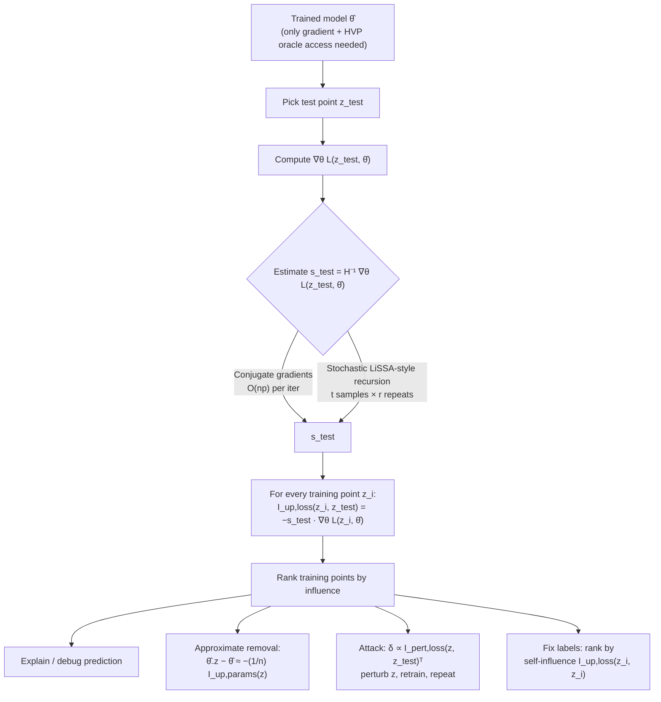

## Summary
Koh & Liang (ICML 2017) revive [[Influence Functions]] — a classic robust-statistics tool (Hampel, 1974; Cook & Weisberg, 1982) — to answer the counterfactual "what would this model predict if a given training point were removed or perturbed?" without retraining. They derive closed-form first-order approximations for the effect of upweighting, removing, or perturbing a training point on model parameters and on the loss at a test point, and scale them to modern models using implicit [[Hessian-Vector Product (HVP)|Hessian-vector products]] (conjugate gradients and the stochastic estimator of Agarwal et al., 2016), needing only gradient/HVP oracle access. Empirically, influence estimates closely match true leave-one-out retraining on convex models, and remain useful even when the theory's assumptions break (non-converged, non-convex CNNs via damping; non-differentiable hinge loss via smoothing). They demonstrate four use cases: understanding model behavior, crafting visually indistinguishable training-set attacks, debugging domain mismatch, and prioritizing mislabeled examples for human review.

**Why it matters for unlearning:** the removal approximation $\hat\theta_{-z} - \hat\theta \approx -\tfrac{1}{n}\mathcal{I}_{\text{up,params}}(z)$ is the mathematical core of influence-function-based approximate unlearning (e.g., certified removal builds a Newton-step deletion update on exactly this machinery).

## Key Contributions
- **Closed-form influence approximations** for the effect of upweighting/removing a training point on parameters ($\mathcal{I}_{\text{up,params}}$) and on test loss ($\mathcal{I}_{\text{up,loss}}$), plus a perturbation variant ($\mathcal{I}_{\text{pert,loss}}$) valid for arbitrary (even discrete) input/label changes.
- **Scalable computation**: avoids forming/inverting the Hessian ($O(np^2+p^3)$) by approximating $s_{\text{test}} = H_{\hat\theta}^{-1}\nabla_\theta L(z_{\text{test}},\hat\theta)$ with CG or stochastic Taylor-series estimation, giving $O(np + rtp)$ total cost over all training points, implementable in any autodiff framework.
- **Robustness beyond theory**: influence remains informative under non-convexity/non-convergence (damped Hessian $H_{\tilde\theta}+\lambda I$; Pearson's $R = 0.86$ on an unconverged CNN) and non-differentiability (SmoothHinge surrogate; $R = 0.95$ at $t=0.001$).
- **First proof-of-concept of visually-indistinguishable training-set attacks** on accurate neural networks: perturbing a single training image (same 8-bit representation) flipped predictions on 57% of test images for an Inception-v3-based classifier.
- **Practical debugging tools**: identifying domain-mismatch culprits and prioritizing label-noise inspection via self-influence $\mathcal{I}_{\text{up,loss}}(z_i, z_i)$.

## Architecture / Method

### Setup
Training points $z_1,\dots,z_n$ with $z_i=(x_i,y_i)$; the empirical risk minimizer is

$$\hat\theta = \arg\min_{\theta\in\Theta} \frac{1}{n}\sum_{i=1}^n L(z_i,\theta)$$

**What each symbol means:** $L(z,\theta)$ is the loss of parameters $\theta$ on point $z$ (regularizers folded in); $\hat\theta$ the trained parameters; $n$ the training-set size. The empirical risk is assumed twice-differentiable and strictly convex in $\theta$ (relaxed in §4 of the paper).
**Logic:** all influence results are local expansions around this optimum — they hold because the gradient of the empirical risk vanishes at $\hat\theta$.

### Upweighting a training point (Eq. 1)
Upweight $z$ by an infinitesimal $\epsilon$: $\hat\theta_{\epsilon,z} = \arg\min_\theta \frac{1}{n}\sum_i L(z_i,\theta) + \epsilon L(z,\theta)$. The classic result (Cook & Weisberg, 1982):

$$\mathcal{I}_{\text{up,params}}(z) \;\overset{\text{def}}{=}\; \left.\frac{d\hat\theta_{\epsilon,z}}{d\epsilon}\right|_{\epsilon=0} = -H_{\hat\theta}^{-1}\,\nabla_\theta L(z,\hat\theta)$$

**What each symbol means:** 
- $H_{\hat\theta} = \frac{1}{n}\sum_{i=1}^n \nabla^2_\theta L(z_i,\hat\theta)$ is the empirical-risk Hessian (positive definite by assumption); 
- $\nabla_\theta L(z,\hat\theta)$ the gradient of the loss at the upweighted point.
**Logic:** this is one Newton step on a quadratic approximation of the risk around $\hat\theta$ — upweighting $z$ pulls the optimum in the direction of $z$'s negative gradient, rescaled by the curvature. Directions of low curvature (little "resistance" from other points) yield larger parameter movement.

Removing $z$ equals upweighting by $\epsilon = -\tfrac{1}{n}$, so:

$$\hat\theta_{-z} - \hat\theta \;\approx\; -\frac{1}{n}\,\mathcal{I}_{\text{up,params}}(z)$$

**What each symbol means:** $\hat\theta_{-z}$ is the minimizer trained without $z$.
**Logic:** this linearization replaces full retraining with one closed-form step — the seed idea of influence-based approximate unlearning.

### Influence on a test prediction (Eq. 2)
Chain rule through the parameters:

$$\mathcal{I}_{\text{up,loss}}(z, z_{\text{test}}) = -\nabla_\theta L(z_{\text{test}},\hat\theta)^\top\, H_{\hat\theta}^{-1}\,\nabla_\theta L(z,\hat\theta)$$

**What each symbol means:** $z_{\text{test}}$ is the test point of interest; the expression is the derivative of $L(z_{\text{test}},\hat\theta_{\epsilon,z})$ w.r.t. $\epsilon$ at $0$.
**Logic:** a curvature-weighted inner product between train and test gradients. Positive value ⇒ upweighting $z$ hurts the test prediction (so removing $z$ helps it), and vice versa. §2.3 shows why this beats Euclidean similarity: the $\sigma(-y\theta^\top x)$ factor upweights high-loss (outlier) points, and $H^{-1}$ accounts for how much the rest of the data resists the change.

### Perturbing a training input (Eqs. 3–5)
For $z_\delta \overset{\text{def}}{=} (x+\delta, y)$, moving mass from $z$ to $z_\delta$ gives $\frac{d\hat\theta_{\epsilon,z_\delta,-z}}{d\epsilon}\big|_{\epsilon=0} = \mathcal{I}_{\text{up,params}}(z_\delta) - \mathcal{I}_{\text{up,params}}(z)$, which holds for **arbitrary** $\delta$ (useful for discrete data/labels). For small continuous $\delta$:

$$\mathcal{I}_{\text{pert,loss}}(z, z_{\text{test}}) = -\nabla_\theta L(z_{\text{test}},\hat\theta)^\top\, H_{\hat\theta}^{-1}\, \nabla_x\nabla_\theta L(z,\hat\theta)$$

**What each symbol means:** $\nabla_x\nabla_\theta L(z,\hat\theta) \in \mathbb{R}^{p\times d}$ is the mixed second derivative (how the parameter gradient shifts as the input $x$ shifts); $p$ = parameter dim, $d$ = input dim.
**Logic:** $[\mathcal{I}_{\text{pert,loss}}]\,\delta$ approximates the effect of $z \mapsto z+\delta$ on test loss; setting $\delta \propto \mathcal{I}_{\text{pert,loss}}^\top$ maximally increases test loss — the basis of the training-set attack.

### Efficient computation
Never invert $H_{\hat\theta}$. Precompute $s_{\text{test}} \overset{\text{def}}{=} H_{\hat\theta}^{-1}\nabla_\theta L(z_{\text{test}},\hat\theta)$ once per test point, then $\mathcal{I}_{\text{up,loss}}(z_i,z_{\text{test}}) = -s_{\text{test}}\cdot\nabla_\theta L(z_i,\hat\theta)$ for every $z_i$. Two estimators for $s_{\text{test}}$, both built on Pearlmutter (1994) implicit HVPs ($[\nabla^2_\theta L(z_i,\hat\theta)]v$ in the same $O(p)$ time as a gradient):

1. **Conjugate gradients (CG):** $H^{-1}v \equiv \arg\min_t \{t^\top H t - v^\top t\}$; each iteration costs $O(np)$.
2. **Stochastic estimation** (Agarwal et al., 2016): with the Taylor expansion $H_j^{-1} \overset{\text{def}}{=} \sum_{i=0}^{j}(I-H)^i \to H^{-1}$, sample training points $z_{s_1},\dots,z_{s_t}$ and recurse

$$\tilde H_j^{-1}v = v + \left(I - \nabla^2_\theta L(z_{s_j},\hat\theta)\right)\tilde H_{j-1}^{-1}v$$

**What each symbol means:** $\tilde H_j^{-1}v$ is the $j$-step unbiased estimate of $H^{-1}v$; $\nabla^2_\theta L(z_{s_j},\hat\theta)$ is a single-sample unbiased estimator of $H$; $t$ = iterations until stabilization, $r$ = repeats averaged to cut variance (requires scaling so $\nabla^2_\theta L \preceq I$ for convergence).
**Logic:** substituting a cheap unbiased Hessian sample into each Taylor term keeps the whole recursion unbiased ($\mathbb{E}[\tilde H_j^{-1}] = H_j^{-1} \to H^{-1}$), turning matrix inversion into $t$ cheap HVPs. Total cost over all training points: $O(np + rtp)$; empirically $rt = O(n)$ suffices and this beat CG.

### Handling broken assumptions
- **Non-convex / non-converged $\tilde\theta$:** form a damped quadratic $L(z,\tilde\theta) + \nabla L^\top(\theta-\tilde\theta) + \tfrac12(\theta-\tilde\theta)^\top(H_{\tilde\theta}+\lambda I)(\theta-\tilde\theta)$. **Symbols/logic:** $\lambda$ offsets negative eigenvalues of $H_{\tilde\theta}$ (equivalent to extra L2 regularization); near a local minimum this correlates with a Newton step after removing $\epsilon$ weight from $z$.
- **Non-differentiable losses:** compute influence on a smooth surrogate, e.g. $\text{SmoothHinge}(s,t) = t\log\!\left(1+\exp\!\left(\frac{1-s}{t}\right)\right)$. **Symbols/logic:** $s$ = margin $y\,w^\top x$, $t$ = temperature; as $t\to 0$ this converges to $\max(0, 1-s)$, restoring the curvature information the hinge's zero second derivative destroys.

## Results & Benchmarks
| Experiment                                                                                                               | Score                                                                                      | Baseline / Setting                                                                                      |
| ------------------------------------------------------------------------------------------------------------------------ | ------------------------------------------------------------------------------------------ | ------------------------------------------------------------------------------------------------------- |
| Influence vs. leave-one-out retraining, logistic regression, 10-class MNIST ($n{=}55{,}000$, $p{=}7{,}840$, L2 reg 0.01) | Predicted ≈ actual loss change (close match, Fig 2)                                        | Exact CG; stochastic version accurate with $r{=}10$, $t{=}5{,}000$ (even $r{=}1$ identified top points) |
| Unconverged, non-convex CNN (2,616 params, 10% of MNIST, 500k iters, damping $\lambda{=}0.01$)                           | Pearson's $R = 0.86$                                                                       | Retraining from $\tilde\theta$ for 30k steps, top-100 points                                            |
| Linear SVM, MNIST 1s vs 7s, SmoothHinge $t{=}0.001$                                                                      | Pearson's $R = 0.95$                                                                       | Raw hinge (derivative 0 at kink) badly overestimated influence; $R = 0.91$ at $t{=}0.1$                 |
| Training-set attack, Inception-v3 (top layer trained), dog-vs-fish (1,800 train / 600 test; 591 correct)                 | 57% (335/591) test predictions flipped via 1 perturbed training image                      | Same 8-bit representation (visually indistinguishable); 2 images → 77%; 10 images → all but 1 of 591    |
| Multi-target attack (30 test images of one dog)                                                                          | 16/30 predictions flipped by perturbing 1 training image                                   | Most-attacked image was the least-confident training example (77% vs. next-lowest 90%)                  |
| Domain-mismatch debugging, hospital readmission (20K diabetic patients, 127 features, logistic regression)               | The 4 training children were 30–40× more influential than the next most influential points | Inspecting learned coefficients failed (14/127 features had larger weight than the 'child' indicator)   |
| Mislabel detection, Enron1 spam (4,147 train / 1,035 test, 10% labels flipped, 40 repeats)                               | Self-influence prioritization repaired dataset while checking fewer points (Fig 6)         | Highest-train-loss ranking and random checking                                                          |

## Limitations
- **Local, first-order approximation**: assumes the model doesn't change much; group deletions or large distribution shifts ("how does this whole hospital's subpopulation affect the model?") are explicitly open questions — directly relevant to sequential/batch unlearning error accumulation.
- Theory requires twice-differentiability, strict convexity, and $\hat\theta$ being the exact ERM; non-convex results are empirical correlations (with a hand-tuned damping $\lambda$), not guarantees.
- Stochastic estimator needs loss scaling ($\nabla^2_\theta L \preceq I$) or an extra tuned hyperparameter; convergence of the Taylor expansion is otherwise not assured.
- Attack experiments assume the attacker can retrain (or observe retraining) after each perturbation iteration and has gradient access to the full network.
- Influence on discrete-data perturbations is derived but not tested empirically.
- Expected to weaken as training-set size grows (attacks harder; single-point influence shrinks as $O(1/n)$).

## My Notes & Questions
- This is the ancestral paper for influence-based approximate unlearning: the $-\frac{1}{n}H^{-1}\nabla L$ removal update is exactly the Newton-style deletion step later certified under (ε,δ)-style guarantees. Worth a [[Certified Removal]] note connecting Guo et al. 2020 back to Eq. 1 here.
- The training-set attack section doubles as a warning for unlearning pipelines: points with high self-influence (ambiguous/mislabeled) dominate the model — precisely the points whose deletion will move parameters most, i.e., worst-case deletion requests.
- Tension to explore: influence assumes the model changes little, but unlearning *wants* the model to change (forget). When is the linear regime informative enough for deletion, and when does it silently underestimate residual memorization? Connects to [[Membership Inference]] as the audit tool.
- Basu et al. later (2020, "Influence Functions in Deep Learning Are Fragile") challenged accuracy on large deep nets — flag for a future [[06-Critical-Reviews]] comparison. [unverified — from memory, not in this paper]
- Question: can the $s_{\text{test}}$ precomputation trick amortize *deletion* requests the same way it amortizes test points? (One $H^{-1}v$ per deletion, not per test point.)

## Related
- [[Influence Functions]]
- [[Data Poisoning]]
- [[Hessian-Vector Product (HVP)]]
- [[Membership Inference]]
- [[Differential Privacy]]

## Review

**2026-07-13 · Reviewer agent · VERDICT: PASS** — re-checked against arXiv:1703.04730 (ar5iv); benchmarks and core formulas match. Status `needs-review → reviewed`.

| Check | Result | Evidence |
| ----- | ------ | -------- |
| 1. Faithfulness | PASS | MNIST logistic n=55k / p=7,840 / L2=0.01; stochastic r=10,t=5k; CNN 2,616 params, 10% MNIST, 500k iters, λ=0.01, R=0.86; SmoothHinge R=0.95 (t=0.001) / 0.91 (t=0.1); attack 335/591=57%, 2→77%, 10→all-but-1; multi-target 16/30; least-confident 77% vs 90%; domain-mismatch 30–40× + 14/127 coeffs; Enron 4,147/1,035, 10% flips, 40 repeats — all match §§4–5. Eqs. 1–5, CG, Agarwal recursion match. |
| 2. Completeness | PASS | All template sections filled; frontmatter complete; no placeholders. |
| 3. Math | PASS | Every displayed formula is LaTeX and followed by symbol + logic prose; matches Eqs. 1–5 / §3. |
| 4. Wikilinks | PASS | Related targets resolve (`Influence Functions`, `Data Poisoning`, `HVP`, `Membership Inference`, `Differential Privacy`); `[[Certified Removal]]` in My Notes also resolves. |
| 5. Conventions | PASS | Tags ∈ README vocab; folder correct. Flag: `certified` is a loose fit (this paper is attribution/attacks, not (ε,δ)-CR). |
| 6. Cross-note | PASS | Linked stubs exist; Papers-MOC lists this note (status string synced to `reviewed` this pass). |
| 7. Calibration | PASS | Limitations match §7 (local/group deletion open; assumptions; discrete untested; O(1/n)); Basu fragility claim explicitly marked `[unverified]`; My Notes editorial. |

**Flags (non-blocking):**
1. **Attack wording:** 57% is of the **591 correctly classified** test images, not of all 600 — tighten Key Contributions / Results phrasing.
2. **Tag:** prefer dropping `certified` (keep `paper`, `verification`) unless you intentionally tag ancestral approximate-unlearning papers this way.
3. **Paper-internal notation:** Eq. 5 defines $\mathcal{I}_{\text{pert,loss}}$ without $1/n$; §3’s computational line inserts $1/n$. Note follows Eq. 5 (correct); worth a one-line caveat if you cite §3.
4. **`02-Concepts/Influence Functions.md`:** My Notes still says “Stub created by Worker…” — content is already beyond a stub; clean that line when convenient.
