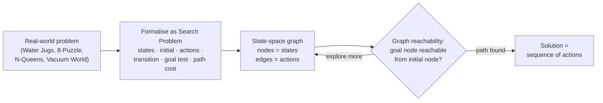

## Summary
> This lecture (Part 2 of the Week 1 deck, slides 19–51) introduces Artificial Intelligence as a field: what it is, how it is defined, where it came from, and where it is going. It frames AI through the lens of the Turing Test versus rationality, sets out the four classic approaches to AI (acting/thinking × humanly/rationally), surveys the sub-areas, foundational disciplines, and history of the field, and lists state-of-the-art achievements. It then pivots to the course's first technical topic — **Search** — motivating it with classic toy problems (Water Jugs, 8-Puzzle, N-Queens, Vacuum World) and formalising a **search problem** as six components, ultimately cast as graph reachability. It matters because search is the foundational problem-solving framework the rest of the course builds on.

## Key Points / Learning Outcomes
- The **Turing Test** (Alan Turing, 1950, *Computing Machinery and Intelligence*) tests a machine's ability to exhibit intelligent behaviour indistinguishable from a human's.
- The Turing Test conflates *behaving* like a human with *thinking* like a human, and offers little guidance on *how to build* an intelligent system; **rationality** is offered as an alternative — a precise mathematical notion of "doing the right thing" (noting humans are not always rational).
- **AI studies how to achieve intelligent behaviour through computational means** — constructing systems whose computation achieves or approximates rationality. AI is part of Computer Science.
- There are **four approaches to AI**: acting humanly, thinking humanly, thinking rationally, and acting rationally (the rational agent approach — "do the right thing").
- AI spans a large variety of sub-areas (search, knowledge representation, machine learning, NLP, vision, robotics, expert systems, etc.) and draws on many foundational disciplines.
- A **search problem** is defined by six components: possible states, initial state, actions, transition model, goal test, and path cost.
- Search can be understood as **graph reachability**: can we reach a goal node from the initial node?

## Core Content

### From Turing Test to Rationality
The lecture opens with Alan Turing's **[[Turing Test]]** (1950), which judges intelligence by whether a machine's behaviour is indistinguishable from a human's. Two critiques are raised: (1) behaving like a human is not the same as thinking like a human, and (2) the test gives little practical guidance on *building* intelligent systems.

As an alternative, the lecture introduces **[[Rationality]]** — a precise mathematical notion of what it means to do the right thing in any particular circumstance. A key caveat: humans are not always rational, so modelling human behaviour and modelling rational behaviour can diverge.

This leads to the working definition: *AI studies how to achieve intelligent behaviour through computational means* — we construct systems whose computation achieves or approximates the desired notion of rationality. AI is positioned as part of Computer Science, distinct from cognitive science, psychology, philosophy, and neuroscience, which study intelligence with a different central focus.

### Four Approaches to AI
The field is organised along two axes — *humanly vs. rationally* and *thinking vs. acting*:

| Approach | Axis | Description |
|----------|------|-------------|
| **Acting humanly** | human-centred | The Turing Test approach: behave intelligently enough to fool a human interrogator. |
| **Thinking humanly** | human-centred | The cognitive-modelling approach (now distinct from AI). |
| **Thinking rationally** | rationalist | The "laws of thought" approach; a direct line through mathematics and philosophy to modern AI. |
| **Acting rationally** | rationalist | The **[[Rational Agent]]** approach — doing the right thing: that which is expected to maximise goal achievement given the available information. |

### An Overview of AI (sub-areas)
AI consists of a huge variety of sub-areas. The lecture's overview map groups them under headings including: **Search** (heuristic search, games, optimization, problem solving, evolutionary computation, simulated annealing), **Knowledge Representation** (rules, semantic nets, conceptual graphs, logic), **Machine Learning** (neural networks), **Natural Language** (speech synthesis/recognition, machine translation, database query), **Vision** (image processing, object recognition, scene analysis, pattern recognition, medical imaging, industrial inspection), **Expert Systems / Knowledge Engineering** (knowledge acquisition, shells, Lisp/Prolog tooling), **Robotics** (navigation, planning, manipulation, factory robots), and **Web/Data Mining**.

### Foundations of AI
AI draws on several disciplines:

| Discipline | Contribution |
|------------|--------------|
| Philosophy | Logic, methods of reasoning, mind as physical system, foundations of learning, language, rationality |
| Mathematics | Formal representation and proof, algorithms, computation, (un)decidability, (in)tractability, probability |
| Economics | Utility, decision theory |
| Neuroscience | Plastic physical substrate for mental activity |
| Psychology | Adaptation, perception, motor control, experimental techniques |
| Computer Engineering | Building fast computers |
| Control theory & Cybernetics | Design systems that maximise an objective function over time |
| Linguistics | Knowledge representation, grammar |

### History of AI (timeline)
- **1943** — McCulloch & Pitts: Boolean circuit model of the brain
- **1950** — Turing's *Computing Machinery and Intelligence*
- **1956** — Dartmouth meeting: the term "Artificial Intelligence" adopted
- **1952–69** — "Look, Ma, no hands!" era
- **1950s** — Early AI programs: Samuel's checkers, Newell & Simon's Logic Theorist, Gelernter's Geometry Engine
- **1965** — Robinson's complete algorithm for logical reasoning
- **1966–73** — AI discovers computational complexity; neural-network research almost disappears
- **1969–79** — Early development of knowledge-based systems
- **1980–** — AI becomes an industry
- **1986–** — Neural networks return to popularity
- **1987–** — AI becomes a science
- **1995–** — Emergence of intelligent agents
- **2001–** — Availability of very large data sets

### State-of-the-Art and Future
Cited landmark systems: Deep Blue beating Kasparov; DART (automated logistics planning/scheduling for transportation); NASA Remote Agent (planning/scheduling for spacecraft operations); the DARPA Grand Challenge (autonomous desert/urban navigation); iRobot's Roomba and PackBot (used in the Afghanistan/Iraq wars); automated speech recognition for airline booking; machine-learning spam filters; and Google's usable machine translation.

Looking forward, the lecture points to LLMs, Movie Gen, and AlphaFold; research trends in large IT companies (GAFA, NVIDIA); the "threat of AI"; and Stanford's AI Index Report (https://aiindex.stanford.edu/report/) as a reference for tracking the state of the field.

### Search — the first key AI problem
The lecture introduces **[[Search Problem|Search]]** as a foundational AI problem, motivated by two application flavours: **path finding** and **games**. It uses four classic toy problems to build intuition:

- **Water Jugs** — given two jugs of different sizes, obtain exactly *x* litres in one jug.
- **8-Puzzle** — a sliding-block puzzle, a common test problem for new search algorithms.
- **N-Queens** — place N (usually 8) queens on a chessboard so no queen attacks any other.
- **Vacuum World** — two rooms, one vacuum; rooms are dirty or clean; three moves (Left, Right, Suck); only 8 possible states.

#### Formal definition of a search problem
A **search problem** is defined by six components:

1. **Possible states** — the state space.
2. **Initial state** — where the search begins.
3. **Actions** — what the agent can do.
4. **Transition model** — the result of applying an action to a state.
5. **Goal test** — whether a state satisfies the goal.
6. **Path cost** — the cost accumulated along a path.

The idea is to *transform* an initial state into a goal state via a sequence of actions.

The four toy problems instantiate these components as follows:

| Component | Water Jugs | 8-Puzzle | N-Queens | Vacuum World |
|-----------|------------|----------|----------|--------------|
| **State** | `x ∈ {0,1,2,3}`, `y ∈ {0,1,2,3,4,5}` (contents of each jug) | a puzzle configuration | queen placement on the board | room states + vacuum location |
| **Initial state** | both jugs empty | any state | empty chessboard | any state |
| **Actions** | empty/fill either jug from tap; pour jug 1→2; pour jug 2→1 | move a tile left/right/up/down (not always possible) | add queen to any empty square / to leftmost empty column / to leftmost empty column in a 'safe' row | left, right, suck |
| **Transition model** | new state of jugs | new puzzle state (if action applicable) | new chessboard | new room state |
| **Goal test** | 4 litres in the larger jug | goal configuration | all N queens on board in safe positions | (goal room state) |
| **Path cost** | number of exchanges | number of tile moves | number of piece moves | number of moves |

> Note: the slides leave the 8-Puzzle and Vacuum World *goal-test* cells, and the 8-Puzzle *state* cell, visually implied (shown as diagrams) rather than spelled out in text. [unverified — exact goal images not transcribed]

#### Search as graph reachability
Once formalised, solving a search problem reduces to **graph reachability**: treat states as nodes and actions as edges, then ask whether a goal node is reachable from the initial node (e.g., "Can we reach node 25 from node 17?"). The search proceeds from an initial state through intermediate states toward one or more goal states.

## Examples / Case Studies / Data
| Example | Detail | Notes |
|---------|--------|-------|
| Water Jugs | Two different-sized jugs; state `(x,y)` with `x∈{0,1,2,3}`, `y∈{0,1,2,3,4,5}`; goal = 4 litres in larger jug | Classic search-problem illustration; path cost = number of exchanges |
| 8-Puzzle | Sliding-block puzzle; tiles move L/R/U/D when possible | Common benchmark for new AI search algorithms; path cost = tile moves |
| N-Queens | Place N (usually 8) queens so none attack another | Multiple action formulations shown (any square / leftmost column / leftmost safe row) |
| Vacuum World | 2 rooms, 1 vacuum, moves = Left/Right/Suck | Only 8 possible states total |
| Deep Blue | Beat Kasparov | SOTA milestone (games) |
| DART / NASA Remote Agent | Automated planning & scheduling (logistics / spacecraft) | SOTA milestones (planning) |
| DARPA Grand Challenge | Autonomous vehicle, desert then urban | SOTA milestone (robotics/navigation) |
| Roomba / PackBot | Vacuum robot / military robot (Afghanistan & Iraq) | Consumer & field robotics |

## Limitations / Open Questions
- The **Turing Test** measures imitation of human behaviour, not genuine thought, and gives no constructive recipe for building intelligent systems.
- **Rationality** is a cleaner mathematical target, but humans themselves are not always rational — so "acting humanly" and "acting rationally" can conflict.
- **Thinking humanly** (cognitive modelling) is noted as now *distinct* from AI proper.
- Historically, neural-network research "almost disappeared" (1966–73) when AI ran into computational-complexity limits — a caution about hype cycles.
- The lecture notes "the threat of AI" as a forward-looking concern without elaborating.

## My Notes & Questions
- Exam-relevant: memorise the **four approaches** (acting/thinking × humanly/rationally) and which is the "Turing Test", "cognitive modelling", "laws of thought", and "rational agent" approach.
- Exam-relevant: be able to write out the **six components of a search problem** and instantiate them for any given toy problem (Water Jugs, 8-Puzzle, N-Queens, Vacuum World).
- The framing "search = graph reachability" is the bridge into the next topic — expect uninformed/informed search algorithms to follow.
- The four approaches and the "acting rationally / rational agent" framing map directly onto Russell & Norvig's *AIMA* — worth cross-referencing the recommended textbook.
- To-be-done this week (from the deck): get the textbook, read the recommended chapters, revise prerequisite knowledge, check the latest timetable, and attend the first tutorial session.

## Source
- Original file: AI-Lec01.pdf (pages 19–51, "Part 2: Introduction to Artificial Intelligence")
- Drive link: 

## Related
- [[Turing Test]]
- [[Rationality]]
- [[Rational Agent]]
- [[Search Problem]]
- [[State Space Search]]
