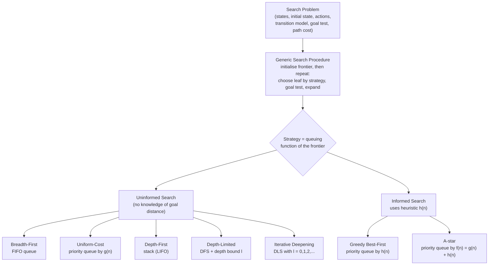

## Summary
> This lecture (COSC2129/1476, lecturer Thuy Nguyen) is the course's first deep technical session on **search**, building directly on the search-problem formulation introduced in [[AI Lecture 01 — Introduction to Artificial Intelligence]]. Part I formalises the generic search procedure and data structures (node, queue/frontier, hash table), lays out the four performance criteria (completeness, optimality, time, space), and works through the five classical **uninformed (blind)** search strategies — breadth-first, uniform-cost, depth-first, depth-limited, and iterative deepening — plus bidirectional search, using the Romania road map and the Missionaries & Cannibals puzzle as running examples. Part II introduces **informed (heuristic) search**: heuristic functions h(n), greedy best-first search, and A* search (f(n) = g(n) + h(n)), including the admissibility/consistency conditions needed for A* to be optimal, and how to construct heuristics via problem relaxation (illustrated on the 8-Puzzle). It matters because these algorithms — and their completeness/optimality/time/space trade-offs — are the toolkit the rest of the course's problem-solving content is built on.

## Key Points / Learning Outcomes
- The **generic search procedure** builds a search tree "on the fly": initialise the frontier with the initial state, repeatedly choose a leaf node per the search strategy, goal-test it, or expand it into successor nodes — search algorithms differ only in their **queuing function** (how the frontier is ordered).
- An **improved search procedure** adds an **explored set** and only adds a newly generated node to the frontier if it is not already in the frontier or explored set — this avoids the redundancy of repeated states (oscillations in the 8-Puzzle, many paths to the same grid cell).
- Search performance is judged on four criteria: **completeness** (guaranteed to find a solution if one exists?), **optimality** (finds the best solution?), **time complexity** (nodes expanded), and **space complexity** (memory needed) — parameterised by branching factor *b*, shallowest goal depth *d*, and maximum path length *m*.
- **Uninformed search** ([[Breadth-First Search]], [[Uniform-Cost Search]], [[Depth-First Search]], [[Depth-Limited Search]], [[Iterative Deepening Search]], bidirectional search) expands nodes based only on distance from the root — it never looks ahead toward the goal.
- **Informed (heuristic) search** ([[Greedy Best-First Search]], [[A* Search]]) uses a [[Heuristic Function]] h(n) — an estimate of cost-to-goal — to prioritise which node to expand next.
- **A* search** (f(n) = g(n) + h(n)) is optimal and complete provided the heuristic is admissible (tree-search) / consistent (graph-search) — the single most important informed-search result in the lecture.
- Good heuristics can be constructed by solving a **relaxed version** of the problem (fewer constraints) and using its solution cost as h(n).
- Classical search as covered here **cannot yet handle**: chance/uncertainty, hidden state, infinite state spaces, or adversarial (game-playing) settings — flagged explicitly as future course topics.

## Core Content
### Generic Search Procedure
```
function SEARCH (problem, strategy)

	return solution or failure
```


**Initialise the search tree with the initial state of the problem**
```
Repeat
	1. If (no candidate nodes can be expanded) then return failure
	2. Choose a leaf node for expansion according to strategy
	3. If (chosen node contains a goal state) then return solution
	4. Else expand the node, by applying legal actions (operations) to the state of the node, and then adding newly generated node(s) to the search tree.

```
### From Problem Formulation to Search Trees
Building on the six-component [[Search Problem]] formulation from Week 1, this lecture turns "solving the problem" into **[[State Space Search]]**: build a search tree rooted at the initial state, and repeatedly **expand** a chosen leaf node by applying legal actions to generate successor (child) nodes. *Which* leaf gets expanded next is entirely determined by the **search strategy** — this single choice is what distinguishes every algorithm in the lecture.



### Data Structures for Search
Every search algorithm needs three structures:
- **Node** — bundles a state, a pointer to its parent node, the action applied to reach it, and the accumulated path cost so far.
- **Queue (the frontier)** — the set of currently-generated-but-not-yet-expanded nodes; its internal ordering (FIFO, LIFO, or priority queue) *is* the search strategy.
- **Hash table** — used alongside an **explored set** for efficient checking of repeated states, so the same state is not re-expanded via a longer or equal-cost path (as George Santayana and, in Russell & Norvig's paraphrase, search algorithms "which cannot remember the past are condemned to repeat it").

### Performance Criteria
Four criteria are used throughout the lecture to judge every algorithm:
- **Completeness** — is a solution guaranteed to be found if one exists?
- **Optimality** — is the solution found guaranteed to be the cheapest?
- **Time complexity** — how many nodes get expanded (as a function of b, d, m)?
- **Space complexity** — how much memory (frontier + explored set) is required?

### Uninformed (Blind) Search
Uninformed strategies only know a node's "distance" from the root; they never estimate distance to the goal. Full details, worked traces on the Romania road map, and completeness/optimality/time/space analysis for each are in their own notes:

- **[[Breadth-First Search]]** — FIFO frontier, complete (finite b) and optimal (equal step costs), but O(b^d) time *and* space.
- **[[Uniform-Cost Search]]** — priority queue by path cost g(n); generalises BFS to unequal step costs; complete and optimal; O(b^⌈C*/ε⌉) time/space.
- **[[Depth-First Search]]** — stack (LIFO) frontier; space-efficient (O(bm)) but neither complete nor optimal in general.
- **[[Depth-Limited Search]]** — DFS bounded to depth l; avoids infinite branches but is neither complete nor optimal, and can terminate in a "cutoff" failure distinct from a genuine no-solution failure.
- **[[Iterative Deepening Search]]** — repeats DLS with l = 0, 1, 2, … ; combines DFS's O(bd) space with BFS's completeness/optimality and near-equal O(b^d) time — "in general, the preferred uninformed search method when the search space is large and the solution depth is unknown."
- **Bidirectional search** — simultaneously searches forward from the initial state and backward from the goal state, stopping when the two searches meet; can be very fast, but is problematic when there are many goal states, requires an efficient way to check whether the two frontiers have met, and may combine two different search strategies (one per direction).

**Worked example — Romania route-finding (Arad → Bucharest):** after expanding Arad (children Sibiu, Timisoara, Zerind) and then Sibiu, BFS expands Timisoara next (next unexpanded node at the shallowest remaining depth), while DFS expands Arad again next (deepest unexpanded node, diving back down through Sibiu's first child) — concretely showing why DFS can revisit nodes/looks deeper before wider, and why repeated-state checking matters.

**Performance comparison** (b = branching factor, d = shallowest goal depth, m = max path length, C* = optimal cost, ε = minimum step cost):

| Criteria | BFS | Uniform-Cost | DFS | DLS | IDS |
|---|---|---|---|---|---|
| Complete | Yes | Yes | No | No | Yes |
| Time | O(b^d) | O(b^⌈C*/ε⌉) | O(b^m) | O(b^l) | O(b^d) |
| Space | O(b^d) | O(b^⌈C*/ε⌉) | O(bm) | O(bl) | O(bd) |
| Optimal | Yes | Yes | No | No | Yes |

> Caveat raised in the lecture: none of the uninformed methods take into account "how far" a node is from the goal — that gap is exactly what motivates Part II.

### Informed (Heuristic) Search
Informed search adds a **[[Heuristic Function]]** h(n) — an estimate of the cost from n to the nearest goal (lower is more promising; h(n) = 0 at a goal, h(n) ≥ 0 elsewhere) — letting the search prioritise nodes that seem to be heading toward the goal rather than merely nodes that are shallow or cheap-so-far.

- **[[Greedy Best-First Search]]** — orders the frontier by h(n) alone; a heuristic version of DFS that "greedily" chases whatever looks closest to the goal. Not complete in general (can loop) and not optimal — on the Romania map it takes Arad–Sibiu–Fagaras–Bucharest (cost 450) instead of the true optimum, because it never accounts for path cost already spent.
- **[[A* Search]]** — orders the frontier by f(n) = g(n) + h(n), i.e. uniform-cost search plus a heuristic term. Optimal and complete when h is **admissible** (tree-search: never overestimates true cost) or, for graph-search, the stronger **consistent**/monotonic condition h(n) ≤ cost(n,n′) + h(n′). On the same Romania problem A* correctly finds the truly optimal route (Arad–Sibiu–Rimnicu Vilcea–Pitesti–Bucharest, cost 418), expanding Rimnicu Vilcea and then Pitesti rather than being lured down Fagaras.
- **Constructing heuristics** — relax the problem (loosen the movement rules) and use the relaxed problem's solution cost as h(n) for the original. On the 8-Puzzle: h1 = count of misplaced tiles (relax "tile moves to an adjacent blank" down to "tile can move to any position"); h2 = Manhattan/city-block distance summed over all tiles (relax down to "tile can move to an adjacent position regardless of occupancy"). Both are admissible; h2(n) ≥ h1(n) for all n, so h2 is **more informed** and lets A* expand fewer nodes.

### Limits of Classical Search (this week's scope)
The lecture closes Part II by explicitly flagging four settings today's algorithms **cannot** handle, previewing later course topics: **chance** (e.g. backgammon), **hidden state** (e.g. poker), **infinite state spaces** (e.g. continuous robot arm configurations), and **games against an adversary** (e.g. chess, football) — plus combinations of the above.

## Examples / Case Studies / Data
| Example | Detail | Notes |
|---------|--------|-------|
| Romania route-finding (Arad → Bucharest) | Weighted road-map graph; used to trace BFS vs DFS expansion order, then Greedy Best-First and A* using straight-line-distance-to-Bucharest as h(n) | Running example across both uninformed and informed sections; A* finds the optimal 418-cost route vs. greedy's 450-cost route |
| Missionaries & Cannibals | 3 missionaries + 3 cannibals, boat holds 1–2; state = `(#C-left, #M-left, boat-bank, #C-right, #M-right)`; initial `(3,3,LEFT,0,0)`, goal `(0,0,RIGHT,3,3)`; actions like `Move(#M,#C,source,dest)` | Used to illustrate concrete state representation and a fragment of the generated state space/search tree |
| 8-Puzzle heuristics | h1 = misplaced tiles; h2 = Manhattan distance; both admissible, h2 dominates h1 | Illustrates problem relaxation as a general recipe for designing heuristics, and A* node expansion traced with f = g + h1 |
| Generic search trace (nodes A–G) | Same 7-node tree traced under BFS (A,B,C,D,E,F,G) and DFS (A,B,D,E,C,F,G) | Shows the frontier (queue/stack) contents at each step |

## Limitations / Open Questions
- **[[Depth-First Search]]** and **[[Depth-Limited Search]]** are neither complete nor optimal — DFS can loop on cyclic state spaces unless repeated states are checked, and DLS can suffer a "cutoff" failure distinct from genuine unsolvability.
- **[[Greedy Best-First Search]]** is only complete if repeated states are removed, and is never guaranteed optimal since it ignores accumulated path cost.
- **[[A* Search]]**'s optimality guarantee is conditional: admissibility suffices for tree-search, but graph-search needs the stronger consistency property — the slides note "almost any" admissible heuristic is also consistent, without proving this holds universally.
- All algorithms covered are for **single-agent, fully-observable, deterministic, finite** state spaces — chance, hidden state, infinite spaces, and adversarial games are explicitly out of scope this week [unverified how/when these are addressed — not covered in this deck].
- The lecture does not spell out how to pick a good depth limit l for [[Depth-Limited Search]] beyond "based on knowledge of the problem" — no concrete method is given.

## My Notes & Questions
- Exam-relevant: reproduce the **performance comparison table** (Complete / Time / Space / Optimal for BFS, Uniform-Cost, DFS, DLS, IDS) from memory, including the b/d/m/C*/ε notation.
- Exam-relevant: be able to state the difference between **admissible** and **consistent** heuristics, and why graph-search A* needs consistency while tree-search A* only needs admissibility.
- Exam-relevant: trace A* vs. Greedy Best-First on the Romania map by hand — this is the lecture's canonical worked example and a likely exam/tutorial question.
- Worth connecting back to [[AI Lecture 01 — Introduction to Artificial Intelligence]]'s six-component problem formulation — this lecture is literally "now that we've formulated the problem, here's how to solve it."
- Follow-up to self: the "cannot tackle yet" slide (chance / hidden state / infinite states / adversarial games) is a good map of where the course is headed — worth revisiting once those topics (e.g. game-playing search, MDPs) are covered, to see how each gap gets closed.

## Source
- Original file: AI-Lec02 Search_.pdf
- Drive link: 

## Related
- [[Search Problem]]
- [[State Space Search]]
- [[Heuristic Function]]
- [[Breadth-First Search]]
- [[Depth-First Search]]
- [[Uniform-Cost Search]]
- [[Depth-Limited Search]]
- [[Iterative Deepening Search]]
- [[Greedy Best-First Search]]
- [[A* Search]]
- [[AI Lecture 01 — Introduction to Artificial Intelligence]]

## Glossary Terms
- [[Completeness]]
- [[Optimality]]
- [[Frontier]]
- [[Explored Set]]
- [[Branching Factor]]
- [[Solution Depth]]
- [[Maximum Path Length]]
- [[Path Cost]]
- [[Heuristic Value]]
- [[Evaluation Function]]
- [[Admissible Heuristic]]
- [[Consistent Heuristic]]

## Review
**2026-07-08 — VERDICT: PASS** (Reviewer agent, verified against AI-Lec02 Search_.pdf, 73 slides, re-read in full. Supersedes same-day FAIL: checks 2/7 re-scored as waived per the updated Drive-access rule in agents/reviewer.md.)

| # | Check | Result | Evidence |
|---|-------|--------|----------|
| 1 | Faithfulness | PASS | All spot-checked claims traceable: performance table incl. UCS O(b^⌈C*/ε⌉) (slide 46), IDS 123,456 vs BFS 111,111 (44), A* 418 vs greedy 450 (f-values, slide 66), M&C state/actions (22–23), Santayana/R&N quote (50), BFS/DFS A–G traces (32, 36), "preferred uninformed method" quote (41). |
| 2 | Completeness | PASS (waived) | All sections filled, no placeholders; `drive_link` empty only because Drive archiving is waived — see 7. |
| 3 | Course placement | PASS | In `01-Documents/AI/`, tags `document` + `course/ai`, matches `course: AI`. |
| 4 | Wikilinks | PASS | All 22 links resolve (7 architectures, 3 concepts, 12 glossary); no duplicates in shared pools. |
| 5 | Conventions | PASS | Tags/type/status values from README vocabulary. |
| 6 | Cross-note | PASS | All linked stubs exist; Documents-MOC has the Week 2 static entry. |
| 7 | Reference record | PASS (waived) | Record exists and set to `processed`. **Drive archive pending** — session-processing agent had no Drive access; `drive_link` left empty per agents/reviewer.md. |
| 8 | Calibration | PASS | Postgrad-appropriate depth; "My Notes & Questions" clearly separated from source claims. |

### Follow-ups (non-blocking)
1. **Drive archive pending:** when a Worker with Drive access next runs, upload `AI-Lec02 Search_.pdf` to Drive `AI/week02/` and populate `drive_link` here and in the reference record.
2. Advisory flag: slide 71's callout visually attaches "Misplaced tile heuristic" to the "B is blank (ignore adjacency)" relaxation, while this note (following R&N) maps h1 to "tile can move to any position". Confirm the lecturer's intent when convenient.
