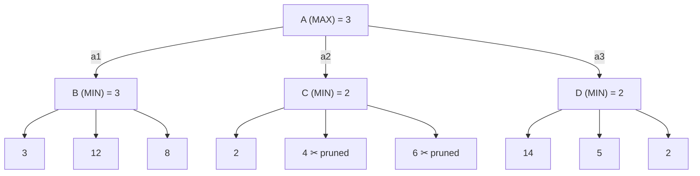

## Summary
> This lecture (COSC2129/1476, lecturer Thuy Nguyen, based on AIMA Chapter 6) extends the single-agent search of [[AI Lecture 02 — Solving Problems by Searching]] to **games with two or more players whose goals conflict** — adversarial search. After a revision of the classic uninformed and informed strategies, it formalises a game as a search problem, introduces **minimax search** (assuming a perfectly-playing opponent), then addresses efficiency: **alpha-beta pruning** cuts the effective search space (O(b^m) → O(b^(m/2)) with good move ordering), and **cutting off search** with a **heuristic evaluation function** (H-Minimax, Shannon 1950) replaces exact utilities when full-depth search is infeasible. It closes with **stochastic games** (chance nodes, expectiminimax) and a survey of state-of-the-art game programs (Deep Blue, Chinook, etc.). This is the course's answer to the "games against an adversary" gap flagged at the end of Week 2.

## Key Points / Learning Outcomes
- **Games as search:** multi-player games (chess, tic-tac-toe, checkers, Othello) can be formulated as search problems; it is adversarial search when the goals of different players conflict. Building the full tree from start to every ending is possible in principle but "almost impossible (and also unnecessary)" even for tic-tac-toe — instead, search from the *current* state for the best next move, the opponent replies, and the process repeats until the game is over.
- **Formal game definition** (a kind of [[Search Problem]]): initial state s0; Player(s) — who moves in state s; Actions(s) — legal moves in s; Result(s, a) — transition model; Terminal-test(s); and Utility(s, p) — value of a terminal state s for player p (e.g. chess: −1, 0, or 1 — a **zero-sum game**).
- **Minimax:** two players MAX and MIN; the root is a MAX node; MAX and MIN levels alternate. Minimax(s) = Utility(s) at terminal states, the max over actions of Minimax(Result(s, a)) at MAX nodes, and the min at MIN nodes — computed **depth-first**. Always assume the opponent plays perfectly (is infallible).
- **Ply** bounds depth: 2-ply = one move each; 2n-ply = n moves each.
- **Alpha-beta pruning:** same procedure as minimax, but stop expanding a MIN node whose current value ≤ α (best MAX value on the path to the root) and a MAX node whose current value ≥ β (lowest MIN value on the path to the root); the whole subtree of a pruned node is skipped. Same outcome as minimax, fewer expansions; with good move ordering, time drops from O(b^m) to O(b^(m/2)) — effective branching factor b^(1/2), i.e. **twice the search depth in the same time**.
- **Cutting off search:** when full-depth search is infeasible, limit depth and estimate utility with a heuristic **evaluation function** (idea from Claude Shannon, 1950). H-Minimax(s, d) = Eval(s) if Cutoff-test(s, d), otherwise max/min over actions as in minimax with d+1.
- **Good evaluation functions** are computationally efficient, match the ranking order of true terminal utilities (win > draw > loss), correlate strongly with actual winning chances on non-terminal states, and carry inherent uncertainty. Typically a weighted sum Eval(s) = w1·f1(s) + … + wn·fn(s), assuming independent features. Apply only at **quiescent states**; beware the **horizon effect** (mitigated by singular extension).
- **Stochastic games** (dice, card deals, coin tosses) add **chance nodes**: ExpectMinimax adds a Σ_r P(r)·ExpectMinimax(Result(s, r)) case at chance nodes. This complicates alpha-beta pruning; Monte Carlo (random) sampling over a large enough sample is an alternative.

## Core Content

### Games as Adversarial Search
The 8-puzzle involves one player; games usually involve two or more (chess, tic-tac-toe, checker, Othello). Game playing *can* be formulated as search — a tree from the initial setup to every possible ending (tic-tac-toe terminal utilities: −1, 0, 1) — but a full tree is impractical even for tic-tac-toe. The realistic method: from the current state, search for the "best" next move (ideally maximising the chance of winning), the opponent replies, then search again from the new state; repeat until the game ends. Minimax search is the standard way to find these moves.

### Formal Definitions
A game is a kind of search problem with: **s0** (initial state), **Player(s)**, **Actions(s)**, **Result(s, a)** (transition model), **Terminal-test(s)**, and **Utility(s, p)** — e.g. chess utilities −1/0/1 (zero-sum).

### Minimax Search
Two players, MAX and MIN. The initial state is a MAX node; children of MAX nodes are MIN (or leaf) nodes and vice versa.

$$
\text{Minimax}(s) =
\begin{cases}
\text{Utility}(s) & \text{if Terminal-test}(s)\\
\max_a \text{Minimax}(\text{Result}(s,a)) & \text{if Player}(s)=\text{MAX}\\
\min_a \text{Minimax}(\text{Result}(s,a)) & \text{if Player}(s)=\text{MIN}
\end{cases}
$$

Calculated in **depth-first** manner. Depth can be bounded via **ply** (2-ply = one move for me, one for my opponent; 2n-ply = n moves each).

**Canonical two-ply example (root A; MIN nodes B, C, D):** leaf utilities under B are 3, 12, 8; under C are 2, 4, 6; under D are 14, 5, 2. Value-assignment order: 3→b1, 12→b2, 8→b3, 3→B, 2→c1, 4→c2, 6→c3, 2→C, 14→d1, 5→d2, 2→d3, 2→D, 3→A. MAX's best move at the root is **a1** (highest minimax value, 3); MIN's best reply is **b1** (lowest utility). Always assume the opponent plays perfectly (infallible).

### Alpha-Beta Pruning
Not all branches need expanding:
- If one MAX's child has value 3, no MIN's child along its path to the root having value 3 or less will change this; if one MIN's child has value 2, no MAX's child along its path having value 2 or more will change this.
- **α** = highest current value of any MAX node along the path to the root; **β** = lowest current value of any MIN node along that path.
- Same procedure as minimax, except: at a **MIN node**, stop expanding if its current value ≤ α of its parent (it can't rise above α); at a **MAX node**, stop if its current value ≥ β of its parent (it can't fall below β). The pruned node's entire subtree is skipped.

**Same two-ply tree, traced:** expand B fully → β(B) = 3, so α(A) = 3. Expand C by c1 → utility 2 < α = 3, so C's value is 2 and expansion of C stops (**beta-pruning**: a MIN node cannot end higher than its parent MAX's α). Expanding c2, c3 (values 4, 6) would leave β(C) = 2 anyway — the search outcome is unaffected, so those expansions are unnecessary. Expand D: d1 = 14 > α → continue (can't stop at d2 — what if d3 were 2, 4, or 10?); d2 = 5 > α → continue; d3 = 2 < α → D's value is 2, stop. Next move identified: **a1**. Same outcome as minimax, fewer nodes expanded. (Note: the expansions of d1/d2 turned out not to be worthwhile — d3's low value dragged D down to 2.)

**Efficiency:** pruning quality depends on the **order of expansion** — try to generate children in "desired" order. Best case reduces minimax from O(b^m) to O(b^(m/2)), i.e. effective branching factor b^(1/2) — a tree **twice as deep** searchable in the same time. Implementation trick: **transposition tables** as hash tables.

### Why Games Are Hard / Search for Games
Search spaces can be huge (chess ≈ 10^40 states); not all moves may be chosen by the opponent(s); time limits may degrade search; exhaustive search is not how humans do it. Responses: assume an optimal opponent, prune the search space, use heuristic approximation of the expected utility, and deal with chance and imperfect information.

### Cutting Off Search — Heuristic Evaluation Functions
Idea goes back to **Claude Shannon (1950)**: limit depth and estimate utility via a heuristic evaluation function (an "educated guess").

$$
\text{H-Minimax}(s, d) =
\begin{cases}
\text{Eval}(s) & \text{if Cutoff-test}(s,d)\\
\max_a \text{H-Minimax}(\text{Result}(s,a), d{+}1) & \text{if Player}(s)=\text{MAX}\\
\min_a \text{H-Minimax}(\text{Result}(s,a), d{+}1) & \text{if Player}(s)=\text{MIN}
\end{cases}
$$

A good Eval(s): is computationally efficient; matches the ranking order of terminal utilities (winning > draws > losses); correlates strongly with actual winning chances at non-terminal states; and has some level of uncertainty (it is an estimate). Often a **weighted sum of features**, assuming feature independence:

$$\text{Eval}(s) = w_1 f_1(s) + w_2 f_2(s) + \dots + w_n f_n(s)$$

Chess example: 9·#Queens + 4·#Bishops + 3·#Knights + 1·#Pawns, where each feature is the white–black count difference (e.g. w1·f1(s) = 9 × (number of white queens − number of black queens)). Features and weights are **not part of the rules of chess** — they come from previous experience.

Apply Eval only to **quiescent states** (not "I am about to lose my queen!"); non-quiescent states (something under attack) can be detected and forced to expand further — this relates to the **horizon effect** and **singular extension**.

### Types of Games & Stochastic Games
| | Perfect information | Imperfect information |
|---|---|---|
| **Deterministic** | Chess, Draughts (checkers), Go, Othello, Noughts and Crosses (tic-tac-toe) | Kriegspiel, Battleship |
| **Stochastic** | Backgammon, Monopoly | Bridge, 500, Scrabble |

Stochastic games involve chance factors — dice, deals in a card game, coin tosses. Backgammon: moves are deterministic, but which moves are *legal* is determined by two dice → requires **chance nodes** in the game tree.

$$
\text{ExpectMinimax}(s) =
\begin{cases}
\text{Utility}(s) & \text{if Terminal-test}(s)\\
\max_a \text{ExpectMinimax}(\text{Result}(s,a)) & \text{if Player}(s)=\text{MAX}\\
\min_a \text{ExpectMinimax}(\text{Result}(s,a)) & \text{if Player}(s)=\text{MIN}\\
\sum_r P(r)\,\text{ExpectMinimax}(\text{Result}(s,r)) & \text{if Player}(s)=\text{CHANCE}
\end{cases}
$$

Chance nodes **complicate alpha-beta pruning**; Monte Carlo (random) choices over a large enough sample can be used instead.

### Revision — Classic Search Strategies (opening section)
Recap of Week 2 with hands-on examples: uninformed — [[Breadth-First Search]], [[Uniform-Cost Search]], [[Depth-First Search]], [[Depth-Limited Search]], [[Iterative Deepening Search]], bi-directional search; informed — [[Greedy Best-First Search]], [[A* Search]]. Performance criteria (completeness, optimality, time, space; parameters b, d, m) and per-algorithm properties restated, including: A* is optimal if h(n) is admissible (tree search) or consistent (graph search). Heuristic properties revisited: **admissibility** (never overestimates cost-to-goal; A* approaches the optimal cost C* from below; every node with f(n) < C* will be expanded), **consistency** (h(n) ≤ c(n, a, n′) + h(n′) for any successor n′), and **informedness** (h2 is more informed than h1 if h2(n) ≥ h1(n) — more informed heuristics search only a subset of the nodes searched by less informed ones).

### State-of-the-Art Game Programs (as presented in the deck)
- **Chess — Deep Blue (1997):** alpha-beta search on many specialist processors; typically 14-ply, sometimes up to 40-ply; opening book of 4,000 positions; database of 700,000 grandmaster games; endgame database of all 5-piece checkmates. "A good PC with the right program can match a human world champion."
- **Draughts — Chinook:** alpha-beta search, beat a human master in 1990; now plays perfectly with a vast endgame database.
- **Othello:** computers too good for humans.
- **Backgammon:** computers competitive with humans.
- **Go:** humans still ahead (branching factor 361); Monte Carlo methods used. *(Note: this slide predates AlphaGo (2016) — see My Notes.)*

## Examples / Case Studies / Data
| Example | Detail | Notes |
|---------|--------|-------|
| Tic-tac-toe full game tree | Terminal utilities −1 / 0 / 1; slide poses "how many nodes per level / how many levels?" | Motivates why the full tree is impractical even for a trivial game |
| Two-ply minimax tree (A; B, C, D) | Leaves: B→{3, 12, 8}, C→{2, 4, 6}, D→{14, 5, 2}; minimax value 3 at root; best move a1, best reply b1 | Canonical worked example, reused for the full alpha-beta trace |
| Alpha-beta trace on the same tree | c2, c3 pruned after c1 = 2 ≤ α = 3; D fully expanded (d1 = 14, d2 = 5 both > α, so no pruning until d3 = 2) | Shows both a successful prune and a case where pruning can't fire |
| Chess evaluation function | Eval = 9·ΔQueens + 4·ΔBishops + 3·ΔKnights + 1·ΔPawns (white − black counts) | Weighted-feature Eval; weights from experience, not the rules |
| Backgammon | Deterministic moves, legality determined by two dice → chance nodes | Motivating example for expectiminimax |
| Deep Blue, Chinook, Go | See "State-of-the-Art Game Programs" above | Historical snapshot as given in the deck |

## Limitations / Open Questions
- Minimax assumes a **perfectly rational (infallible) opponent** — the deck does not cover what happens against a fallible or non-optimal opponent.
- Alpha-beta's O(b^(m/2)) bound requires **good move ordering**, but the deck gives no concrete ordering method beyond "generate children in desired order".
- The weighted-sum evaluation function **assumes feature independence** — acknowledged in the slides, but no treatment of correlated features is given.
- Chance nodes **complicate alpha-beta pruning**; the deck flags Monte Carlo sampling as an alternative without detailing it — likely connects forward to Monte Carlo methods later (and overlaps with the [[Monte Carlo Simulation]] course).
- **Imperfect-information games** (Kriegspiel, Bridge, Scrabble) are classified in the game-type table but no solution method for them is presented in this deck.
- The horizon effect and singular extension are named but not developed [the deck names them without definitions — definitions not stated in the source].

## My Notes & Questions
- Exam-relevant: be able to **hand-trace minimax and alpha-beta on the two-ply A/B/C/D tree**, including the exact value-assignment order and *why* c2/c3 are pruned but d1/d2 must still be expanded ("what if d3 = 2, 4, 10?"). This is the deck's canonical example and an obvious exam question.
- Exam-relevant: state the α and β definitions precisely (α = highest MAX value on the path to root, β = lowest MIN value on the path to root) and the two stopping rules (MIN node: value ≤ parent's α; MAX node: value ≥ parent's β).
- Exam-relevant: the O(b^m) → O(b^(m/2)) result and its interpretation (search twice as deep in the same time; effective branching factor √b).
- Engineering framing: H-Minimax is the classic compute-budget trade-off — exact search swapped for a learned/hand-crafted value estimate at a depth cutoff. The weighted-feature Eval is essentially a linear value-function approximation; modern engines replace it with learned evaluators.
- The Go slide ("humans still ahead") is a pre-2016 snapshot — AlphaGo has since beaten top humans using MCTS + deep networks [not in the source deck; flagged as outside material].
- Cross-course link: the "Monte Carlo (random) choices" escape hatch for stochastic games connects directly to the [[Monte Carlo Simulation]] course — worth a critical review once both courses have covered their respective Monte Carlo material.
- Question for tutorial: for expectiminimax, under what conditions can alpha-beta-style pruning still be applied at chance nodes (bounded utilities)? The deck says pruning is "complicated" but doesn't elaborate.

## Source
- Original file: AI-Lec03- Adversarial Search.pdf
- Drive link: 

## Related
- [[AI Lecture 02 — Solving Problems by Searching]]
- [[AI Lecture 01 — Introduction to Artificial Intelligence]]
- [[Adversarial Search]]
- [[Minimax Search]]
- [[Alpha-Beta Pruning]]
- [[Expectiminimax]]
- [[Search Problem]]
- [[State Space Search]]
- [[Heuristic Function]]
- [[A* Search]]

## Glossary Terms
- [[Evaluation Function]]
- [[Admissible Heuristic]]
- [[Consistent Heuristic]]
- [[Branching Factor]]
- [[Zero-Sum Game]]
- [[Ply]]
- [[Game Tree]]
- [[Chance Node]]
- [[Quiescent State]]
- [[Horizon Effect]]
- [[Transposition Table]]
