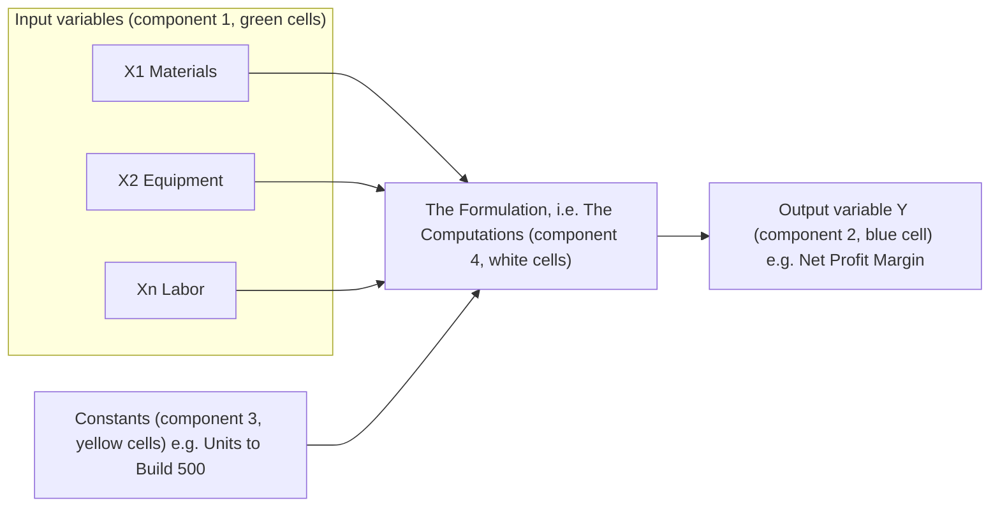
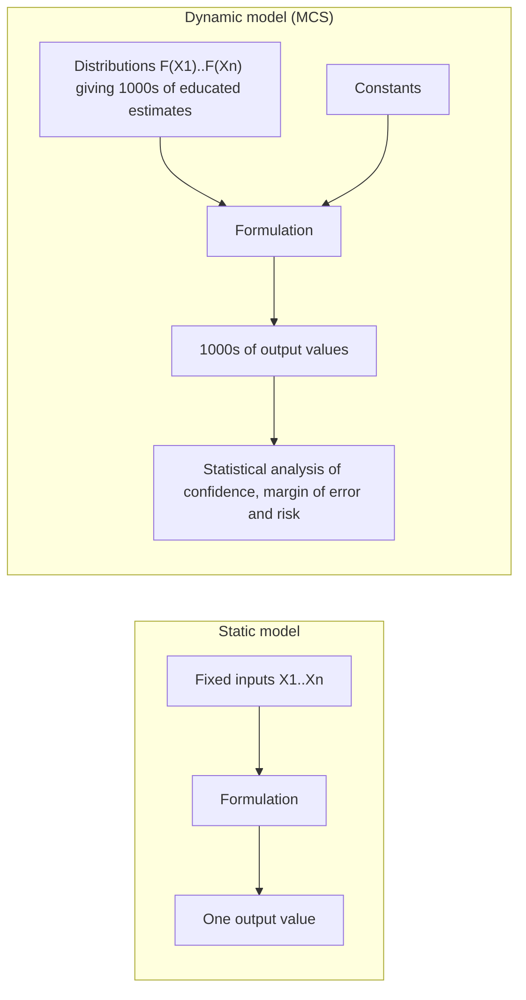

## Summary
> This note combines Section 1, Lectures 3 and 4 of the Monte Carlo Simulation course. Lecture 3 (The Purpose of MCS) defines simulation via Claude Shannon's 1975 definition, decomposes a formulation/model into its four components (input variables, constants, computational procedures, output variables), contrasts static vs. dynamic formulations, and presents the two main benefits of MCS — (1) resolving the problem of estimation by producing estimates with measured confidence, and (2) matching the model with reality — illustrated with an airline-catering trolley case and a hotel room-pricing case. Lecture 4 (The Background of MCS) covers the method's origins with Fermi, von Neumann, and Ulam in the Manhattan Project, the 1949 Metropolis–Ulam paper, the origin of the "Monte Carlo" name, and the sister method Discrete Event Simulation.

## Key Points / Learning Outcomes
- Simulation (Shannon, 1975): "the process of designing a model of a real system and conducting experiments with this model for the purpose 1) either of understanding the behavior of the system or 2) for evaluating various strategies (within the limits imposed by a criterion or a set of criteria) for the operation of the system."
- A formulation model has 4 components: input variables, constants, computational procedures, and output variables. Static models feed fixed input values through the formulation and can only ever give 1 result.
- Main Benefit 1 — resolving the problem of estimation: the validity of the output variable(s) is totally dependent on the confidence we have in our estimates of the input variables. MCS replaces single fixed estimates with thousands of randomly generated values drawn from probability distributions, giving a measured confidence and insight into the margin of error / risk.
- Main Benefit 2 — matching the model with reality: building and validating an MCS model tests our understanding of reality and lets us verify how far the model is from it (cartography analogy via Borges's "On Exactitude in Science").
- Generic broad MCS process: (1) develop a static formulation and identify inputs/outputs/constants; (2) identify a distribution and its parameters per input variable; (3) generate 1000s of scenarios with randomly generated values; (4) analyze the 1000s of output values statistically. A more detailed 8-step process comes in Section 4.
- History: developed by Enrico Fermi, John von Neumann, and Stanislaw Ulam, who met in the mid-40s on the Manhattan Project (1942–1946, Los Alamos) studying neutron behavior. First official paper: Metropolis & Ulam, "The Monte Carlo Method" (Journal of the American Statistical Association, 1949). Named after the Monte Carlo district of Monaco, famous for its casinos.
- MCS is powerful for analyzing formulations but not adaptable to workflows, event networks, and other processes — for those, analysts use the sister method [[Discrete Event Simulation]].

## Core Content

### Simulation and the estimation problem (L1.3 §A)
One of the main problems in business analytics is dependence on fixed or static estimates: using fixed values for input variables can only give 1 result. Shannon's definition recommends a "dynamic" experiment instead.

A **formulation model** has **4 components**:

1. **Input variables** — the drivers of the model; what we must estimate to get output values. Also called *Change Variables* (we care how their changes affect results) or *Independent Variables* (the way they vary is beyond our control, and the end-result depends on them). Examples: equipment costs, arrivals per hour, sales demand, financial returns of a stock, credit cards lost, room bookings, cancelations, discounts, interest rates, ATM withdrawals.
2. **Output variables** — the results of the computation; often called *Dependent Variables*. A model may have several. Examples: net profit margin, total equipment cost, truck utilization rate, total project duration, cost of missed sales due to stock shortage.
3. **Constants** — values that do not change throughout the formulation. If a constant might change, it must be treated as an input variable. Examples: maintenance rate, exchange rates, working hours/day, pallet capacity in kg, number of years, expense growth rate, maximum salary, airline ticket cost.
4. **Computational procedures** — the formulation itself (the computations connecting inputs and constants to outputs).

*Mirrors slides 9, 11 and 16 of L1.3: independent/change input variables flow in from the left, constants drop in from the top, the formulation box does the computations, and the dependent output Y comes out the right. Component numbering follows the lecture (1 inputs, 2 outputs, 3 constants, 4 computational procedures).*

High-school algebra analogy: in `Y = 5X² + 3X + 1`, the X's are the input variables, the coefficients 5, 3, 1 are the constants, Y is the output variable, and the right-hand side is the formulation. Key insight (repeated twice in the deck): **if we knew the input variables precisely — or had a clearly defined equation — we would not need to simulate.**

Worked static example — proposal to supply 500 units:

| Element | Value | Formula |
|---|---|---|
| Materials (input) | 40 | |
| Equipment rental (input) | 50 | |
| Labor (input) | 60 | |
| Subtotal variable costs | 150 | =SUM(B2:B4) |
| Units to build (constant) | 500 | |
| Total variable cost | 75,000 | =B7*B5 |
| Unit sales price | 200 | |
| Total revenue | 100,000 | =B9*B7 |
| Profit margin | 25,000 | =B10-B8 |
| **Net profit margin (output)** | **25.00%** | =B11/B10 |

Other formulation examples: NPV of a 5-year project, utilization rate of a production line, reliability of a multi-component system, material consumption projection in a warehouse, acceptance-sampling OC curve, total duration of a 50-task (mostly parallel) project.

### Where MCS can be used (L1.3 §B)
Earliest applications were strictly mathematical/scientific (e.g., solving complex integrals or differential equations). Typical objectives: (1) estimates with reliable confidence, (2) calculating specific values via elaborate formulations, (3) analyzing existing processes (utilization, bottlenecks, KPIs), (4) modeling/analyzing new process designs, (5) assessing risks of choosing wrong estimates, (6) assessing output sensitivity to input variation. Applicable sectors include sales & marketing, queuing systems, project management, acceptance sampling, material management, bookings/reservations, HR, financial analysis, risk management, reliability engineering, production management, and workflow analysis.

### Main Benefit 1: resolving the problem of estimation (L1.3 §C–D)
Traditional static estimation is called the "poison" of data analysis, data science, and machine learning. Analysts are under constant pressure to estimate costs, timings/durations, counts, rates, financial values, and KPIs. Unresolved, this produces: compounding errors in individual variables (larger global errors), guesses based on possibly invalid experience, copied estimates/formulations of doubtful validity, and single-scenario implementations that ignore alternative effects.

Intermediate improvement (Delphi-style): averaging N expert estimates. With 5 respondents, Materials = 42 (not 40), Equipment = 48 (not 50), Labor = 56 (not 60) → net profit margin 27% instead of 25%, now based on N estimates rather than 1.

The full **dynamic model** goes further — the "heart" of it, per input variable:

1. Identify a pattern of data from which to extract random samples (the frequency or probability distribution).
2. Distributions always have parameters (averages, standard deviations, rates, etc.).
3. Determine those parameters for each input variable's distribution.
4. Generate N random values from these distributions instead of collecting expert estimates.

Generic broad MCS process: (1) develop static formulation, identify inputs/outputs/constants → (2) identify best-fitting distribution + parameters per input → (3) generate 1000s of formulations (scenarios) with randomly drawn values → (4) analyze the 1000s of outputs statistically. Section 4 of the course expands this into an 8-step process.

### Main Benefit 2: matching the model with reality (L1.3 §E)
Borges's short story "On Exactitude in Science" (a cartographer scales his map up until it equals the empire, point by point) motivates the modeling tradeoff: your model is a pseudo-realistic map of your real business process — the more realistic, the nearer to the truth, but also the more complex and costly to produce ("and harder to fold"). We prepare models to test our understanding of reality; setting up an MCS model and analyzing its results verifies how far we are from reality.

**Real case 1 — airline catering trolleys.** A catering company at an airport with 70 incoming + 70 outgoing flights/day; incoming trolleys go to the kitchen for cleaning, outgoing trolleys are prepared and transported to aircraft. Operations claimed airport expansion required more staff; the manager believed the head count was already inflated. Desired outputs: utilization rates (kitchen throughput, loading, transport), queue lengths/averages per step, overall time in system. The 10-step trolley process: prep food → prep other items → load on trolleys → security check → load on hi-loaders → drive to airplane → remove incoming trolleys → install outgoing trolleys → drive back to wash hangar → remove and clean trolleys. Stage 1 (verification): all activity timings measured; best-fit distribution identified per activity (Normal, Uniform, Binomial); random values generated per input; formulation run 1000 times. Result: model matched reality (throughput, utilization, durations — whole process and single steps), so it could predict future situations. Stage 2 (extension): vary input parameters to test whether the same staff can handle more flights or more trolleys; classify flights by source/flight number; simulate different flight-volume periods across the year and day. Outcome: the manager proved current staffing sufficed for short-to-medium-term flight increases.

**Real case 2 — hotel room pricing.** Objective: estimate the right price per room with 2 room types (regular, suites), given bookings with/without availability, free upgrades to suites, suite bookings with/without availability, stay durations per type, and costs (per room type per day, free upgrades, etc.). A feasible room rate is impossible to estimate manually: too many input variables with built-in estimation errors feeding a complicated formulation.

### Other benefits of MCS (L1.3 §F)
1. **Applicability** — models (queuing, utilization, reservations, event flow) transfer across business domains.
2. **Flexibility** — models can be extended to analyze new operations or solutions.
3. **Risk assessment** — risk impacts, worst-case identification, evaluation of potential risks, budgeting for risk responses.
4. **Cost-effectiveness** — computer modeling is far cheaper than investigating actual implementations.
5. **Sensitivity and influence analysis** — spreadsheet modeling is well suited to identifying and ranking the input variables with the highest influence on the output.

### The background of MCS (L1.4)
Developed by three men who met in the mid-40s on the **Manhattan Project** (1942–1946, Los Alamos, New Mexico), studying the behavior of neutrons:

- **Enrico Fermi (1901–1954)** — creator of the world's first nuclear reactor; Nobel Prize 1938 for induced radioactivity; fermions named after him; developed the theory of Beta Decay generating the particle he called the Neutrino (later posited as one of the 4 fundamental forces in nature). He developed MCS techniques to support his theory of Neutron Scattering, working on an analog computer called **FERMIAC**.
- **John von Neumann (1903–1957)** — inventor of the von Neumann architecture (basis of the first digital computers and most computers today); "last of the great mathematicians". His hydrogen-bomb work was mostly computed on the newly created computers; with Ulam he developed simulations on his von Neumann machines.
- **Stanislaw Ulam (1909–1984)** — originated the Teller–Ulam thermonuclear design; discovered the concept of the cellular automaton. Playing Solitaire, he could not find a mathematical method to estimate the probability of winning, and developed the basis of MCS to model such games.

The first official paper on MCS: **Metropolis & Ulam, "The Monte Carlo Method" (1949)**, Journal of the American Statistical Association.

**Why "Monte Carlo"?** Monte-Carlo is the most famous of the 9 districts of the City State of Monaco (the second smallest country in the world after the Vatican), named after Prince Charles III who was behind its construction in the nineteenth century. It is famous for its casinos, one of which was frequented by Stanislaw Ulam's father.

Random numbers predate the method's naming: in 1947 the RAND Corporation issued *A Million Random Digits with 100,000 Normal Deviates*, available as a set of 20,000 punched IBM cards.

**Discrete Event Simulation**: MCS is powerful for formulations but not adaptable to workflows, event networks, or other processes — analysts use the sister method [[Discrete Event Simulation]]. In 1960 the first special-purpose simulation language, SIMSCRIPT, was developed by Harry Markowitz at RAND, followed by GASP, SLAM, SIMULA, ARENA, SIMIO, etc.

## Examples / Case Studies / Data
| Example | Detail | Notes |
|---------|--------|-------|
| Supply proposal (static) | 500 units; inputs 40/50/60; NPM 25% | Baseline static formulation — single result |
| Supply proposal (5-expert average) | Inputs 42/48/56; NPM 27% | N estimates > 1 estimate; precursor to full MCS |
| Airline catering trolleys | 70+70 flights/day, 10-step process, 1000 runs; Normal/Uniform/Binomial fits | Model verified against reality, then extended; proved staffing sufficient |
| Hotel room pricing | 2 room types, upgrades, availability-dependent bookings, stay durations, costs | Manual estimation infeasible — too many uncertain inputs |
| Y = 5X² + 3X + 1 | Algebra analogy for components | With a clearly defined equation, no simulation needed |

## Limitations / Open Questions
- MCS output validity still depends on choosing distributions and parameters that genuinely represent each input variable — the lectures defer the "how" (distribution fitting, the detailed 8-step process) to Section 4.
- MCS is not adaptable for simulating workflows, event networks, and other processes — that requires [[Discrete Event Simulation]] (queue/event-driven), previewed here but not yet taught.
- The realism/cost tradeoff (cartography analogy): more realistic models are nearer the truth but more complex and costly to produce.
- Open question for later lectures: how many runs are "enough" (the deck says "1000s") and how confidence is quantified statistically.

## My Notes & Questions
> Engineering framing: the static→dynamic move is exactly point-estimate → posterior/sampling thinking; MCS is forward uncertainty propagation through a deterministic formulation. The "constants that might change are input variables" rule is a practical modeling discipline — akin to deciding what goes in a config vs. what gets a prior. The trolley case is a queuing/utilization study run entirely as simulation because the process defies closed-form analysis — note the verification stage (calibrate against observed reality) before the extrapolation stage; that mirrors ML train/validate-before-predict discipline. Exam-relevant anchors: Shannon's definition (1975), the 4 model components, the 2 main benefits, the 4-step generic process, Metropolis & Ulam 1949, FERMIAC, RAND 1947 random digits, SIMSCRIPT 1960 (Markowitz).

## Source
- Original files:
  - `L1.3--(PowerPoint)+The+Purpose+of+Monte+Carlo+Simulation+(MCS).pdf` — [[L1.3--(PowerPoint)+The+Purpose+of+Monte+Carlo+Simulation+(MCS)|reference record]]
  - `L1.4--(PowerPoint)+The+Background+of+Monte+Carlo+Simulation.pdf` — [[L1.4--(PowerPoint)+The+Background+of+Monte+Carlo+Simulation|reference record]]
- Drive link: pending upload (Drive root for this course not yet configured)

## Related
- [[Monte Carlo Simulation]]
- [[Probability Distribution]]
- [[Discrete Event Simulation]]
