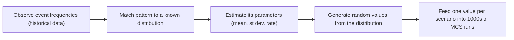

## Summary
> Combined note for Section 2 of the Monte Carlo Simulation course ("Probability, Random Numbers, Random Variables and Normal Distributions") plus a supplementary textbook chapter on the Poisson distribution. It covers the probability rules for combining events (union, exclusive union, conditional probability), what randomness and pseudo-random numbers are, random variables and their frequency/cumulative-frequency distributions (PMF, PDF, CDF), the Normal distribution with its five applications (spread, standardization, probabilities, inverse lookups, random generation), and the Poisson distribution and Poisson Process. Per request, each statistical definition is paired with one or two examples from the source material, and Excel-mechanics content (RAND/RANDBETWEEN/RANDARRAY/ToolPak workouts, DIST/INV/XLOOKUP function syntax) is deliberately omitted.

## Key Points / Learning Outcomes
- Combine event probabilities correctly: addition rule for inclusive OR (subtract the intersection once), exclusive XOR (subtract it twice), the "elegant" complement-based union formula that scales to any number of events, and conditional probability as a reduction of the sample space.
- Randomness means equal probability of occurrence or no assignable cause; computer-generated numbers are pseudo-random, and business inputs (arrivals, demand, breakdowns, defaults) behave as random events that can be modeled by distributions.
- A random variable X measures the value of a randomly occurring event (count or fractional measurement); its values are mutually exclusive. Discrete X's give a PMF, continuous X's a PDF, and both can be represented cumulatively as a CDF.
- Relative frequency = frequency % = probability = expectation; cumulative frequency % is the area under the frequency curve up to X and answers "P(X ≤ A)" and inverse "which A has P% below it" questions.
- The Normal (Gauss) distribution is fully defined by mean and standard deviation, is symmetric with mean = median = mode, and obeys the 68.26 / 95.46 / 99.73 % rule for ±1/2/3 standard deviations.
- Z-standardization, Z = (X − Mean) / StDev, converts measurements from different populations into a common currency (units of standard deviations) so they can be compared; reverse with X = Mean + Z·StDev.
- The Poisson distribution P(X = x) = e^(−θ)·θ^x / x! has mean = variance = θ, models counts of "successes" in time/space via the Poisson Process (θ = rate λ × window w), approximates the binomial when n is large and p small, and sums of independent Poissons are Poisson.

## Core Content

### 1. Probability of combined events (L2.1 P2)

**Union of events — inclusive OR (Addition Rule).** The union A∪B ("A or B or both") has probability P(A∪B) = P(A) + P(B) − P(A∩B). The intersection is subtracted because adding P(A) and P(B) counts the overlap twice (Venn-diagram argument).

- *Example 1 (cards):* A = drawing an Ace (4/52), B = a black card (26/52). P(A∩B) = 4/52 × 26/52 = 3.84% (the 2 black aces, 2/52). P(A∪B) = 4/52 + 26/52 − 3.84% = 53.84%.
- *Example 2 (proposals):* P(win project A) = 0.16, P(win B) = 0.24, P(win both) = 0.11 → P(at least one) = 0.16 + 0.24 − 0.11 = 0.29.

**The "elegant" union formula (any number of events).** From the OR truth table, P(all false) = (1−P(A))·(1−P(B))·…, so P(at least one) = 1 − (1−P(A))(1−P(B))… — valid for 2 or more independent events, avoiding the combinatorial explosion of the textbook 3-event formula.

- *Example:* four projects with win probabilities 0.2, 0.6, 0.4, 0.3 → P(at least one) = 1 − 0.8×0.4×0.6×0.7 = 1 − 0.1344 = 86.56%.

**Union of events — exclusive XOR.** "Either A or B but not both" (mutually exclusive outcome): subtract the intersection one more time, P = P(A) + P(B) − 2·P(A∩B).

- *Example:* same two projects — P(exactly one project) = 0.16 + 0.24 − 2×0.11 = 0.18. (XOR for more than 2 events is much more complex and deferred by the course.)

**Conditional probability (intersection of dependent events).** P(A | B) is the probability of A given that B has already happened: P(A|B) = P(A∩B) / P(B). Knowing B occurred *reduces the sample space* to B. If A is independent of B, P(A|B) = P(A).

- *Example 1 (cards):* sample space = 10 number cards; P(drawing the 5) = 1/10. Told the card was odd (5 odd cards), the sample space shrinks: P(5 | odd) = (1/10)/(5/10) = 1/5.
- *Example 2 (business):* probability a customer purchases product A having already purchased product B; probability a truck breaks down given it has not had preventive maintenance recently.

### 2. Randomness and random numbers (L2.2)

**Random events (definition).** Randomness relates to a set where each element has an equal probability of occurrence, or to events with no assignable cause (by nature or by our ignorance of the causes). Strict randomness does not occur in the "macro world" — but we often cannot explain causes, so events behave randomly.

- *Example 1 (mechanical randomness):* drawing a card from a well-shuffled deck; tossing non-fraudulent dice; a lottery funnel.
- *Example 2 (business processes):* customer arrivals at a bank lobby, sales demand, equipment breakdown rates, staff turnover, credit defaults, defects in samples, flight bookings and no-shows.

**Pseudo-random numbers (definition).** Computer-generated "random" numbers are causal (produced by a program), hence not truly random; since no value has priority over another they are called pseudo-random. Randomness/goodness-of-fit can be tested with the Chi-Square test, Q-Q plot, Kolmogorov-Smirnoff test, or Anderson-Darling test (not covered in depth).

**The modeling workflow.** Analyze an event's frequency pattern → associate it with a known probability (frequency) distribution → measure the distribution's parameters from historical data → generate random values fitting that distribution, one per scenario, across 1000s of scenarios. Distributions the course will use: Uniform, Discrete Probability, Normal, Binomial, Geometric.

- *Example 1:* pencil lengths from a production process follow a [[Normal Distribution]]; given average length and standard deviation, random lengths can be generated to represent production in the model.
- *Example 2:* vehicle arrivals at a petrol station follow the [[Poisson Distribution]]; counting arrivals per 5-minute period gave 33 arrivals over 11 periods → rate = 3.0 vehicles/period, which parameterizes the Poisson used to generate arrivals.

### 3. Random variables and distributions (L2.3 P1)

**Random variable (definition).** A random variable X measures the value of a randomly occurring event, where the value can be a count or a fractional measurement. Its values are mutually exclusive (a customer cannot buy 2 and 3 cones at the same time).

- *Example (ice cream shop):* X = number of cones a customer buys (0..N); Y = number of customers per value of X. With N = 8 and 400 customers, the frequency table (30, 45, 80, 120, 70, 30, 20, 4, 1) shows how X is distributed — management uses it to see how many buy 3 vs 5–7 vs none.

**Discrete vs continuous random variables.** Discrete X's are counts: defects per motherboard, trucks arriving per minute, machine breakdowns per hour, staff leaving per month. Continuous X's take any value in a range: amount defaulted (USD), patient temperature (°C), pipe diameter (cm), procedure completion time (minutes) — precision limited only by the measuring device.

**Binning (bracketing).** Continuous or overly fine data is grouped into bins (brackets/ranges) before building a frequency table; a value belongs to a bin if it is greater than the lower bound AND less than or equal to the upper bound.

- *Example 1:* invoice-preparation times measured in seconds, converted to fractional minutes and mapped to bins 3–5, 5–7, 7–9, 9–11, 11–13, 13–15 → frequencies 0, 3, 5, 5, 6, 1 (20 measurements).
- *Example 2:* 2000 cash deposits (USD with 2 decimals) bracketed into $10 bins for charting.

**Frequency, relative frequency, probability.** Frequency = count of observations per X. Relative frequency (Freq %) = frequency / total sample — a proportion. Interchangeable terms: Relative Frequency = Freq % = Probability = Expectation.

- *Example (24 scored applications, scores 1–6):* frequencies 2, 4, 6, 6, 4, 2 → Freq % 0.083, 0.167, 0.25, 0.25, 0.167, 0.083. P(score = 4) = 6/24 = 0.25, so as new applications arrive we *expect* a score of 4 about 25% of the time.

**PMF and PDF (definitions).** A distribution listing discrete, mutually exclusive items is a Probability Mass Function (PMF) — e.g. Bernoulli, Binomial, Geometric/Negative Binomial, HyperGeometric, Poisson. A frequency distribution of continuous items is a Probability Density Function (PDF) — e.g. Normal, BetaPERT, Exponential, Lognormal, Weibull, Gamma, Erlang, Logistic.

### 4. Cumulative frequency and the CDF (L2.3 P2)

**Cumulative Frequency % / CDF (definition).** The cumulative frequency % at X is the sum of Freq % from the lowest value up to and including X — equivalently the area under the frequency curve up to X (bars imagined as unit-width rectangles). The table or curve of cumulative frequency % is the Cumulative Frequency Distribution (CDF); it represents both PMFs and PDFs.

- *Example (application scores):* P(score < 5) = (2+4+6+6)/24 = 18/24 = 75%; P(score > 4) = (4+2)/24 = 25%; P(2 ≤ score ≤ 4) = (4+6+6)/24 = 66.67%. Cumulative column: 0.083, 0.25, 0.50, 0.75, 0.917, 1.0.
- *Non-adjacent values:* P(score = 2 or > 4) = (4+4+2)/24 = 41.66% — bars need not be adjacent.

**The three questions a frequency chart answers.** (Q1) Given X, the probability of exactly X (bar height); (Q2) given X, the cumulative probability of any value ≤ X (point on the cumulative curve); (Q3) given a %, the value A below which that share of the population falls (inverse: read the cumulative curve backwards). The inverse of a distribution is conceptually the CDF with its axes switched.

- *Example:* given probability 0.75, the inverse of the score distribution returns X = 4 (cumulative probability 0.75 happens at score 4).

**Chart conventions.** Frequency plots as bars (primary axis), cumulative frequency % as a line (secondary axis) — a combo chart. Terminology alert from the deck: such a chart is not a Pareto chart; a Pareto chart has the same components but bars sorted in descending order of Y.

### 5. The Normal distribution and its applications (L2.4 P1 + P2)

**Normal (Gauss / bell curve) distribution (definition).** Widely found in nature and business; completely defined by its mean and standard deviation; symmetric (half the population below the mean); extends to ± infinity; mean = median = mode. Some data-science/ML methods only work if data is normally distributed (testable), and it underpins Six Sigma computations.

- *Examples of normally distributed variables:* human vital statistics (height, weight, blood pressure); manufacturing measurements (weight, length, tolerance); sales demand; stock prices; satisfaction and performance scores; product defects.

**Mean (definition).** Mean = total value of measurements / number of measurements. Example: (5+7+12+14+8)/5 = 9.2. The mean alone is not sufficient: two patients can both average 37.0 °C while one is constant at 37.0 and the other swings 35.4–38.9 — spread matters.

**Variance and standard deviation (definitions).** Deviations from the mean sum to zero, so square them: variance = average squared deviation; standard deviation = √variance (restoring the original units). For a *sample* rather than the whole population, divide by (n−1) — the degrees of freedom — instead of n.

- *Example 1:* series 1, 2, 5, 5, 4, 4, 2, 1 (mean 3): squared deviations sum to 20; a constant series 3,3,…,3 sums to 0; series 0,1,4,7,5,3,3,1 sums to 38 — same mean, very different spread.
- *Example 2 (purchases):* 16 monthly purchases totalling $162,616 → mean $10,164; sum of squared deviations 135,233,490 → variance 8,452,093 → StDev ≈ $2,907 (back in USD).

**The 68/95/99.7 rule.** For a Normal population, ±1 StDev around the mean contains 68.26%, ±2 StDev 95.46%, ±3 StDev 99.73% of the population.

- *Example 1:* heights with mean 170 cm, StDev 3 → 68% of people between 167 and 173 cm.
- *Example 2:* procedure cost mean $54, StDev 2 → 95.46% of costs between $50 and $58.

**Z-score / standardization (definition).** To compare items from populations with different means and spreads, shift by the mean and divide by the standard deviation: Z = (X − Mean) / StDev. The Z distribution is the specific Normal with mean 0 and StDev 1; Z measures how far X lies from the mean *in units of standard deviations* ("a new currency"). Reverse: X = Mean + Z·StDev.

- *Example 1 (test scores):* Staff 1 scored 76 on test A (mean 70, StDev 5) → Z = 1.20; Staff 2 scored 82 on test B (mean 80, StDev 3) → Z = 0.667. Staff 1 performed better relative to their population despite the lower raw score.
- *Example 2 (credit-card transactions):* $175 in period 1 (mean $180, StDev $12) → Z = −0.42; $187 in period 2 (mean $195, StDev $9) → Z = −0.89. Transaction 2 is relatively lower although its dollar value is higher.
- *Reverse example:* Z = 1.3, mean 360, StDev 56 → X = 360 + 1.3×56 = 432.8 (deck's workout uses Z = 1.2 → 427.20).

**Application 3 — probability from an X (area under the curve).** Given X = A, the cumulative probability P(X ≤ A) is the area under the Normal curve from −∞ to A. For P(X > A) take 1 − P(X ≤ A); for P(A < X < B) subtract the two cumulative areas.

- *Example 1 (heights):* mean 170 cm, StDev 12 → P(height < 180) ≈ 0.7976 theoretically (a 4000-person sample's frequency table gave 0.8105 — sample results differ from the theoretical value, and differ per sample).
- *Example 2 (front-office queue):* waiting time mean 75 min, StDev 12 → P(wait > 90) = 10.56%, P(wait < 65) = 20.23%, P(65 < wait < 85) = area(85) − area(65).

**Application 4 — inverse (X from a probability).** Given a cumulative probability P, the inverse returns the value A such that P of the population lies below A. The native inverse always works on the left tail, so top-N% questions must be rephrased (top 30% ⇒ inverse at 70%); middle ranges need two inverse lookups.

- *Example 1 (incentives):* scores mean 89, StDev 8; top 30% ⇒ cutoff at inverse(70%); middle 60% ⇒ between inverse(20%) and inverse(80%).
- *Example 2 (retraining):* cashier scores mean 76, StDev 6; bottom 25% ⇒ cutoff = inverse(0.25) = 72.22 — cashiers below 72.22 get retrained. Z-flavor: the Z above 80% of the population is 0.8416; below 40% is −0.2533; the middle (50%) is Z = 0.
- *Example 3 (tender policy):* ATM bids mean $43,000, StDev $5,200; dropping the top 30% and bottom 30% of bids means keeping bids between inverse(30%) and inverse(70%).

**Application 5 — generating normally distributed values.** Feeding many random probabilities into the Normal inverse yields a normally distributed set of values — given a normally distributed input variable (mean, StDev), N random values can be generated and plugged one per scenario. This is the start of simulation, and inverse functions of other distributions extend it.

### 6. The Poisson distribution and the Poisson Process (textbook ch. 4)

**Poisson distribution (definition).** For a count random variable X over the non-negative integers, X ~ Poisson(θ) with one parameter θ > 0 (many texts use λ): P(X = x) = e^(−θ)·θ^x / x!, for x = 0, 1, 2, …. Mean μ = θ and variance σ² = θ (so σ = √θ). Strongly right-skewed for θ ≤ 5; approximately symmetric/bell-shaped for θ ≥ 25, which permits a Normal approximation with continuity correction: z = (x − 0.5 − θ)/√θ.

- *Example 1:* X ~ Poisson(10): P(X = 8) = 0.1126, P(X ≤ 8) = 0.3328, so P(X ≥ 9) = 1 − 0.3328 = 0.6672.
- *Example 2 (Normal approximation):* X ~ Poisson(25), P(X ≥ 30): μ = 25, σ = 5, continuity-correct to P(X ≥ 29.5) = P(Z ≥ 0.90) ≈ 0.1841 vs exact 0.1821.

**Estimating θ.** Point estimate is the observed x; approximate two-sided CI: x ± z√x. Example: x = 30 → 95% CI = 30 ± 1.96√30 = [19.3, 40.7]. The approximation is adequate for θ ≥ 40; below that, exact methods are preferred (e.g. observing X = 3 gives exact 95% CI [0.6187, 8.7673]).

**Poisson approximation to the binomial.** If X ~ Bin(n, p) with large n and small p, setting θ = np gives Poisson probabilities close to the exact binomial ones.

- *Example:* Bin(1000, 0.003) vs Poisson(3): P(X = 0) exact 0.0496 vs approx 0.0498; P(X = 2) 0.2242 vs 0.2240 — agreement to ~3 decimals.

**Poisson Process (definition).** A model for successes occurring at random times (or places) with three assumptions: (1) counts in disjoint intervals are independent; (2) the distribution of the count in an interval depends only on the interval's length; (3) successes cannot be simultaneous. Then the count in any window of length w is Poisson with θ = λ·w, where λ is the process rate. Extends to 2-D/3-D with θ = rate × area or volume.

- *Example 1:* radioactive particles hitting a target; accidents at an intersection; goals in a hockey game; vehicles passing on a remote highway.
- *Example 2 (sums):* independent X_i ~ Poisson(θ_i) sum to Poisson(Σθ_i) — ten i.i.d. Poisson(θ) observations summing to 92 give a CI for 10θ of 92 ± 1.96√92 = [73.2, 110.8], hence [7.32, 11.08] for θ.

**Why impose the Poisson structure?** A researcher can estimate p₀ = P(X=0) either non-parametrically (count zeros / n) or by assuming Poisson (estimate θ by the sample mean, then e^(−θ̂)). In the chapter's simulation (true θ = 0.6931, so P(X=0) = 0.5, n = 10, 1000 datasets), the Poisson-based estimator showed slight bias for small n but a ~14.2% smaller mean absolute error — imposing correct structure pays off, though clinging to a wrong assumption is the opposite failure mode.

## Examples / Case Studies / Data
| Example | Detail | Notes |
|---------|--------|-------|
| Ace-or-black-card union | 4/52 + 26/52 − 2/52 = 53.84% | Addition rule + elegant formula give same result |
| Two/four project proposals | P(≥1) = 0.29 (2 projects); 86.56% (4 projects); P(exactly one) = 0.18 | OR, elegant formula, XOR respectively |
| Card 5 given odd card | 1/10 → 1/5 | Conditional probability via reduced sample space |
| Petrol-station arrivals | 33 arrivals / 11 periods → rate 3.0 → Poisson | Counting → rate → distribution fit |
| Ice-cream cones | X = cones (0–8), 400 customers | Discrete frequency distribution for promotion decisions |
| 24 application scores | Freq 2,4,6,6,4,2; cum 0.083→1.0 | PMF + CDF, all three chart questions |
| Army heights | Mean 170, StDev 12; P(<180) ≈ 0.7976 vs sample 0.8105 | Theoretical vs sample cumulative probability |
| Front-office queue | Mean 75, StDev 12; P(>90) = 10.56%, P(<65) = 20.23% | Tail manipulation of cumulative areas |
| Staff test scores / card transactions | Z = 1.20 vs 0.667; Z = −0.42 vs −0.89 | Standardization reverses naive raw comparisons |
| Cashier retraining cutoff | Inverse(0.25) at mean 76, StDev 6 → 72.22 | Inverse application |
| Poisson(10) and Poisson(25) | P(X=8) = 0.1126; P(X≥30) ≈ 0.1841 | PMF and Normal approximation |
| Bin(1000, 0.003) vs Poisson(3) | Probabilities agree to ~3 decimals | Poisson approximation to binomial |

## Limitations / Open Questions
- The XOR relationship for more than 2 events is deferred by the course ("much more complex — clarified when needed").
- Randomness tests (Chi-Square, Q-Q, Kolmogorov-Smirnoff, Anderson-Darling) are named but not taught; the course points to external tutorials.
- Sample-derived frequency tables differ from theoretical distribution values (and between samples) — the course flags this but defers formal treatment of sampling error; confidence intervals arrive in Step 6 of the MCS process, where Percentile functions replace Normal-based intervals for non-Normal outputs.
- The Poisson chapter's structure-vs-no-structure debate (parametric bias vs lower error) is left as a judgment call — "how much math structure should we impose?" has no rule given.
- Excel implementation details (RAND family, Analysis ToolPak, DIST/INV/XLOOKUP syntax and workouts) were deliberately excluded from this note per request; refer to the source PDFs when doing the workouts.

## My Notes & Questions
> The through-line for MCS: Section 1 said inputs need distributions; Section 2 supplies the machinery — probability algebra for combining events, the RV/frequency-table formalism, the CDF as the bridge between probabilities and values, and the inverse-CDF trick (uniform random number → inverse → distribution-shaped random value) that is *the* core mechanism of Monte Carlo sampling (Application 5). Note the deliberate identification frequency % = probability = expectation — a frequentist stance that makes the empirical histogram the estimator of the PMF/PDF. The Z-score section is the same standardization used everywhere in ML feature scaling. The Poisson chapter is deeper than the slides: mean = variance = θ is the classic overdispersion check, and the "why bother" simulation is a neat bias-variance argument for parametric structure. Exam anchors: addition rule vs XOR (−P vs −2P), elegant formula 1−Π(1−pᵢ), P(A|B) = P(A∩B)/P(B), 68.26/95.46/99.73, Z = (X−Mean)/StDev, Poisson PMF with mean = variance = θ, Poisson Process assumptions, θ = λw.

## Source
- Original files:
  - `L2.1--(PowerPoint)+Applied+Probability+P2.pdf` — [[L2.1--(PowerPoint)+Applied+Probability+P2|reference record]]
  - `L2.2--(PowerPoint)+Random+Numbers,+Generation+and+their+Application.pdf` — [[L2.2--(PowerPoint)+Random+Numbers,+Generation+and+their+Application|reference record]]
  - `L2.3--(PowerPoint)+Random+Variables+and+Distributions+P1.pdf` — [[L2.3--(PowerPoint)+Random+Variables+and+Distributions+P1|reference record]]
  - `L2.3--(PowerPoint)+Random+Variables+and+Distributions+P2.pdf` — [[L2.3--(PowerPoint)+Random+Variables+and+Distributions+P2|reference record]]
  - `L2.4--(PowerPoint)+The+Normal+Distribution+and+its+Applications+P1.pdf` — [[L2.4--(PowerPoint)+The+Normal+Distribution+and+its+Applications+P1|reference record]]
  - `L2.4--(PowerPoint)+The+Normal+Distribution+and+its+Applications+P2.pdf` — [[L2.4--(PowerPoint)+The+Normal+Distribution+and+its+Applications+P2|reference record]]
  - `poisson_Distribution.pdf` — [[poisson_Distribution|reference record]]
- Drive link: pending upload (Drive root for this course not yet configured)

## Related
- [[Introduction to Monte Carlo Simulation]]
- [[Probability Distribution]]
- [[Random Variable]]
- [[Conditional Probability]]
- [[Normal Distribution]]
- [[Poisson Distribution]]
- [[Monte Carlo Simulation]]
