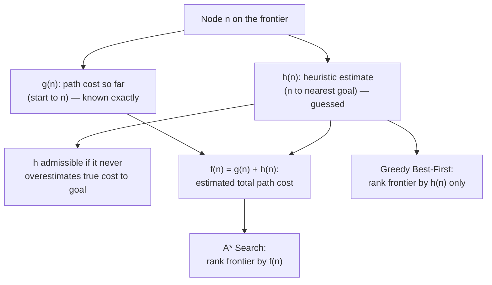
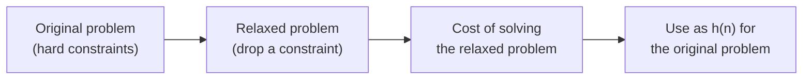

## Definition
> A function h(n) that estimates the cost of the cheapest path from node n to a goal state, used to guide a search algorithm toward promising nodes without exhaustively expanding the whole state space.

## Intuition
Uninformed search treats every unexpanded node as equally worth exploring — it only knows "how far from the start", never "how close to the goal". A heuristic injects problem-specific knowledge (e.g. straight-line distance on a map, or how scrambled a puzzle looks) so the search can prefer nodes that seem to be heading in the right direction, without guaranteeing they actually are.

## How It Works
- **h(n)** — estimated cost from node n to the nearest goal. Required: h(n) = 0 when n is a goal node, and h(n) ≥ 0 otherwise.
- Lower h(n) is treated as "more promising".
- **Admissibility** — h is admissible if it never overestimates the true cost to the goal. Admissibility is what makes tree-search [[A* Search]] optimal.
- **Consistency (monotonicity)** — a stronger condition needed for graph-search optimality: h(n) ≤ cost(n, n′) + h(n′) for every pair of adjacent nodes n, n′. Almost any admissible heuristic in practice turns out to be consistent.
- **Informedness** — if h2(n) ≥ h1(n) for all n (both admissible), h2 is "more informed" than h1 and will cause [[A* Search]] to expand fewer nodes; more information about the goal narrows the search.
- **Getting a heuristic**: relax the problem (drop a constraint on the rules, e.g. "a tile can move to any position" instead of "only to an adjacent blank") and use the cost of solving the easier, relaxed problem as h(n) for the original problem.
- **Worked example (8-Puzzle)**: h1 = number of misplaced tiles; h2 = Manhattan (city-block) distance of every tile to its goal position. Both are admissible; h2 dominates h1 (h2(n) ≥ h1(n)), so h2 is the better-informed and generally more efficient heuristic.
- **f(n) = g(n) + h(n)** — the evaluation function combining path cost so far (g) with estimated cost to goal (h); this is exactly what [[A* Search]] uses to rank the frontier ([[Greedy Best-First Search]] uses h(n) alone).

To design h itself: relax the problem, solve the easier version, and use that cost as the estimate.

## Variants & Depth
> Introduced here for classical state-space search (8-Puzzle, route-finding). The same idea of a cost-to-go estimate reappears wherever a search or planning process needs to prioritise exploration — e.g. value functions in reinforcement learning play an analogous "how promising is this state" role, though they are learned rather than hand-designed.

## Key Documents
- [[AI Lecture 02 — Solving Problems by Searching]]

## Related Concepts
- [[Search Problem]]
- [[State Space Search]]

## My Notes

## Review
**2026-07-08 — PASS** (Reviewer, vs AI-Lec02 Search_.pdf slides 54–56, 61, 68, 70–71). h(n)≥0 with h(goal)=0, lower-is-better, admissibility/consistency definitions, informedness (h2 ≥ h1), problem relaxation, and 8-Puzzle h1/h2 all match. Flag: the RL value-function analogy under Variants & Depth is the note author's extension, not slide content — kept as it is clearly framed as a forward-looking remark.
