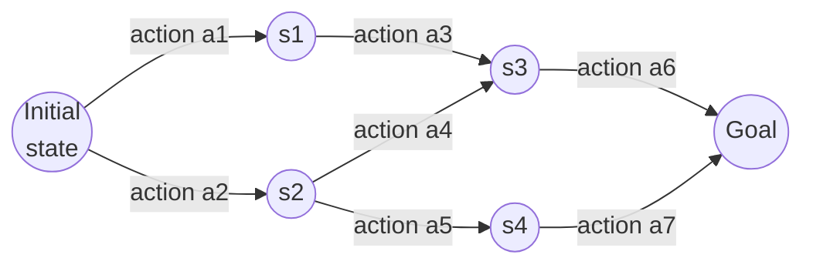

## Definition
> Treating a [[Search Problem]] as a graph — states as nodes, actions as edges — and solving it as graph reachability: can a goal node be reached from the initial node?

## Intuition
Once a problem is formalised with states and transitions, "finding a solution" becomes "finding a path through a graph" from the start node to a goal node.

## How It Works
Nodes are states; edges are the transitions produced by actions. The search explores from the initial node toward one or more goal nodes (e.g., "Can we reach node 25 from node 17?"). Path cost accumulates over the edges traversed.

Nodes are states, edges are actions (each carrying a step cost); a solution is any path from the initial node to a goal node, and search is the process of exploring those edges to find one.

## Variants & Depth
> The bridge from problem formulation to actual search algorithms (uninformed and informed/heuristic search), expected in subsequent weeks.

## Key Documents
- [[AI Lecture 01 — Introduction to Artificial Intelligence]]

- [[AI Lecture 02 — Solving Problems by Searching]]

## Related Concepts
- [[Search Problem]]

## My Notes
