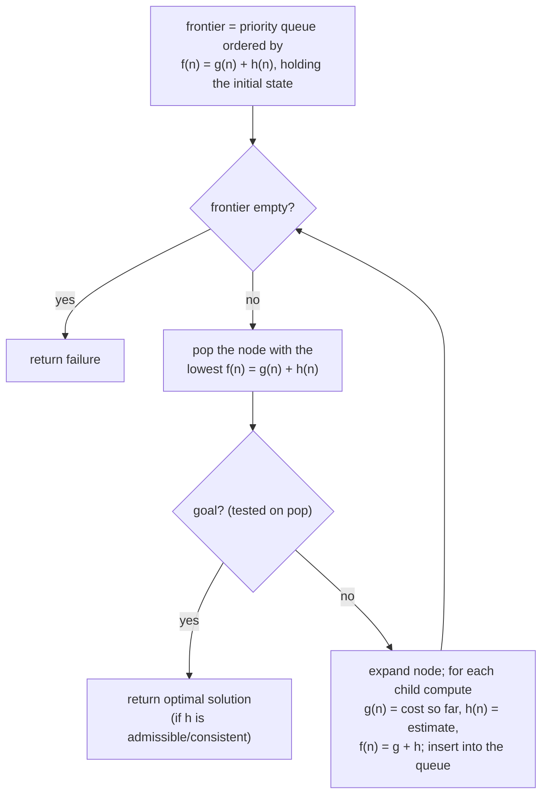

## Overview
A* search is an informed [[Search Problem|search]] strategy that ranks the frontier by f(n) = g(n) + h(n) — path cost so far plus estimated cost to the goal ([[Heuristic Function]]) — making it uniform-cost search's informed counterpart. It matters as the canonical "best of both worlds" search algorithm: complete and optimal like [[Uniform-Cost Search]], but far more efficient when given a good heuristic.

## Key Design Choices
- Frontier is a priority queue ordered by f(n) = g(n) + h(n), the estimated cost of the cheapest solution passing through n.
- Optimal and complete when h is **admissible** (never overestimates true cost); for graph-search (as opposed to tree-search), the stronger property of **consistency** (h(n) ≤ cost(n,n′) + h(n′)) is required for the optimality guarantee — almost any admissible heuristic in practice is also consistent.
- A more informed admissible heuristic (higher h, still admissible) expands fewer nodes — e.g. Manhattan-distance h2 beats misplaced-tiles h1 on the 8-Puzzle.
- Worked route-finding example (Arad → Bucharest): A* correctly expands Rimnicu Vilcea over the locally-tempting Fagaras branch once path costs are folded in, and returns the truly optimal route (Arad–Sibiu–Rimnicu Vilcea–Pitesti–Bucharest, cost 418) rather than the greedy-looking but costlier Arad–Sibiu–Fagaras–Bucharest (cost 450).

## Comparison to Previous
| Feature | A* | [[Uniform-Cost Search]] | [[Greedy Best-First Search]] |
|---------|----|--------------------------|-------------------------------|
| Ranking function | f(n) = g(n) + h(n) | g(n) only | h(n) only |
| Complete | Yes, if h is consistent | Yes | Only if repeated states removed |
| Optimal | Yes, if h is admissible (tree) / consistent (graph) | Yes | No |
| Time | Exponential worst case; O(bm) if heuristic is perfect | O(b^⌈C*/ε⌉) | Exponential worst case |
| Space | Exponential | O(b^⌈C*/ε⌉) | Exponential |

## Training Details
- N/A — classical informed search algorithm, not a trained/learned model. Performance depends entirely on the hand-designed or problem-derived [[Heuristic Function]] supplied, not on any training process.

## Strengths & Weaknesses
**Strengths:** Complete (consistent h) and optimal (admissible/consistent h); along any path f is non-decreasing, so if a solution exists its f-value is eventually reached — this underlies completeness. A good heuristic dramatically reduces the number of nodes expanded compared to uninformed search.
**Weaknesses:** Exponential time complexity in the worst case (a poor or uninformative heuristic degrades toward uniform-cost search's cost); exponential space complexity, since (like all the tree-search methods covered this week) it must keep every generated node in memory.

## Key Documents
- [[AI Lecture 02 — Solving Problems by Searching]]

## Related
- [[Heuristic Function]]
- [[Greedy Best-First Search]]
- [[Uniform-Cost Search]]
- [[Search Problem]]

## Review
**2026-07-08 — PASS** (Reviewer, vs AI-Lec02 Search_.pdf slides 61–69). f(n)=g(n)+h(n), admissibility (tree) vs consistency (graph, h(n) ≤ cost(n,n′)+h(n′)), "almost any admissible heuristic will also be consistent", f non-decreasing along a path, O(bm) with a perfect heuristic, exponential worst-case time/space, and the 418-cost optimal Romania route (slides 66–67) all match the source.
