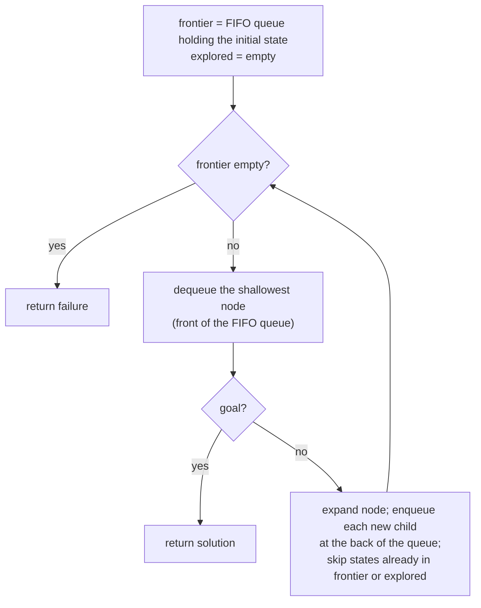

## Overview
Breadth-first search (BFS) is an uninformed [[Search Problem|search]] strategy that expands the shallowest unexpanded node first. The frontier is a FIFO queue: nodes are dequeued in the order they were enqueued, so the search fans out one full depth level at a time before going deeper. It matters as the baseline "systematic and complete" search strategy against which other uninformed strategies ([[Depth-First Search]], [[Iterative Deepening Search]]) are compared.

## Key Design Choices
- Frontier implemented as a FIFO queue → deepest-first exploration order is level-by-level.
- Discards any new path to a state already in the frontier or explored set (a later path to an already-seen state can only be longer or equal, never shorter, since all edges are explored in non-decreasing depth order).
- Goal test is applied when a node is generated/dequeued for expansion, not on generation of every child.

## Comparison to Previous
| Feature            | BFS                                  | Uniform-cost / DFS                          |
| ------------------ | ------------------------------------ | ------------------------------------------- |
| Frontier structure | FIFO queue                           | Priority queue (uniform-cost) / stack (DFS) |
| Complete           | Yes, if branching factor b is finite | Uniform-cost: yes; DFS: no in general       |
| Optimal            | Yes, if all step costs equal         | Uniform-cost: yes; DFS: no                  |
| Time               | O(b^d)                               | Uniform-cost: O(b^⌈C*/ε⌉); DFS: O(b^m)      |
| Space              | O(b^d)                               | Uniform-cost: O(b^⌈C*/ε⌉); DFS: O(bm)       |

## Training Details
- N/A — classical uninformed search algorithm, not a trained/learned model.

## Strengths & Weaknesses
**Strengths:** Complete when b is finite; optimal when all step costs are equal (shallowest goal = cheapest goal); simple to implement and reason about.
**Weaknesses:** Exponential time and space complexity, O(b^d), where d is the depth of the shallowest goal node — like all uninformed search methods, it does not scale to large search spaces because it never looks ahead toward the goal.

## Key Documents
- [[AI Lecture 02 — Solving Problems by Searching]]

## Related
- [[Search Problem]]
- [[State Space Search]]
- [[Depth-First Search]]
- [[Uniform-Cost Search]]
- [[Iterative Deepening Search]]

## Review
**2026-07-08 — PASS** (Reviewer, vs AI-Lec02 Search_.pdf slides 31–33, 46). FIFO frontier, shallowest-first, discard-new-paths, complete (b finite), optimal (equal step costs), O(b^d) time/space all match the source.
