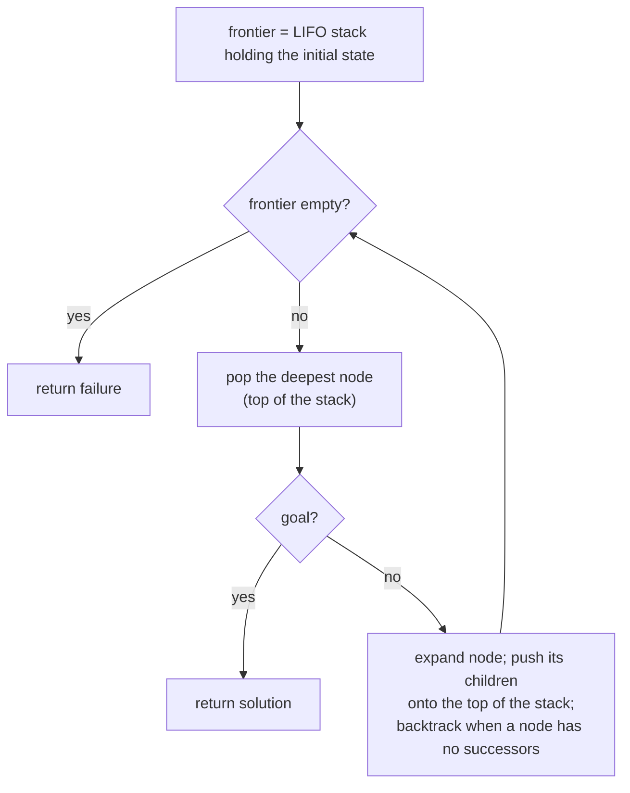

## Overview
Depth-first search (DFS) is an uninformed [[Search Problem|search]] strategy that always expands the deepest unexpanded node in the current frontier, backtracking to the next-deepest node once a node with no unexplored successors is found. The frontier is a stack (LIFO). It matters as the space-efficient counterpart to [[Breadth-First Search]], and as the basis for [[Depth-Limited Search]] and [[Iterative Deepening Search]].

## Key Design Choices
- Frontier implemented as a stack (LIFO queue) → deepest unexpanded node is always expanded next.
- Moves back up the tree ("backtracks") once a dead end (node with no successors) is reached.
- No bound on how deep the search can go unless combined with a depth limit ([[Depth-Limited Search]]).

## Comparison to Previous
| Feature | DFS | BFS |
|---------|-----|-----|
| Frontier structure | Stack (LIFO) | Queue (FIFO) |
| Complete | No in general (unless cycles are checked) | Yes, if b is finite |
| Optimal | No — may return a deeper (costlier) solution than another | Yes, if step costs equal |
| Time | O(b^m), m = max path length (can be ≫ d) | O(b^d) |
| Space | O(bm) | O(b^d) |

## Training Details
- N/A — classical uninformed search algorithm, not a trained/learned model.

## Strengths & Weaknesses
**Strengths:** Linear space complexity O(bm) — far cheaper in memory than BFS — because it only needs to remember a single path from root to leaf plus unexplored siblings.
**Weaknesses:** Not complete in general (can loop forever down an infinite or cyclic branch unless repeated states are checked); not optimal (the first goal found may not be the cheapest); worst-case time O(b^m) where m may be much larger than the shallowest goal depth d.

## Key Documents
- [[AI Lecture 02 — Solving Problems by Searching]]

## Related
- [[Search Problem]]
- [[State Space Search]]
- [[Breadth-First Search]]
- [[Depth-Limited Search]]
- [[Iterative Deepening Search]]

## Review
**2026-07-08 — PASS** (Reviewer, vs AI-Lec02 Search_.pdf slides 35–37, 46). LIFO stack, deepest-first, backtracking on dead ends, not complete/optimal, O(b^m) time and O(bm) space (m possibly ≫ d) all match the source.
