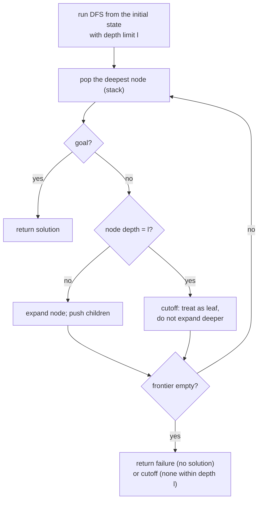

## Overview
Depth-limited search (DLS) is [[Depth-First Search]] with an imposed depth bound l: nodes at depth l are treated as if they have no successors, which avoids the unbounded-tree problem plain DFS can suffer from. It matters mainly as the building block for [[Iterative Deepening Search]].

## Key Design Choices
- Depth limit l chosen up front — ideally based on knowledge of the problem (e.g. diameter of the state space).
- All nodes at depth l are cut off (treated as leaves with no successors), even if the true goal lies deeper.
- Terminates with one of two distinct kinds of failure: standard failure (no solution exists at all) vs. cutoff (no solution found within the depth limit, but one might exist deeper).

## Comparison to Previous
| Feature | DLS | DFS |
|---------|-----|-----|
| Bound | Depth-bounded at l | Unbounded |
| Complete | No | No in general |
| Optimal | No | No |
| Time | O(b^l) | O(b^m) |
| Space | O(bl) | O(bm) |

## Training Details
- N/A — classical uninformed search algorithm, not a trained/learned model.

## Strengths & Weaknesses
**Strengths:** Guarantees termination (unlike unbounded DFS) by bounding depth; linear space O(bl).
**Weaknesses:** Neither complete nor optimal — if the goal lies deeper than l, it will not be found (cutoff failure), and if l is badly chosen relative to the true solution depth, the search is wasted.

## Key Documents
- [[AI Lecture 02 — Solving Problems by Searching]]

## Related
- [[Depth-First Search]]
- [[Iterative Deepening Search]]
- [[Search Problem]]

## Review
**2026-07-08 — PASS** (Reviewer, vs AI-Lec02 Search_.pdf slide 40). Depth bound l, cutoff-vs-failure distinction, not complete/optimal, O(b^l) time and O(bl) space all match. Minor flag: the example "(e.g. diameter of the state space)" under Key Design Choices is a standard R&N illustration, not on the slide — slide says only "based on knowledge of the problem".
