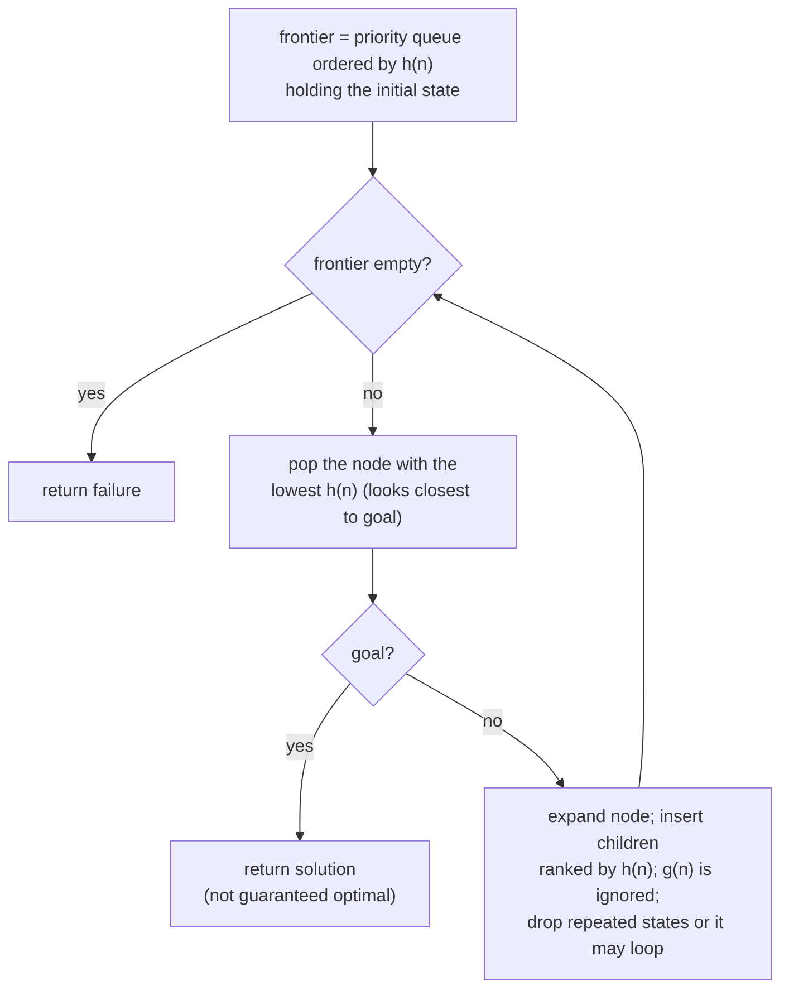

## Overview
Greedy best-first search is an informed (heuristic) [[Search Problem|search]] strategy that ranks the frontier purely by the [[Heuristic Function|heuristic]] h(n) — the estimated cost from n to the goal — and always expands the node with the lowest h-value. It can be seen as a heuristic version of [[Depth-First Search]]: it greedily chases whatever currently looks closest to the goal.

## Key Design Choices
- Frontier ordered solely by h(n); path cost so far, g(n), is ignored entirely.
- Expand the node with the lowest h-value at each step (e.g. lowest straight-line distance to the destination city in route-finding).
- Complete only if repeated states can be detected and removed — otherwise it can get stuck looping between states.

## Comparison to Previous
| Feature | Greedy Best-First | [[A* Search]] |
|---------|--------------------|------|
| Ranking function | h(n) only | f(n) = g(n) + h(n) |
| Complete | Only if repeated states removed | Yes, if heuristic is consistent |
| Optimal | No | Yes, if heuristic is admissible/consistent |
| Time / Space | Exponential (worst case) | Exponential (worst case), but far less with a good heuristic |

## Training Details
- N/A — classical informed search algorithm, not a trained/learned model.

## Strengths & Weaknesses
**Strengths:** Can be very efficient with a good heuristic — often reaches a goal quickly by always chasing the most "promising" node.
**Weaknesses:** Not complete in general (can loop) and not optimal — because it ignores accumulated path cost g(n), it can be lured down an expensive path that merely looks close to the goal (worked example: Arad→Sibiu→Fagaras→Bucharest, cost 450, versus the true optimum via Rimnicu Vilcea/Pitesti, cost 418).

## Key Documents
- [[AI Lecture 02 — Solving Problems by Searching]]

## Related
- [[Heuristic Function]]
- [[A* Search]]
- [[Depth-First Search]]
- [[Search Problem]]

## Review
**2026-07-08 — PASS** (Reviewer, vs AI-Lec02 Search_.pdf slides 57–60, 66–67). Frontier by h(n) only, "heuristic version of DFS", not complete/optimal, complete only if repeated states removed, exponential time/space, and the 450-vs-418 Romania comparison (f-values on slide 66) all match the source.
