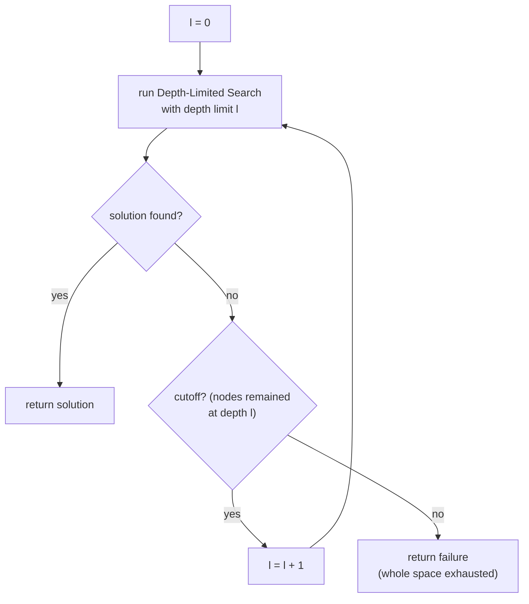

## Overview
Iterative deepening search (IDS) repeatedly runs [[Depth-Limited Search]] with an increasing depth limit (0, 1, 2, …) until a goal is found. It combines the space-efficiency of [[Depth-First Search]] with the completeness and optimality of [[Breadth-First Search]], and is, in general, the preferred uninformed search method when the search space is large and the solution depth is unknown.

## Key Design Choices
- Repeats DLS with limit = 0, 1, 2, … until a solution is returned or the whole space is exhausted.
- Re-generates shallow nodes on every iteration — appears wasteful, but most nodes in a tree live at the bottom level, so the re-expansion cost of upper levels is small relative to the final full-depth pass.
- Requires no prior knowledge of solution depth, unlike plain [[Depth-Limited Search]].

## Comparison to Previous
| Feature | IDS | BFS | DFS |
|---------|-----|-----|-----|
| Complete | Yes | Yes (b finite) | No in general |
| Optimal | Yes (equal step costs) | Yes (equal step costs) | No |
| Time | O(b^d) — worked example b=10, d=5: 123,456 vs BFS's 111,111 node expansions | O(b^d) | O(b^m) |
| Space | O(bd) | O(b^d) | O(bm) |

## Training Details
- N/A — classical uninformed search algorithm, not a trained/learned model.

## Strengths & Weaknesses
**Strengths:** Complete and optimal like BFS, but with DFS's linear space complexity O(bd) — the best combination of the two for large/unknown-depth search spaces. Not as wasteful as it looks: the time overhead versus BFS is modest because most nodes sit at the deepest level.
**Weaknesses:** Still exponential time complexity in the worst case, O(b^d) — same asymptotic ceiling as all uninformed methods since neither knows "how far to the goal".

## Key Documents
- [[AI Lecture 02 — Solving Problems by Searching]]

## Related
- [[Depth-First Search]]
- [[Depth-Limited Search]]
- [[Breadth-First Search]]
- [[Search Problem]]

## Review
**2026-07-08 — PASS** (Reviewer, vs AI-Lec02 Search_.pdf slides 41–46). Repeated DLS with l=0,1,2,…, "preferred uninformed method" quote, worked figures 123,456 vs 111,111 (b=10, d=5), complete/optimal, O(b^d) time and O(bd) space all match the source.
