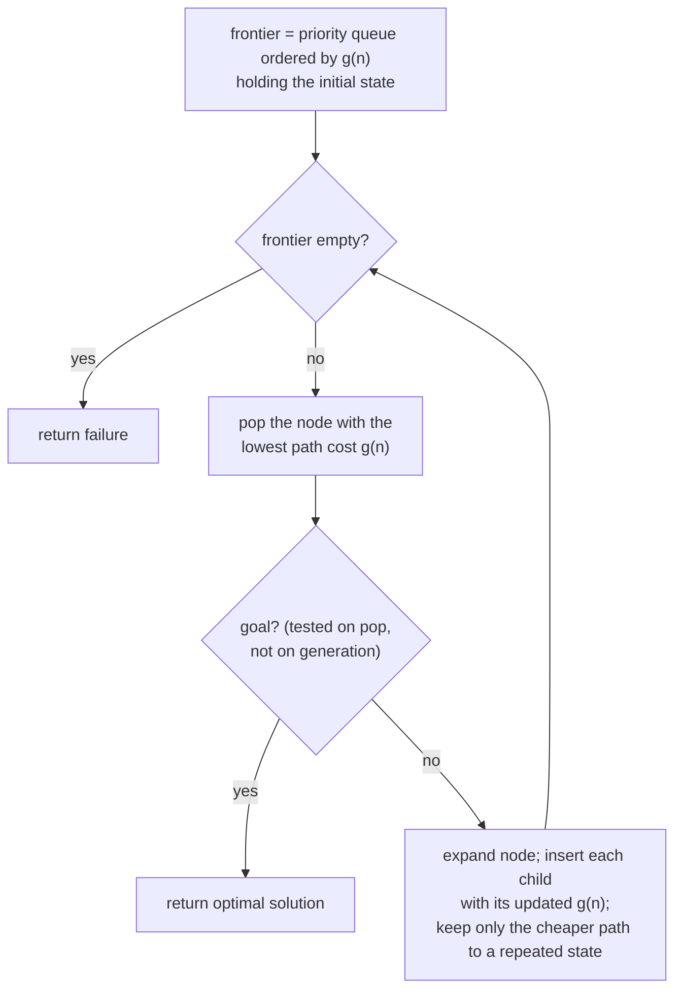

## Overview
Uniform-cost search is an uninformed [[Search Problem|search]] strategy that expands the node with the lowest path cost g(n) so far, using a priority queue as the frontier rather than a plain FIFO queue. It is the variant of [[Breadth-First Search]] that handles problems where step costs differ (e.g. distances between cities), and it goal-tests a node only when it is selected for expansion (not on generation).

## Key Design Choices
- Frontier is a priority queue ordered by path cost g(n) (e.g. cumulative distance in a route-finding problem), not by depth.
- Goal test happens when a node is popped for expansion, not when it is generated — this is what guarantees optimality.
- Reduces to [[Breadth-First Search]] exactly when g(n) = depth(n), i.e. when every step cost is equal.

## Comparison to Previous
| Feature | Uniform-Cost | BFS |
|---------|--------------|-----|
| Ordering | Priority queue by cumulative path cost g(n) | FIFO by depth |
| Complete | Yes | Yes, if b finite |
| Optimal | Yes | Yes, only if step costs equal |
| Time | O(b^⌈C*/ε⌉) | O(b^d) |
| Space | O(b^⌈C*/ε⌉) | O(b^d) |

(C* = cost of the optimal solution, ε = minimum step cost.)

## Training Details
- N/A — classical uninformed search algorithm, not a trained/learned model.

## Strengths & Weaknesses
**Strengths:** Optimal and complete regardless of whether step costs are uniform, because it always expands the cheapest frontier path first.
**Weaknesses:** Still uninformed — never looks ahead to the goal — so its time/space complexity is exponential in the worst case, governed by the optimal cost C* and minimum step size ε rather than depth alone.

## Key Documents
- [[AI Lecture 02 — Solving Problems by Searching]]

## Related
- [[Search Problem]]
- [[Breadth-First Search]]
- [[State Space Search]]

## Review
**2026-07-08 — PASS** (Reviewer, vs AI-Lec02 Search_.pdf slides 34, 46). Priority queue by g(n), goal-test on selection for expansion, BFS-equivalence when g(n)=depth(n), and O(b^⌈C*/ε⌉) (slide 46 table) all match the source.
